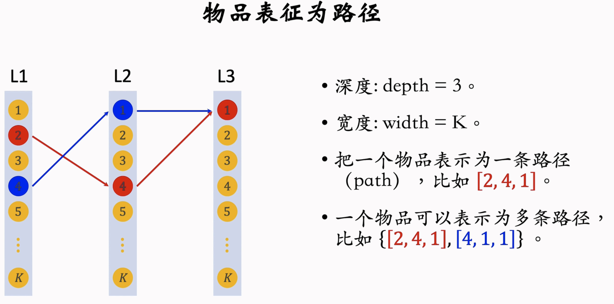
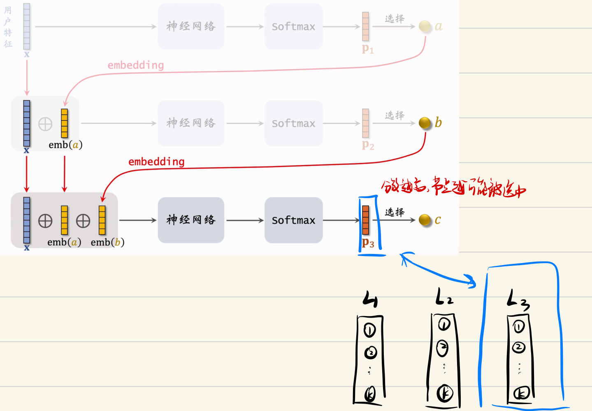
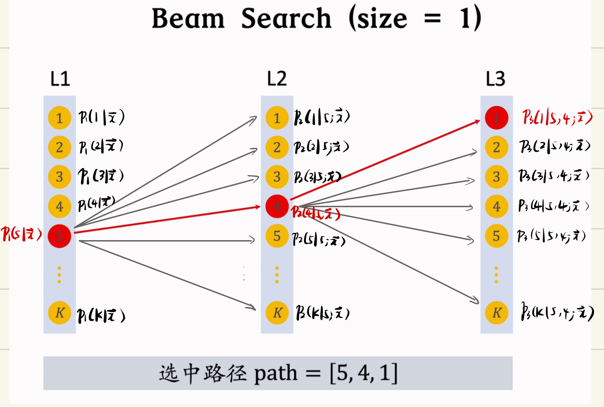
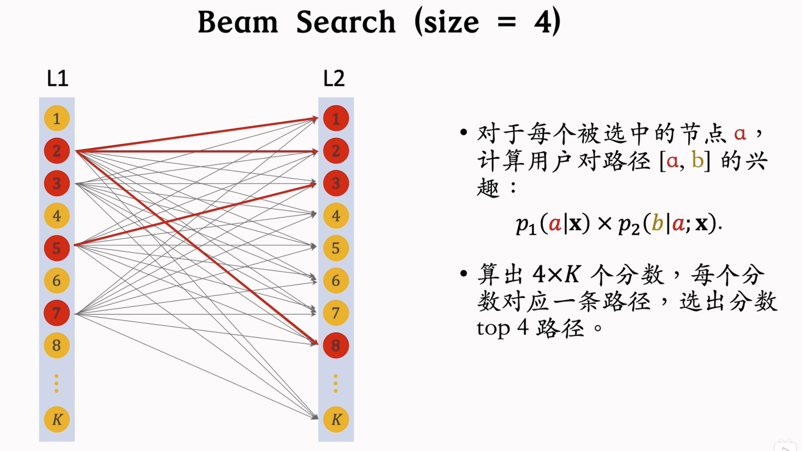
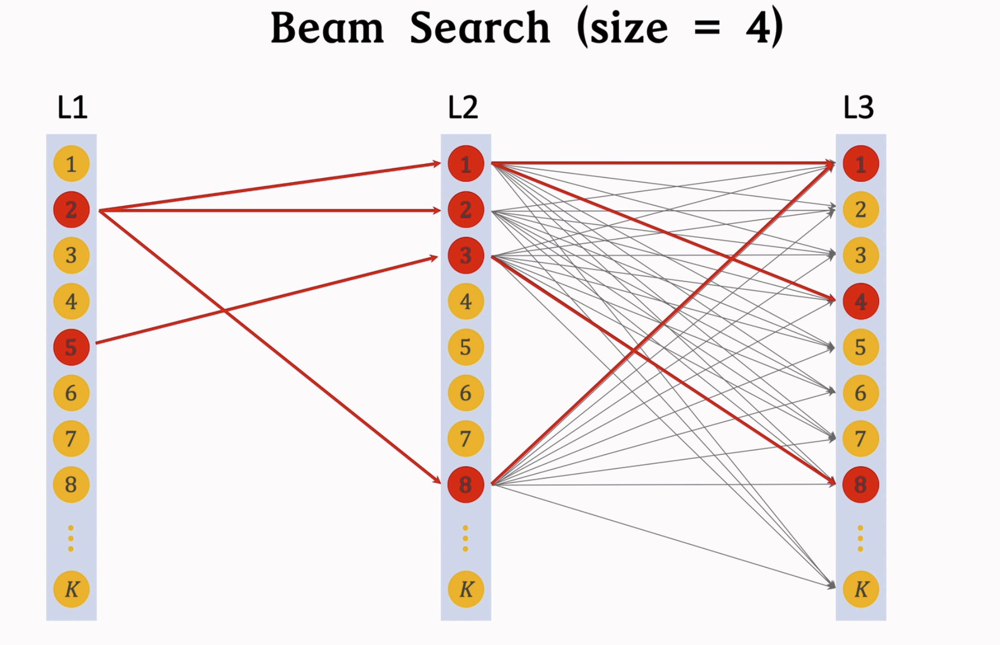
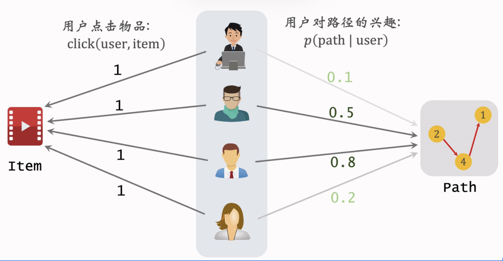

> - 经典的双塔模型把用户、物品表征成向量, 线上做最近邻查找.
> - Deep Retrieval 把物品表征成`路径(path)`, 线上查找用户最匹配的路径.
> - Deep Retrieval 类似于阿里的 TDM

## 索引

- `物品`到`路径`的索引: `item -> list <path>`
  - 一个物品可以对应多条路径
  - 用 $3$ 个节点表示一条路径
- `路径`到`物品`的索引: `path -> list <item>`
  - 一条路径对应多个物品

## 预估模型
预估`用户`到`路径`的兴趣

- 用 $3$ 个节点表示一条路径 `path = [a, b, c]`
- 给定用户特征 $\vec x$, 预估用户对节点 $a$ 的兴趣 $p_1(a\mid\vec x)$
- 给定用户特征 $\vec x$ 和节点 $a$, 预估用户对节点 $b$ 的兴趣 $p_2(b\mid a; \vec x)$
- 给定用户特征 $\vec x$ 和节点 $a, b$, 预估用户对节点 $c$ 的兴趣 $p_3(c\mid a, b; \vec x)$
- 预估用户对 `path = [a, b, c]` 的兴趣:
$$
p(a,b,c\mid \vec x)=p_1(a\mid\vec x)\cdot p_2(b\mid a;\vec x)\cdot p_3(c\mid a,b;\vec x).
$$

## 线上召回

`召回: 用户 -> 路径 -> 物品`
1. 给定用户特征, 用 `beam search` 召回一批路径;
2. 利用索引 `path -> list<item>` 召回一批物品;
3. 对物品做打分和排序, 选出一个子集.

### Beam Search
- 假设有 $3$ 层, 每层 $K$ 个节点, 则共 $K^3$ 条路径.
- 用神经网络给所有 $K^3$ 条路径打分, 计算量太大.
- 用 `beam search` 减小计算量
- 需设置超参数 `beam size`

`beam size = 1` 的例子:

- 计算第一层 $p_1(i\mid \vec x)$, 得到最大值的节点 $5$;
- 计算第二层 $p_2(i\mid 5;\vec x)$, 得到最大值的节点 $4$;
- 计算第三层 $p_3(i\mid 5,4;\vec x)$, 得到最大值的节点 $1$;
- 最终得到最优路径 `path = [5, 4, 1]`.

不难看出 Beam Search 得到的路径并非最优路径, 事实上这是一种贪心算法, 得到局部的最优路径.

`beam size = 4` 的例子:

- 计算第一层 $p_1(i\mid \vec x)$, 得到最大值的 $4$ 个节点 $2,3,5,7$;
- 计算第二层 $p_1(i\mid \vec j;x)$, $j=2,3,5,7$, 得到最大值的四条路径 $[2,1], [2,2], [2,8], [5,3]$.

- 计算第三层 $p_1(i\mid \vec j,k;x)$, $[j,k]=[2,1], [2,2], [2,8], [5,3]$, 得到最大值的四条路径 $[2,1,1], [2,1, 4], [2, 8, 1], [5, 3, 8]$.

## 训练——同时学习神经网络参数和物品表征
- 神经网络 $p(a,b,c\mid \vec x)$ 预估用户对路径 $[a,b,c]$ 的兴趣.
- 把一个物品表征为多条路径 $\lbrace[a,b,c]\rbrace$, 建立索引:
  - `item -> list<path>`
  - `path -> list<item>`
- 正样本 `(user, item)`: `click(user, item) = 1`

### 学习神经网络参数
- 物品表征为 $J$ 条路径 $[a_j, b_j, c_j]_{j=1}^J$.
- 用户对路径 $[a, b, c]$ 兴趣:
$$
p(a,b,c\mid\vec x)=p_1(a\mid\vec x)p_2(b\mid a;\vec x)p_3(c\mid a,b;\vec x)
$$
- 如果用户点击过物品, 则说明用户对这 $J$ 条路径感兴趣.
  - 应该让 $\sum_{j=1}^Jp(a_j,b_j,c_j\mid \vec x)$ 变大
  - 损失函数 $loss=-\log\left(\sum_{j=1}^Jp(a_j,b_j,c_j\mid \vec x)\right)$.

### 学习物品表征

- 用户 `user` 对路径 `path = [a, b, c]` 兴趣记作
$$p(\text{path}\mid \text{user})=p(a,b,c\mid \vec x)$$
- 物品 `item` 与路径 `path` 的相关性
$$
score(\text{item, path})=\sum_{\text{user}} p(\text{path}\mid\text{user})\times\text{click}(\text{user,item}).
$$
- 根据 $score(\text{item, path})$ 选出 $J$ 条路径作为 `item` 的表征 $\Pi=\lbrace \text{path}_1, \text{path}_2,\cdots,\text{path}_J\rbrace$.
- 损失函数 (选与 `item` 高度相关的 `path`)
$$
loss(\text{item},\Pi)=-\log\left(\sum_{j=1}^Jscore(\text{item,path}_j)\right)
$$
- 正则项 (避免过多的 `item` 集中在一条 `path` 上)
$$
\text{reg}(\text{path}_j) = (\text{number of items on path}_j)^4
$$
- 用贪心算法更新路径
  - 假设物品被表征为 $J$ 条路径 $\Pi=\lbrace \text{path}_1, \text{path}_2,\cdots,\text{path}_J\rbrace$.
  - 每次固定 $\lbrace \text{path}_i\rbrace~(i\neq l)$, 并从未被选中的路径中, 选出一条作为新的 $\text{path}_l$.
  
  $$
  \text{path}_l \gets \operatorname*{arg\,min}_{\text{path}_l}\left(loss(\text{item}, \Pi) + \alpha \cdot \text{reg}(\text{path}_l)\right)
  $$
  
  - 选中的路径有较高分数 $score(\text{item, path}_l)$, 而且路径上的物品数量不会太多.

> 参考: 【推荐系统公开课——8小时完整版，讲解工业界真实的推荐系统】https://www.bilibili.com/video/BV1HZ421U77y?vd_source=54b296fb4038582045c08b7b00aa22a1
