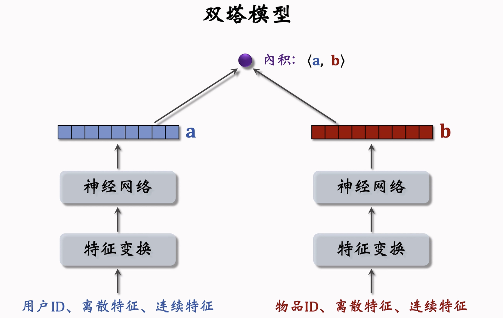
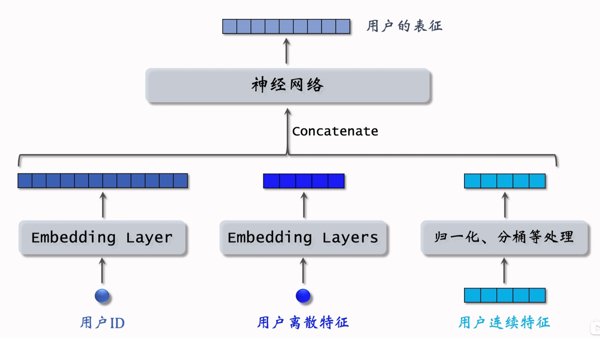
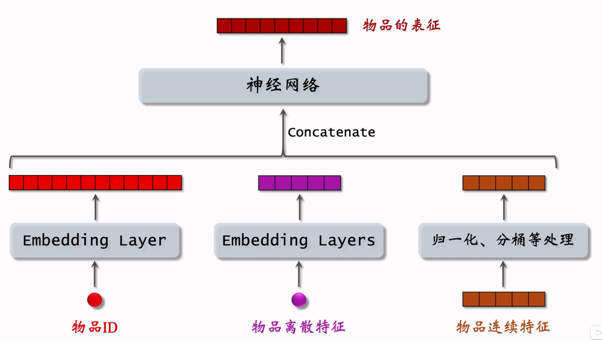
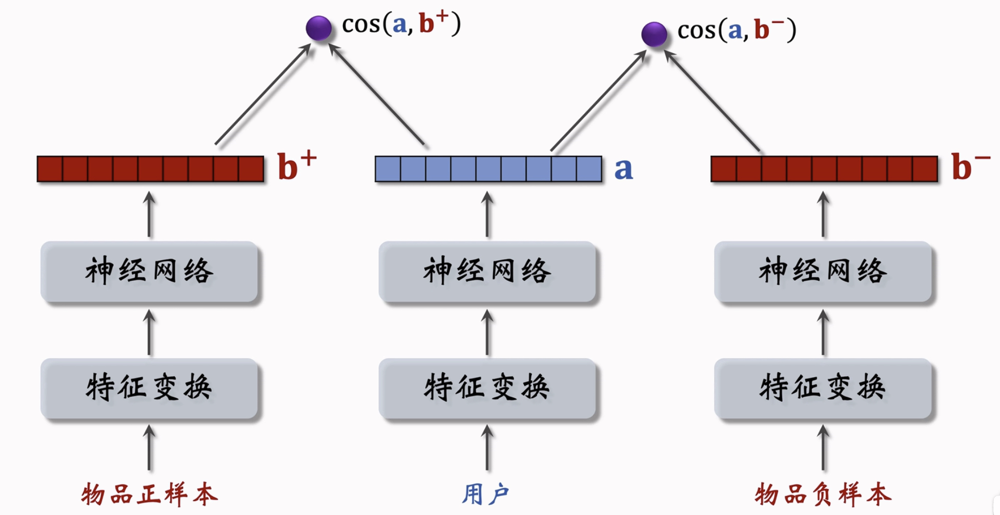
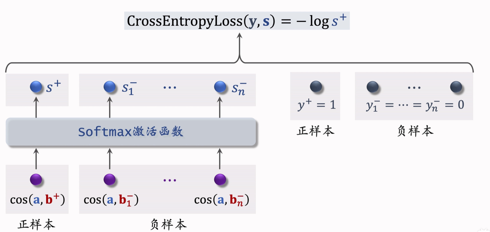
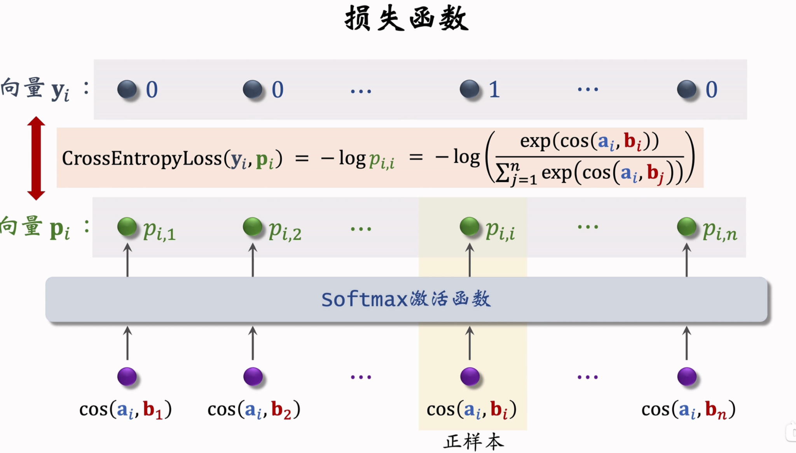
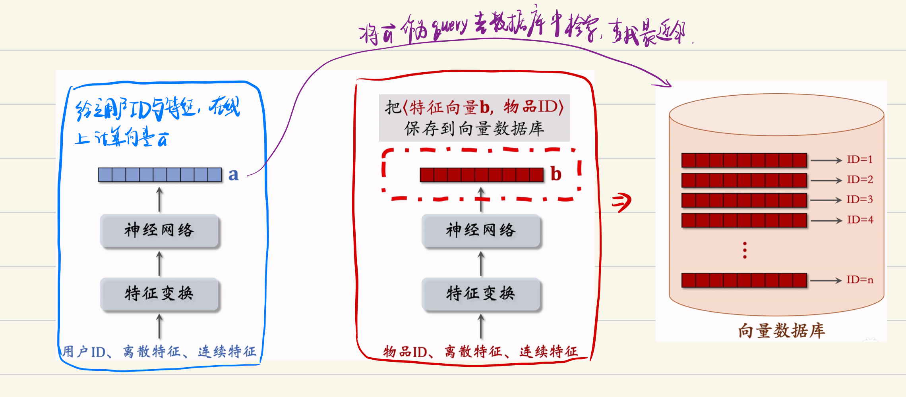
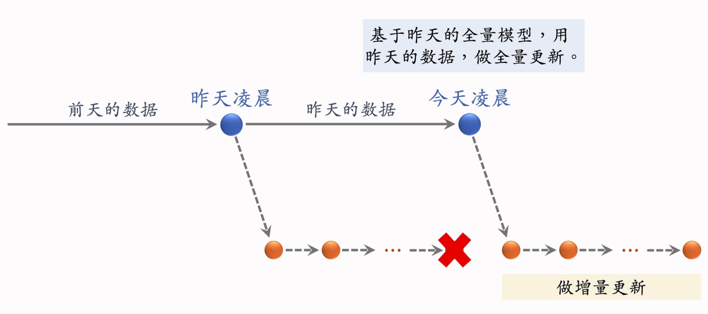
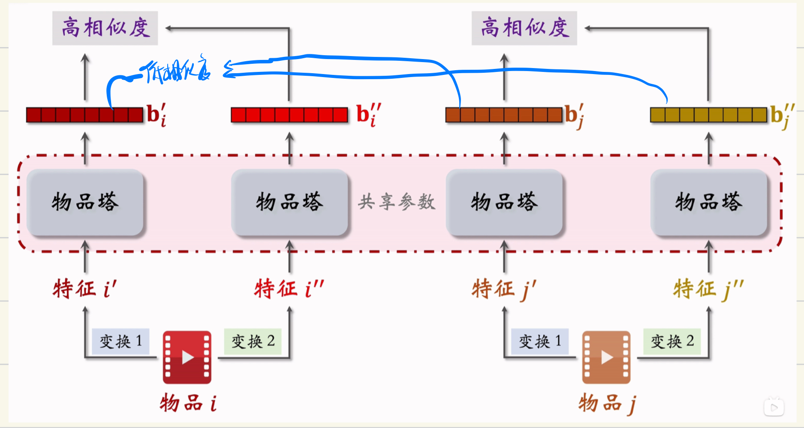
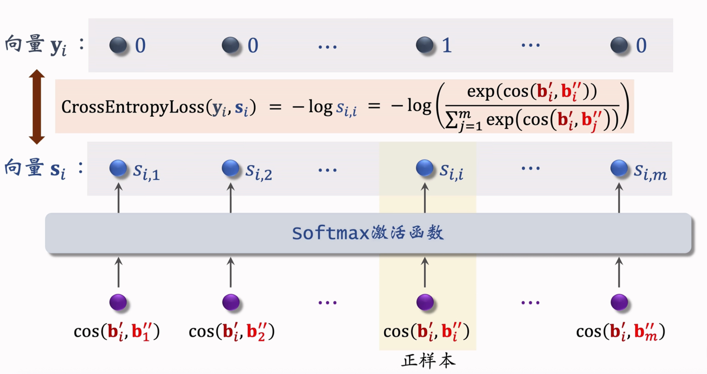

# 双塔模型

## 双塔模型的结构

双塔模型模型由`用户塔`和`物品塔`两部分组成, 其结构如下:

> 双塔模型是后期融合, 一般排序是前期融合

左边是用户塔, 右边是物品塔. 而用户塔和物品塔的结构如下:

## 双塔模型的训练
- Pointwise: 独立看待每个正样本和负样本, 做简单的二元分类. 把正负样本组成数据集, 对其进行随机梯度下降训练模型.
- Pairwise: 每次取一个正样本, 一个负样本, 组成一个二元组.
- Listwise: 每次取一个正样本和多个负样本, 类似于做多元分类.

> 正负样本如何界定?
> - 正样本: 用户点击物品;
> - 负样本:
>   - 没有召回;
>   - 召回但被粗排、精排淘汰;
>   - 曝光但用户未点击

### Pointwise训练
- 把召回看作二元分类任务.
- 对于正样本, 鼓励 $(\vec{a}, \vec{b})$ 接近 $1$;
- 对于负样本, 鼓励 $(\vec{a}, \vec{b})$ 接近 $-1$.
- 控制正负样本数量比例为 $1:2$ 或 $1:3$.

### Pairwise训练

其中, 物品塔共享参数.

> 基本想法: 鼓励 $\cos(\vec a,\vec b^+)>\cos(\vec a,\vec b^-)$ 且两者相差越大越好.

- 若 $\cos(\vec a,\vec b^+)>\cos(\vec a,\vec b^-)+m$, 则无损失. 其中 $m$ 为超参数, 要调.
- 否则, $Loss=\cos(\vec a,\vec b^-)+m-\cos(\vec a,\vec b^+)$.
  - Triplet hinge loss:
    $$
    L(\vec a, \vec b^+, \vec b^-)=\max\lbrace0, \cos(\vec a,\vec b^-)+m-\cos(\vec a,\vec b^+)\rbrace.
    $$
  - Triplet logistic loss:
    $$
    L(\vec a, \vec b^+, \vec b^-)=\log\left(1+\exp\left(\sigma\left(\cos(\vec a,\vec b^-)-\cos(\vec a,\vec b^+)\right)\right)\right).
    $$

### Listwise训练
- 一条数据包含
  - 一个用户向量 $\vec a$;
  - 一个正样本 $\vec b^+$;
  - 多个负样本 $\vec b_1^-, \vec b_2^-, \cdots, \vec b_n^-$.
- 鼓励 $\cos(\vec{a}, \vec{b}^+)$ 尽量大;
- 鼓励 $\cos(\vec{a}, \vec{b}_i^-)$ 尽量小.

训练结构:

> 推荐系统中少部分物品(热门物品)占据大部分点击, 大部分物品点击次数不高. 而被抽样的概率正比于点击次数, 因此需要通过纠偏来降低热门物品成为负样本的概率.
> $$
> \cos(\vec a_i, \vec b_j) \quad \text{被替换为}\quad \cos(\vec a_i, \vec b_j)-\log p_j
> $$
> 于是
> $$
> \exp(\cos(\vec a_i,\vec b_j)) \to \frac{\exp(\cos(\vec a_i,\vec b_j))}{p_j},
> $$
> 这相当于降低了热门物品的权重.

此时双塔模型的损失函数为

$$
L_{main}[i] = -\log\left(\frac{\exp(\cos(\vec a_i, \vec b_i)-\log p_i)}{\sum_{i=1}^n\exp(\cos(\vec a_i, \vec b_j)-\log p_j)}\right)
$$

做梯度下降, 减少损失函数

$$
\frac1n\sum_{i=1}^nL_{main}[i].
$$

## 线上召回
- 离线存储: 把物品向量 $\vec b$ 存入向量数据库.
  
  
  - 完成训练后, 用物品塔计算每个物品的特征向量 $\vec b$;
  - 把几亿个物品向量 $\vec b$ 存入向量数据库 (如 Milvus, Faiss, Hnswlib);
  - 向量数据库建索引, 以便加速最近邻查找.
- 线上召回: 查找用户最感兴趣的 $k$ 个物品.
  - 给定用户 ID 与画像, 线上用神经网络算用户向量 $\vec a$.
  - 最近邻查找
    - 把向量 $\vec a$ 当作 query, 调用向量数据库做最近邻查找.
    - 返回余弦相似度最大的 $k$ 个物品作为召回结果.
> Q: 为什么事先存储物品向量 $\vec b$, 线上计算用户向量 $\vec a$?
> - 每做一次召回, 用到一个用户向量 $\vec a$, 几亿件物品向量 $\vec b$ (线上计算物品向量代价太大).
> - 用户兴趣动态变化, 而物品特征相对稳定 (可以离线存储用户向量, 但不利于推荐效果).

## 模型更新
- 全量更新: 今天凌晨, 用昨天全天的数据训练模型
  - 在昨天模型参数的基础上做训练 (不是随机初始化).
  - 用昨天数据打包成 TFRecord 文件训练 $1$ epoch, 即每天训练数据只用一遍.
  - 发布新的用户塔神经网络和物品向量, 供线上召回使用.
  - 全量更新对数据流、系统要求比较低.
- 增量更新: 做 online learning 更新模型参数
  - 用户兴趣会随时发生变化
  - 实时搜集线上数据, 做流式处理, 生成 TFRecord 文件.
  - 对模型做 online learning, 增量更新 ID Embedding 参数, 锁住全连接层.
  - 发布用户 ID Embedding, 供用户塔在线上计算用户向量.

## 双塔模型+自监督学习

> 为什么进行自监督学习?——双塔模型的问题.
> - 推荐系统的头部效应严重
>   - 少部分物品占据大部分点击
>   - 大部分物品点击次数不高
> - 高点击物品的表征学得好, 长尾物品的表征学得不好 (训练样本不够)
> - 自监督学习: 做 data augmentation, 更好地学习长尾物品的向量表征.

### 训练物品塔

- 学习目标
  - 物品 $i$ 的两个向量 $b_i',b_i''$ 要有较高的相似度.
  - 物品 $i$ 和 $j$ 的向量表征 $b_i'$ 和 $b_j''$ 有较低的相似度.
  - 鼓励 $\cos(b_i',b_i'')$ 尽量大, 鼓励 $\cos(b_i',b_j'')$ 尽量大 $(i\neq j)$.
- 特征变换: Random Mask
  - 随机选取一些离散特征(比如类目), 把它们遮住.
  - 例：
    - 某物品的类目特征为 $u=\lbrace \text{数码}, \text{投影}\rbrace$
    - MASK后的类目特征是 $u'=\lbrace \text{default}\rbrace$
- 特征变换: Dropout (仅对多值离散特征生效)
  - 一个物品可有多个类目, 那么类目是一个多值离散特征
  - Dropout: 随机丢弃 50% 的值
  - 例:
    - 某物品类目特征 $u=\lbrace\text{美妆},\text{摄影}\rbrace$
    - Dropout 后的类目特征 $u'=\lbrace\text{美妆}\rbrace$
- 特征变换: 互补特征 (Complementary)
  - 假设一物品有四种特征: `ID, 类目, 关键词, 城市`
  - 随机分成两组: `{ID, 关键词}` 和 `{类目, 城市}`
  - `{ID, default, 关键词, default} -> 物品表征`

    `{default, 类目, default, 城市} -> 物品表征`

    鼓励两个向量相似.
- 特征变换: Mask一组关联的特征
  - 例:
    - 受众性别 `u = {男, 女, 中性}`
    - 类目 `v = {美妆, 数码, 足球, 科技, ...}`
    - `u = 女` 和 `v = 美妆` 同时出现的概率 `p(u,v)` 大.
    - `u = 女` 和 `v = 数码` 同时出现的概率 `p(u,v)` 小.
    - `p(u)`: 某特征取值为 `u` 的概率
      - `p(男) = 20%,  p(女) = 30%, p(中) = 50%`
    - `p(u, v)`: 一个特征取 `u`, 另一个取 `v` 同时发生的概率
      - `p(女, 美妆) = 3%,  p(女, 数码) = 0.1%`
    - 离线计算特征两两间关联, 用互信息 (mutual information) 衡量
        $$
        MI(u,v)=\sum_u\sum_vp(u,v)\cdot\log\frac{p(u,v)}{p(u)p(v)}.
        $$
    - 做法:
      - 设共有 $k$ 种特征, 离线计算特征两两间的互信息 $MI$, 得到 $k\times k$ 矩阵.
      - 随机算一个特征作为种子, 找到种子最相关的 $\frac k2$ 种特征。
      - MASK 种子及其相关的 $\frac k2$ 种特征, 保留其余 $\frac k2$ 种特征.
    - 好处: 比 Random Mask, Dropout, 互补特征等方法效果更好.
    - 坏处: 方法复杂, 实现难度大, 不容易维护.
- 训练模型
  - 从全体物品中均匀抽样, 得到 $m$ 个物品, 作为一个 `batch`.
  - 做两类特征变换, 得到物品塔输出的两组向量 $b_1',\cdots, b_m'$ 和 $b_1'',\cdots, b_m''$
  - 第 $i$ 个物品的损失函数为
    $$
    L_{self}[i] = -\log\left(\frac{\exp(\cos(b_i',b_i''))}{\sum_{j=1}^m\exp(\cos(b_i',b_j''))}\right).
    $$
  - 做梯度下降, 减小自监督学习的损失 $\frac1m\sum_{i=1}^mL_{self}[i]$.

 

为解决长尾问题, 将自监督学习加入到双塔模型的训练之中:
- 对点击做随机抽样, 得到 $n$ 对 `用户-物品` 二元组, 作为一个 `batch`.
- 从全体物品中均匀抽样, 得到 $m$ 个物品, 作为一个 `batch`.
- 做梯度下降, 使得损失减小
  $$
    \frac1n\sum_{i=1}^nL_{main}[i]+\alpha\cdot\frac1m\sum_{j=1}^mL_{self}[j].
  $$
  其中 $\alpha$ 为超参数.

> 参考: 【推荐系统公开课——8小时完整版，讲解工业界真实的推荐系统】https://www.bilibili.com/video/BV1HZ421U77y?vd_source=54b296fb4038582045c08b7b00aa22a1