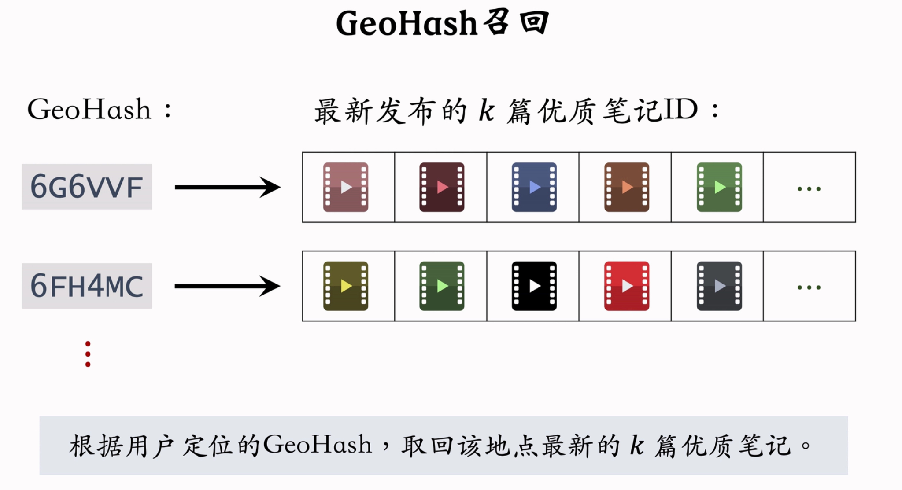

# 地理位置召回与作者召回

## GeoHash 召回 —— 地理位置召回

> 用户可能对附近发生的事情感兴趣.

- `GeoHash` —— 对经纬度的编码, 地图上的一个长方形区域.

  - 索引: `GeoHash -> <优质笔记列表(按时间倒排)>`
  - 这条召回通道没有个性化

    

- 同城召回
  - 用户可能对同城发生的事感兴趣.
  - 索引: `城市 -> <优质笔记列表>`
  - 这条召回通道没有个性化

## 作者召回
> 用户对关注的作者发布的笔记感兴趣
> - 索引:
>   - `用户 -> 关注的作者`
>   - `作者 -> 发布的笔记`
> - 召回: `用户 -> 关注的作者 -> 最新笔记`

- 有交互的作者召回
  - 若用户对某笔记感兴趣, 则用户可能对该作者其他笔记也感兴趣.
  - 索引: `用户 -> 有交互的作者`
  - 召回: `用户 -> 有交互的作者 -> 最新笔记`
- 相似作者召回
  - 若用户喜欢某作者, 则用户可能喜欢相似类型的作者
  - 索引: `作者 -> 相似作者 (k 个)`
  - 召回: `用户 -> 感兴趣的作者 (n 个) -> 相似作者 (nk 个) -> 最新作者 (nk 篇笔记)`

## 缓存召回 —— 复用前 $n$ 次推荐精排的结果
> 为什么做缓存召回
> - 精排输出几百篇笔记, 送入重排. 而重排做多样性抽样, 仅仅选出几十篇笔记. 导致精排结果一大半没有曝光, 被浪费.

例:
- 精排前 $50$ 但没有被曝光的笔记缓存起来, 作为一条召回通道
- 缓存大小固定, 需退场机制
  - 一旦笔记成功被曝光, 就从缓存退场
  - 若超出缓存大小, 则移除最先进入缓存的笔记
  - 笔记最多被召回 $10$ 次, 达到 $10$ 次就退场
  - 每篇笔记最多保存 $3$ 天, 达到 $3$ 天就退场

> 参考: 【推荐系统公开课——8小时完整版，讲解工业界真实的推荐系统】https://www.bilibili.com/video/BV1HZ421U77y?vd_source=54b296fb4038582045c08b7b00aa22a1
