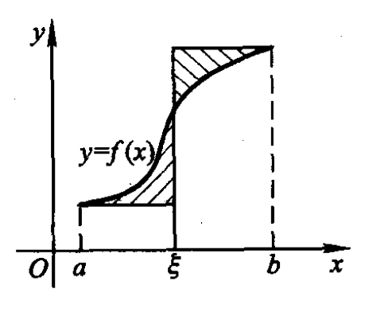

# 一元积分学

## 判断题/数学常识

函数可积$(f\in R[a,b])$的充要条件：

1. $\forall c\in (a,b),f\in R[a,c],f\in R[c,b]$;
2. 可积第一充要条件: 上积分等于下积分;
3. 可积第二充要条件:  存在某一分割使得上和与下和的差是一个无穷小;
4. 可积第三充要条件: 存在一个分割使得振幅大于事先任意给定的数的小区间总长是一个无穷小.

函数可积$(f\in R[a,b])$的充分条件：

1. $f\in C[a,b]$;
2. $f$ 在 $[a,b]$ 上只有有限多个间断点且 $f$ 有界;
3. $f$ 在 $[a,b]$ 上单调;
4. $\forall\varepsilon>0,\exists g(x)\in R[a,b], \ s.t. \ |f(x)-g(x)|<\varepsilon$;
5. $g(x)\in R[a,b]$, 且仅在有限个点处 $f\neq g$;
6. $f(x)$ 在 $[a,b]$ 上有界，且在 $[a,b]$ 上不连续点集只有有限个聚点.

函数可积$(f\in R[a,b])$的必要条件：

1. $f$ 有界;
2. $|f|\in R[a,b], \ f^2\in R[a,b]$;
3. $f$ 在 $[a,b]$ 上必有无穷多个处处稠密的连续点;
4. 存在[$a,b]$上的阶梯函数$h(x)$,使得  $\int_a^b|f( x) - g( x) |\mathrm{~d}x< \varepsilon$;
5. 存在 $[a,b]$ 上的连续函数 $g(x)$,使得 $\int_a^b|f( x) - h( x) |\mathrm{~d}x< \varepsilon$.

**[华四8.1.4]** 含有第一类间断点的函数没有原函数.
**注：**这是因为导函数至多有第二类间断点.

**[华四8.1.8]** 含有第二类间断点的函数可能有原函数, 也可能没有原函数.
**注：** 情形I: $F(x)=\begin{cases}x^2\sin\frac{1}{x}, & x\neq0,\\\\0,&x=0.\end{cases}\Rightarrow f(x)=F'(x)=\begin{cases}2x\sin\frac{1}{x}-\cos\frac{1}{x}, & x\neq 0,\\\\ 0, & x=0.\end{cases}$ 则 $f(x)$ 有第二类间断点 $x=0$, 但 $f(x)$ 有原函数 $F(x)$; 情形II: Dirichlet 函数的定义域上的每一个点都是第二类间断点, 显然它没原函数.

**[华四八总4]** 周期函数不一定可导, 若可导则其导函数还是周期函数; 周期函数不一定有原函数, 若有原函数则其原函数不一定是周期函数.
**注：** Dirichlet 函数的周期可以是任意有理数, 但它不可导也没有原函数.

**[华四9.4.5]** 设 $f,g\in R[a,b]$, 则 $M(x)=\max\limits_{[a,b]}\{f(x),g(x)\},m(x)=\min\limits_{[a,b]}\{f(x),g(x)\}$ 在
$[a,b]$ 上也可积.
**注：** $M(x)=\frac{f(x)+g(x)+|f(x)-g(x)|}{2},m(x)=\frac{f(x)+g(x)-|f(x)-g(x)|}{2}$.

**[华四9.5.15]** 若 $f$ 在 $[a,b]$ 上连续可微, 则存在 $[a,b]$ 上连续可微的增函数 $g$ 和连续可微的减函数 $h$, 使得 $f(x)=g(x)+h(x), \ x\in[a,b]$.
**注：** 注意到 $f(x)=\int_a^xf'(t)\mathrm{~d}t+f(a)=\int_a^{x}\left[f'(t)+|f'(t)|\right]\mathrm{~d}t+f(a)-\int_a^x|f'(t)|\mathrm{~d}t$. 令 $g(x)=\int_a^{x}\left[f'(t)+|f'(t)|\right]\mathrm{~d}t,h(x)=f(a)-\int_a^x|f'(t)|\mathrm{~d}t$ 即可.

**[李例4-2-2-5]** $f\in R[a,b]\Rightarrow \begin{cases}|f|\in R[a,b],\\\\ f^2\in R[a,b].\end{cases}$    $|f|\in R[a,b]\begin{cases}\Rightarrow f^2\in R[a,b],\\\\ \nRightarrow f\in R[a,b]. \end{cases}$    $f^2\in R[a,b]\begin{cases}\nRightarrow f\in R[a,b],\\\\ \Rightarrow |f|\in R[a,b].\end{cases}$
**注：** 一个例子 $f(x)=\begin{cases}1,&x\in\mathbb{Q},\\\\ -1,&x\in\overline{\mathbb{Q}}.\end{cases}$

**[李例4-2-2思考]** 两个可积函数的复合不一定是可积函数; 但若函数 $f\in C[a,b],\varphi\in R[\alpha,\beta]$, 且 $a\le \varphi(t)\le b, \ t\in[\alpha,\beta]$, 则 $f\circ g$ 在 $[\alpha,\beta]$ 上可积.
**注：** 一个例子 $f(x)=R(x)\in R[0,1], \ g(x)=\begin{cases}1,&x=\frac{1}{n} \ (n=1,2,\cdots)\\\\ 0,&其 \ 它\end{cases}$.

## 不定积分

### 求原函数

**[华四8.1.6(2)]** $\int|\sin x|\mathrm{~d}x$.
**注：** $f(x):=|\sin x|=\begin{cases}\cdots&\cdots\\\\-\sin x, & -\pi\le x\le0\\\\ \sin x, & 0\le x\le\pi\\\\ -\sin x,&\pi\le x\le2\pi\\\\ \cdots&\cdots\end{cases}$

**[华四8.2.2(9)]** $\int\sec^3x\mathrm{~d}x$.
**注：** 分部积分.

**[华四8.2.2(10)]** $\int\sqrt{x^2\pm a^2}\mathrm{~d}x \ (a>0)$.
**注：** 换元.

**[华四8.3例6]** $\int{\frac{\mathrm{~d}x}{(1+x)\sqrt{2+x-x^2}}}$.
**注：** 注意到 $\frac{1}{(1+x)\sqrt{2+x-x^2}}=\frac{1}{(1+x)\sqrt{(2-x)(1+x)}}=\frac{1}{(1+x)^2}\sqrt{\frac{1+x}{2-x}}$. 接下去还原即可.

**[华四8.3例7]** $\int\frac{\mathrm{~d}x}{x\sqrt{x^2-2x-3}}$.
**注：** 令 $\sqrt{x^2-2x-3}=x-t$.

**[华四8.3.1(4)]** $\int\frac{\mathrm{~d}x}{1+x^4}$.
**注：** 注意到 $\frac{1}{1+x^4}=\frac{1}{2}\frac{1+x^2+1-x^2}{1+x^4}=\frac{1}{2}\left(\frac{1+x^2}{1+x^4}+\frac{1-x^2}{1+x^4}\right)=\frac{1}{2}\left(\frac{\frac{1}{x^2}+1}{\frac{1}{x^2}+x^2}-\frac{1-\frac{1}{x^2}}{\frac{1}{x^2}+x^2}\right)=\frac{1}{2}\left(\frac{(x-\frac{1}{x})'}{(x-\frac{1}{x})^2+2}-\frac{(x+\frac{1}{x})'}{(x+\frac{1}{x})^2-2}\right)$

**[华四8.3.2(3)]** $\int\frac{\mathrm{~d}x}{1+\tan x}$.
**注：** 令 $t=\tan x$.

**[华四8.3.2(4)]** $\int\frac{x^2}{\sqrt{1+x-x^2}}\mathrm{~d}x$.
**注：** 注意到 $\frac{x^2}{\sqrt{1+x-x^2}}=\frac{(1+x)-(1+x-x^2)}{\sqrt{1+x-x^2}}=\frac{1+x}{\sqrt{1+x-x^2}}-\sqrt{1+x-x^2}$.

**[华四八总1(18)]** $\int\frac{\mathrm{~d}x}{\sqrt{\sin x\cos^7x}}$.
**注：** 注意到 $\frac{1}{\sqrt{\sin x\cos^7x}}=\frac{1}{\sqrt{\tan x\cos^8 x}}=\frac{\sec^4x}{\sqrt{\tan x}}$.

**[华四八总1(19)]** $\int e^x\left(\frac{1-x}{1+x^2}\right)^2\mathrm{~d}x$.
**注：** 注意到 $\left(\frac{1-x}{1+x^2}\right)^2=\frac{1+x^2-2x}{(1+x^2)^2}=\frac{1}{1+x^2}-\frac{2x}{(1+x^2)^2}$.

**[华四八总2(1)]** $\int\frac{\mathrm{~d}x}{x^4+x^2+1}$.
**注：** 注意到 $\frac{1}{x^4+x^2+1}=\frac{1}{(x^2+1)^2-x^2}$.

**[华四八总3(4)]** $\int\frac{1+x^4}{(1-x^4)^{\frac{3}{2}}}\mathrm{~d}x$.
**注：** 注意到 $\frac{1+x^4}{(1-x^4)^{\frac{3}{2}}}=\frac{1-x^4+2x^4}{(1-x^4)^{\frac{3}{2}}}=\frac{\sqrt{1-x^4}+\frac{2x^4}{\sqrt{1-x^4}}}{1-x^4}=\left(\frac{x}{\sqrt{1-x^4}}\right)'$.

### 不定积分的递推式

**[华四6.2例16]** $I_n=\int\frac{x^n}{\sqrt{1-x^2}}\mathrm{~d}x$.
**注：** 注意到 $\frac{x^n}{\sqrt{1-x^2}}=-x^{n-1}\left(\sqrt{1-x^2}\right)'$.

[李例4-1-3-9] $I_n=\int\frac{\mathrm{d}x}{x^n\sqrt{x^2+1}}$.
**注：** 方法与上题类似.

**[华四6.2.4(2)]** $I(m,n)=\int \cos^mx\sin^nx\mathrm{~d}x$.
**注：** 用分部积分, 没什么难的.

**[华四6.2.6(4)]** $I_n=\int e^{ax}\sin^nx\mathrm{~d}x$.
**注：** 分部积分即可, 要耐心.

**[华四八总1(20)]** $I_n=\int\frac{v^n}{\sqrt{u}}\mathrm{~d}x$, 其中 $u=a_1+b_1x,v=a_2+b_2x$.
**注：** 分部积分, 沉住气.

**[华四八总5(2)]** $I_n=\int\frac{\sin nx}{\sin x}\mathrm{~d}x$.
**注：** 事实上 $\sin nx=\sin[(n-2)x+2x]=\sin(n-2)x\cos2x+\cos(n-2)x\sin x$.

## 定积分的计算问题

### 计算定积分

**[华四9.5例4]** $\int_0^1\frac{\ln(1+x)}{1+x^2}\mathrm{~d}x$.
**注：** 令 $x=\tan t$, 于是原式化为了 $\int_0^1\ln(1+\tan t)\mathrm{~d}t$.

**[华四9.5例6]** $\int_0^{\frac{\pi}{2}}\sin^nx\mathrm{~d}x$ 和 $\int_0^{\frac{\pi}{2}}\sin^nx\mathrm{~d}x$.
**注：** 就是分部积分.

**[华四9.5.4(12)]** $\int_0^{\frac{\pi}{2}}\frac{\cos\theta}{\sin\theta+\cos\theta}\mathrm{~d}\theta$.
**注：** 令 $I_1=\int_0^{\frac{\pi}{2}}\frac{\cos\theta}{\sin\theta+\cos\theta}\mathrm{~d}\theta,I_2=\int_0^{\frac{\pi}{2}}\frac{\sin\theta}{\sin\theta+\cos\theta}\mathrm{~d}\theta$, 则 $\begin{cases}I_1+I_2=\frac{\pi}{2}\\\\ I_1-I_2=0\end{cases}$.

**[李例4-2-8-5]** $\int_0^1\frac{\ln(1-x)}{x}\mathrm{~d}x$.
**注：** 利用幂级数展开 $\ln(1-x)=-\sum\limits_{n=1}^{\infty}\frac{x^n}{n}$.

**[李例4-2-8练1]** $\int_0^{n\pi}x|\sin x|\mathrm{~d}x$.
**注：** 事实上 $\int_0^1x|\sin x|\mathrm{~d}x=\sum\limits_{k=1}^n\int_{(k-1)\pi}^{k\pi}x|\sin x|\mathrm{~d}x$.

### 与定积分有关的极限运算

**[李例4-2-9练1]** 证明 $\lim\limits_{n\to\infty}\int_0^{\pi}(\sin x)^{\frac{1}{n}}\mathrm{~d}x=\pi$.
**注：** 事实上, $\pi\ge\int_0^{\pi}(\sin x)^{\frac{1}{n}}\mathrm{~d}x\ge\int_{\varepsilon}^{\pi-\varepsilon}(\sin x)^{\frac{1}{n}}\mathrm{~d}x\ge(\sin\varepsilon)^{\frac{1}{n}}(\pi-2\varepsilon)\to \pi-2\varepsilon \ (n\to\infty)$

**[李例4-2-9练2]** 证明 $\lim\limits_{n\to\infty}\int_0^{1}e^{x^n}\mathrm{~d}x=1$.
**注：** 事实上, $x+1\le e^x\le ex+1, \ x\in[0,1]$.

**[李例4-2-9练3]** 证明 $\lim\limits_{n\to\infty}\int_0^{\pi/2}(1-\sin x)^{n}\mathrm{~d}x=0$.
**注：** 事实上, $\int_0^{\pi/2}(1-\sin x)^{n}\mathrm{~d}x=\int_0^{a}(1-\sin x)^{n}\mathrm{~d}x+\int_a^{\pi/2}(1-\sin x)^{n}\mathrm{~d}x$. 不难验证右边这两部分都是趋于零的.

**[李例4-2-5-9]** 设 $f(x)=\int_{x}^{x^{2}}\left(1+\frac{1}{2t}\right)^{t}\sin\frac{1}{\sqrt{t}}\mathrm{d}t(x>0)$. 求$\operatorname*{lim}\limits_{n\to\infty}f(n)\sin\frac{1}{n}$.
**注：** 利用 L'Hospital 法则.

### 定积分的应用

**[华四10.1例4]** 求双扭线 $r^2=a^2\cos 2\theta$ 所围图形的面积.
**注：** 可以画出双扭线的图, 然后根据对称性求解 $S=4\times \frac{1}{2}\int_0^{\pi/4}a^2\cos 2\theta\mathrm{~d}\theta$.

**[华四10.1例4]** 求由曲线 $x=t-t^3,y=1-t^4$ 所围图形的面积.
**注：** 注意到当 $t=\pm1$ 时 $x=y=0$, 故 $t$ 由 $-1$ 变为 $1$ 时, 曲线从原点出发回到了原点, 构成了一个封闭曲线, 于是 $S=\left|\int_{-1}^1y(t)x'(t)\mathrm{~d}t\right|$.

**[华四10.1.9]** 求曲线 $r=\sin\theta$ 与 $r=\sqrt{3}\cos\theta$ 所围公共部分的面积.
**注：** 由 $\sin\theta=\sqrt{3}\cos\theta$ 得知 $\theta=\frac{\pi}{3}$, 于是 $S=4\left(\int_0^{\pi/3}\frac{1}{2}\sin^2\theta\mathrm{~d}\theta+\int_{\pi/3}^{\pi/2}\frac{1}{2}\cdot3\cdot\cos^2\theta\mathrm{~d}\theta\right)$.

**[华四10.2.2(3)]** 求平面曲线 $r=a(1+\cos\theta) \ (a>0)$ 绕极轴旋转所围立体的体积.
**注：** 画出图形之后可知 $V=\left|\int_0^{2\pi/3}\pi y^2\mathrm{~d}x\right|-\left|\int_{2\pi/3}^{\pi}\pi y^2\mathrm{~d}x\right|$.

## 定积分的定义和可积理论

**[李例4-2-1-3]** 求 $A,B$ 使得 $A\le\int_0^1\sqrt{1+x^4}\mathrm{~d}x\le B$, 要求 $B-A<0.1$.
**注：** 对 $[0,1]$ 做分割, 积分和的上确界作为定积分的上界, 积分和的下确界作为定积分的下确界, 于是只要划分得越密, 积分和的上下确界就会越接近.

**[华四9.2定理9.1] (Newton-Leibniz formula)** 若函数 $f\in C[a,b]$, 且存在原函数 $F$, 即 $F'(x)=f(x),x\in[a,b]$, 则 $f$ 在 $[a,b]$ 上 Riemann 可积, 且
$$
\int_a^bf(x)\mathrm{~d}x=F(b)-F(a).
$$
**注：** 利用 Lagrange 中值定理和闭区间上的连续函数的一致连续性即可. 事实上, 上述定理的条件可以弱化如下.

**[华四9.2.3]** 若 $f\in R[a,b],F\in C[a,b]$, 且除了有限个点外有 $F'(x)=f(x)$, 则有
$$
\int_a^bf(x)\mathrm{~d}x=F(b)-F(a).
$$
**注：** 利用 Lagrange 中值定理和可积的定义既可, 前提这有限个点必须成为分割的分割点.

**[华四9.3定理9.2]** 若 $f\in R[a,b]$, 则 $f$ 在 $[a,b]$ 上必有界.
**注：** 反证法容易证得.

**[华四9.3定理9.5]** 若 $f$ 是 $[a,b]$ 上只有有限个间断点的有界函数, 则 $f\in R[a,b]$.
**注：** 只需让这有限个间断点所在小区间的长度是无穷小即可.

**[华四9.3定理9.6]** 若 $f$ 是 $[a,b]$ 上的单调函数, 则 $f$ 在 $[a,b]$ 上可积.
**注：** 单调函数的在每个小区间上的振幅的和就是 $f(b)-f(a)$, 因此只需控制分割的模长 $||T||$ 即可.

**[华四9.6性质2]** 设 $T'$ 为分割 $T$ 添加 $p$ 个新分点后所得到的分割, 则有
$$
S(T)-(M-m)p||T||\le S(T')\le S(T),\\
s(T)\le s(T')\le s(T)+(M-m)p||T||\\
$$
其中 $M=\sup\limits_{[a,b]}f,m=\inf\limits_{[a,b]}f$.
**注：** 先考虑增加一个分点的情形, 添加一个分点以后上下和的变化仅仅体现在一个小区间上, 依次为突破口即可证得结论.

**[华四9.6性质6] (Darboux 定理)** 设 $S(T),s(T)$ 是分割 $T$ 上和和下和, 且 $S=\inf\limits_TS(T),s=\sup\limits_{T}s(T)$ 是上下和对分割 $T$ 的上下确界, 则有
$$
\lim\limits_{||T||\to0}S(T)=S,\quad \lim\limits_{||T||\to0}s(T)=s.
$$
**注：** 利用上下确界的定义以及性质2可证得.

**[华四9.6定理9.14] （可积第一充要条件）** 函数 $f\in R[a,b]\Longleftrightarrow S=s$.
**注：** 必要性只需应用可积的定义和 Darboux 定理; 充分性也是用可积的定义和 Darboux 定理.

**[华四9.6定理9.15]（可积第二充要条件）** 函数 $f\in R[a,b]\Longleftrightarrow \forall\varepsilon>0$, 总存在某一分割 $T$, 使得 $S(T)-s(T)<\varepsilon\Longleftrightarrow \sum\limits_{i=1}^n\omega_i\Delta x_i<\varepsilon$.
**注：** 利用可积第一充要条件即可.

**[华四9.6定理9.16]（可积第三充要条件）** 函数 $f\in R[a,b]\Longleftrightarrow \forall\varepsilon,\eta>0$, 总存在某一分割 $T$, 使得属于 $T$ 的所有区间当中, 对应于振幅 $\omega_{k'}\ge\varepsilon$ 的那些小区间 $\Delta_{k'}$ 的总长 $\sum\limits_{k'}\Delta x_{k'}<\eta$.
**注：** 利用可积第二充要条件即可, 在证明充分性时对于振幅大的小区间控制其区间长度(分割的模长)即可.

**[华四9.3.3]** 设 $f,g$ 是定义在 $[a,b]$ 上的有界函数. 证明: 若仅在 $[a,b]$ 中有限个点处 $f(x)\neq g(x)$, 则当 $f\in R[a,b]$ 上时, $g\in R[a,b]$, 且 $\int_a^bf(x)\mathrm{~d}x=\int_a^bg(x)\mathrm{~d}x$.
**注：** 设$x_1,\cdots,x_k$ 是这有限个点, $M=\max\{|f(x_i)-g(x_i)|\}$. 因此对这有限个点所在的小区间的长度, 即分割的模长进行控制就行.

**[华四9.3.7]** 设 $f$ 在 $[a,b]$ 上有定义, 且对任给的 $\varepsilon>0$, 存在 $[a,b]$ 上的可积函数 $g$, 使得 $|f(x)-g(x)|<\varepsilon,\ \ x\in[a,b]$. 证明 $f\in R[a,b]$.
**注：** 对 $[a,b]$ 作分划. 不难发现每个小区间上 $f$ 的振幅都是一个无穷小加上 $g$ 的振幅, 于是可以利用积分第二充要条件证明.

**[华四9.3例3]** 证明 Riemann 函数 $R(x)$ 在 $[0,1]$ 上可积, 且 $\int_0^aR(x)\mathrm{~d}x=0$.
**注：** 事实上振幅超过任意给定 $\varepsilon$ 的小区间的个数一定是有限多个, 又因为 $R(x)$ 是有界的, 因此只需控制这有限个小区间的长度, 接着无论是利用可积第二充要条件还是第三充要条件都不难证明之.

**[华四9.3.6]** 证明函数 $f(x)=\begin{cases}0,&x=0\\\frac{1}{x}-\left[\frac{1}{x}\right],&x\in(0,1]\end{cases}$ 在 $[0,1]$ 上可积.
**注：** 把图画出来清晰点. 事实上对 $\forall\varepsilon>0$, $[\frac{\varepsilon}{2},1]$ 上仅有有限个间断点且有界, 从而可积.

**[华四9.6例2]** 证明: 若函数 $f\in C[a,b],\varphi\in R[\alpha,\beta]$, 且 $a\le \varphi(t)\le b, \ t\in[\alpha,\beta]$, 则 $f\circ g$ 在 $[\alpha,\beta]$ 上可积.
**注：** 利用 $f$ 的一致连续性, $\varphi$ 的可积性, 配合可积第三充要条件不难证明. 利用此命题可证明如下命题：$f\in R[a,b],f(x)\ge0,x\in[a,b]$, 则 $\sqrt{f}\in R[a,b]$.

**[华四9.6.7]** 用区间套定理证明: 若 $f\in R[a,b]$, 则 $f$ 在 $[a,b]$ 上必有无限多个处处稠密的连续点.
**注：** 根据所给条件, 我一定能构造出一个闭区间列 $\{[a_n,b_n]\}$ 满足 
(1) $[a_{n+1},b_{n+1}]\subset[a_n,b_n],n=1,2,\cdots$;
(2) $0<b_n-a_n\le\frac{b-a}{2^n}\to0 \ (n\to\infty)$;
(3) $\omega_{[a_n,b_n]}^f<\frac{1}{n}$.
从而由(1)(2)知它是一个闭区间套, 根据闭区间套定理知 $\exists\xi\in[a_n,b_n],n=1,2,\cdots$, 且 $\lim\limits_{n\to\infty}a_n=\lim\limits_{n\to\infty}b_n=\xi$, 利用 (3) 不难证明 $\xi$ 是连续点. 于是对 $[a,b]$ 上的任意闭区间都能找到这样的连续点, 从而命题得证.

**[李例4-2-2-1]** 设函数 $f(x)$ 在 [a,b] 上有定义，证明 $f(x)\in R[a,b]$ 的充分必要条件是： 存在 $I\in\mathbb{R}$, 对于$\forall\varepsilon>0,\exists[a,b]$ 的一个分割$T:a=x_0<x_1<\cdots<x_n=b$, 对于$\forall\xi_i\in[x_{i-1},x_i](i=$ $1,2,\cdots,n)$ 有 $\left|\sum\limits_{i=1}^nf(\xi_i)\Delta x_i-I\right|<\varepsilon$.
**注：** 必要性是显然的; 充分性可以利用积分第二充要条件证明.

**[李例4-2-2-3]** 设函数 $f(x)\in R[a,b]$,证明：对 $\forall\varepsilon>0$,
(1)存在[$a,b]$上的阶梯函数$h(x)$,使得  $\int_a^b|f( x) - g( x) |\mathrm{~d}x< \varepsilon.$
(2) 存在 $[a,b]$ 上的连续函数 $g(x)$,使得 $\int_a^b|f( x) - h( x) |\mathrm{~d}x< \varepsilon$.
**注：** (1) 构造
$$
\overline{f}(x)=\begin{cases}M_i,& x\in[x_{i-1},x_i) \ (i=1,2,\cdots,n-1),\\\\ M_n,&x\in[x_{n-1},b],\end{cases}\\\\
\underline{f}(x)=\begin{cases}m_i,& x\in[x_{i-1},x_i) \ (i=1,2,\cdots,n-1),\\\\ m_n,&x\in[x_{n-1},b].\end{cases}
$$
可以验证上述阶梯函数函数满足题目要求.
(2) 只需依次连接 $(x_{i-1},f(x_{i-1}))$ 和 $(x_i,f(x_i))$ 即可.

**[李例4-2-2-4]** 设函数 $f(x)$ 在$\mathbb{R}$ 上有定义，且在任何有限闭区间上可积，证明： 对任何闭区间 $[a,b]$ 有
$$
\lim\limits_{h\to0}\int_a^b|f(x+h)-f(x)|\mathrm{d}x=0.
$$

**注：** 事实上, 由上题可知存在一个连续函数 $g(x)$, 使得 $\int_{\alpha}^{\beta}\left|f(x)-g(x)\right|\mathrm{~d}x<\varepsilon$.

**[李例4-2-2练8]** 设函数 $f(x)$ 在区间 $[a,b]$ 上有界，且它在 $[a,b]$ 上不连续点集只有有限个聚点. 证明：$f(x)\in R[a,b]$.
**注：** 先用长度任意小的区间覆盖这有限个聚点, 再覆盖这些区间外的有限多个不连续点.

## 定积分的性质和应用

**[华四9.4定理9.7]** **(积分第一中值定理)** 若 $f\in C[a,b]$, 则 $\exists \xi\in(a,b)$, 使得
$$
\int_a^bf(x)\mathrm{~d}x=f(\xi)(b-a).
$$
**注：** 用连续函数的介值定理.

**[华四9.4定理9.8]** **(推广的积分第一中值定理)** 若 $f,g\in C[a,b]$, 且 $g(x)$ 在 $[a,b]$ 上不变号, 则 $\exists \xi\in(a,b)$, 使得
$$
\int_a^bf(x)g(x)\mathrm{~d}x=f(\xi)\int_a^bg(x)\mathrm{~d}x.
$$
**注：** 利用连续函数的介值定理. 设 $M=\max f(x),m=\min f(x)$, 分以下几种情形讨论:
(1) $M=m$; (2) $M>m$ 且 $\int_a^bg(x)\mathrm{~d}x=0$; (3) $M>m$ 且 $\int_a^bg(x)\mathrm{~d}x\neq0$;

**[华四9.4例4]** 设 $f\in C[0,1]$, 求 $\lim\limits_{n\to\infty}\int_0^1f(\sqrt[n]{x})\mathrm{~d}x$.
**注：** 这是积分第一中值定理的应用. 事实上
$$
\int_0^1f(\sqrt[n]{x})\mathrm{~d}x=\int_0^{\frac{1}{n}}f(\sqrt[n]{x})\mathrm{~d}x+\int_{\frac{1}{n}}^{1}f(\sqrt[n]{x})\mathrm{~d}x=\frac{1}{n}f(\sqrt[n]{\xi_n})+\left(1-\frac{1}{n}\right)f(\sqrt[n]{\eta_n})
$$
**[华四9.4.10]** 若 $f\in C[a,b]$, 且 $\int_a^bf(x)\mathrm{~d}x=\int_a^bxf(x)\mathrm{~d}x=0$, 则 $f$ 在 $(a,b)$ 上至少存在两个零点; 又若 $\int_a^bx^2f(x)\mathrm{~d}x=0$, 则 $f$ 在 $(a,b)$ 上至少存在三个零点.
**注：** 根据积分第一中值定理, 有一个零点是显然的, 利用反证法证明零点不止一个.

**[华四9.4.11(2)]** 设 $f$ 在 $[a,b]$ 上二阶可导, 且 $f''(x)>0, f(x)\le 0,x\in[a,b]$. 证明:
$$
f(x)\ge\frac{2}{b-a}\int_a^bf(x)\mathrm{~d}x, \ x\in[a,b].
$$
**注：** 有条件可知 $f$ 是下凸函数, 因此对 $\forall x,t\in[a,b]$, 有 $f(x)\ge f(t)+(x-t)f'(t)$, 两边同时对 $t$ 求积分即可.

**[华四9.5定理9.10] (原函数存在定理)** 若 $f(x)\in C[a,b], \ \Phi(x)=\int_a^xf(t)\mathrm{~d}t$, 则 $\Phi$ 在 $[a,b]$ 上处处可导, 且 $\Phi'(x)=f(x), \ x\in[a,b]$.
**注：** 利用导数的定义和积分第一中值定理.

**[华四9.5定理9.11] (积分第二中值定理)** 设函数 $f\in R[a,b]$, 则
	(1) 若函数 $g$ 在 $[a,b]$ 上是减函数, 且 $g(x)\ge0$, 则存在 $\xi\in[a,b]$, 使得
$$
\int_a^bf(x)g(x)\mathrm{~d}x=g(a)\int_a^{\xi}f(x)\mathrm{~d}x;
$$
​	(2) 若函数 $g$ 在 $[a,b]$ 上是增函数, 且 $g(x)\ge0$, 则存在 $\eta\in[a,b]$, 使得
$$
\int_a^bf(x)g(x)\mathrm{~d}x=g(b)\int_{\eta}^bf(x)\mathrm{~d}x.
$$
**注：** 由于 $g$ 在 $[a,b]$ 上单调, 因此 $g$ 一定可积. 事实上, 设 $F(x)=\int_a^xf(t)\mathrm{~d}t$, 只需证明 $\frac{1}{g(a)}\int_a^bf(x)g(x)\mathrm{~d}x$ 介于 $F$ 的最大值和最小值之间即可.

此命题有如下推论

**[华四9.5定理11推论]** 设 $f\in R[a,b]$. 若 $g$ 是单调函数, 则存在 $\xi\in[a,b]$, 使得
$$
\int_a^bf(x)g(x)\mathrm{~d}x=g(a)\int_a^{\xi}f(x)\mathrm{~d}x+g(b)\int_{\xi}^bf(x)\mathrm{~d}x.
$$
**注：** 不妨设 $g$ 单调递减, 则令 $h(x)=g(x)-g(b)$, 可知 $h(x)$ 递减且非负, 再利用积分第二中值定理即可.

**[华四9.5例6]** 证明 Waills 公式: $\frac{\pi}{2}=\lim\limits_{n\to\infty}\left[\frac{(2m)!!}{(2m-1)!!}\right]^2\cdot\frac{1}{2m+1}$.
**注：** 突破口在于 $\int_0^{\frac{\pi}{2}}\sin^{2m+1}x\mathrm{~d}x\le\int_0^{\frac{\pi}{2}}\sin^{2m}x\mathrm{~d}x\le\int_0^{\frac{\pi}{2}}\sin^{2m-1}x\mathrm{~d}x$.

**[华四9.5-三]** 导出 Tayor 公式的积分型余项 $R_n^I(x)=\frac{1}{n!}\int_{x_0}^x(x-t)^nf^{(n+1)}(t)\mathrm{~d}t$, 并以此导出 Lagrange 余项 $R_n^L=\frac{f^{(n+1)}(\xi)}{(n+1)!}(x-x_0)^{n+1}$ 和 Cauchy 余项 $R_n^C=\frac{(1-\theta)^nx^{n+1}}{n!}f^{(n+1)}(\theta x)$.
**注：** 这要用到推广的分部积分公式: 若 $u,v$ 在 $[a,b]$ 上有 $n+1$ 阶连续导函数, 则
$$
\begin{aligned}
\int_a^bu(x)v^{(n+1)}(x)\mathrm{~d}x=&[u(x)v^{(n)}(x)-u'(x)v^{(n-1)}(x)+\cdots+\\\\
(-1)^nu^{(n)}(x)v(x)]_a^b&+(-1)^{n+1}\int_a^bu^{(n+1)}(x)v(x)\mathrm{~d}x\quad (n=1,2,\cdots).
\end{aligned}
$$
**[华四9.5.11]** 设 $y=f(x)$ 为 $[a,b]$ 上严格增的连续函数. 试证存在 $\xi\in(a,b)$, 使得下图中阴影部分面积相等

**注：** 构造 $F(t)=\int_a^t[f(x)-f(a)]\mathrm{~d}x-\int_t^b[f(b)-f(x)]\mathrm{~d}x$ 即可.

**[华四9.5.13]** 证明: 当 $x>0$ 时有不等式 $|\int_x^{x+c}\sin t^2\mathrm{~d}t|\le\frac{1}{x} \ (c>0)$.
**注：** 令 $t^2=u$, 则 $\left|\int_x^{x+c}\sin t^2\mathrm{~d}t\right|=\left|\int_{x^2}^{(x+c)^2}\frac{1}{2\sqrt{u}}\sin u\mathrm{~d}u\right|=\frac{1}{2x}\left|\int_{x^2}^{\xi}\sin u\mathrm{~d}u\right|\le\frac{1}{x}$.

**[华四9.5.14]** 若 $f\in R[a,b]$, $\varphi$ 在 $[\alpha,\beta]$ 上严格单调且 $\varphi'\in R[\alpha,\beta],\varphi(\alpha)=a,\varphi(\beta)=b$, 则有 $\int_a^bf(x)\mathrm{~d}x=\int_{\alpha}^{\beta}f(\varphi(t))\varphi'(t)\mathrm{~d}t$.
**注：** 做分割用定积分的定义做.

**[华四九总1]** 若 $\varphi\in C[0,a],f$ 二阶可导且 $f''(x)\ge0$, 则有
$$
\frac{1}{a}\int_0^af(\varphi(t))\mathrm{~d}t\ge f\left(\frac{1}{a}\int_0^a\varphi(t)\mathrm{~d}t\right).
$$
**注：** 利用 $f$ 的下凸性即可.

**[华四九总6]** **Schwarz 不等式**: 若 $f,g\in R[a,b]$, 则
$$
\left(\int_a^bf(x)g(x)\mathrm{~d}x\right)^2\le\int_a^bf^2(x)\mathrm{~d}x\cdot\int_a^bg^2(x)\mathrm{~d}x.
$$
**注：** 方法一：构造 $F(t)=\int_a^b[tf(x)+g(x)]^2\mathrm{~d}x\ge0$; 
方法二：利用二重积分 $\iint\limits_{[a,b]^2}[f(x)g(y)-f(y)g(x)]^2\mathrm{~d}x\mathrm{d}y\ge0$.
方法三：构造 $F(t)=\int_a^tf^2(x)\mathrm{~d}x\cdot\int_a^tg^2(x)\mathrm{~d}x-\left(\int_a^tf(x)g(x)\mathrm{~d}x\right)^2$, 求导分析单调性即可.

**[华四九总7(3)] Minkowski 不等式**: 若 $f,g\in R[a,b]$, 则
$$
\left[\int_a^b(f(x)+g(x))^2\mathrm{~d}x\right]^{\frac{1}{2}}\le\left[\int_a^bf^2(x)\mathrm{~d}x\right]^{\frac{1}{2}}+\left[\int_a^bg^2(x)\mathrm{~d}x\right]^{\frac{1}{2}}
$$
**注：** 左边展开再利用 Schwarz 不等式即可.

**[李例4-2-3-12]** 设 $f(x)\geqslant0$ 且在 $[a,b]$ 上连续, $\int_a^bf(x)\mathrm{~d}x=1, \ k$ 为实数，证明：
$$
\left(\int_a^bf(x)\cos kx\mathrm{d}x\right)^2+\left(\int_a^bf(x)\sin kx\mathrm{d}x\right)^2\leqslant1.
$$
**注：** 可以利用二重积分或者利用 Cauchy-Schwarz 不等式.

**[华四九总10]** 设 $f$ 在 $[0,a]$ 上连续可微且 $f(0)=0$, 则
$$
\int_0^a|f(x)f'(x)|\mathrm{~d}x\le\frac{a}{2}\int_0^a[f'(x)]^2\mathrm{~d}x.
$$
**注：** 构造 $g(x)=\int_0^x|f'(t)|\mathrm{~d}t$, 不难验证 $|f(x)|\le g(x)$.

**[华四九总11]** 若 $f\in R[a,b]$, 且处处有 $f(x)>0$, 则 $\int_a^bf(x)\mathrm{~d}x>0$.
**注：** 事实上, 我们有结论“可积函数在给定区间上有无限多个处处稠密的连续点”.

**[Riemann-Lebesgue引理]** 设 $f\in R[a,b]$, $g$ 是周期为 $T$ 的周期函数且 $g\in R[0,T]$, 则 
$$
\lim\limits_{n\to\infty}\int_a^bf(x)g(nx)\mathrm{~d}x=\frac{1}{T}\int_a^bf(x)\mathrm{~d}x\cdot\int_0^Tg(x)\mathrm{~d}x.
$$
**注：** 注意到
$$
\begin{aligned}
&\left|\int_a^bf(x)\left[g(nx)-\frac{1}{T}\int_0^Tg(t)\mathrm{~d}t\right]\mathrm{~d}x\right|=\left|\sum\limits_{k=1}^n\int_{x_{k-1}}^{x_k}f(x)\left[g(nx)-\frac{1}{T}\int_0^Tg(t)\mathrm{~d}t\right]\mathrm{~d}x\right|\\\\
&\le\left|\sum\limits_{k=1}^n\int_{x_{k-1}}^{x_k}(f(x)-m_k)\left[g(nx)-\frac{1}{T}\int_0^Tg(t)\mathrm{~d}t\right]\mathrm{~d}x\right|+\left|\sum\limits_{k=1}^n\int_{x_{k-1}}^{x_k}m_k\left[g(nx)-\frac{1}{T}\int_0^Tg(t)\mathrm{~d}t\right]\mathrm{~d}x\right|
\end{aligned}
$$
**[李例4-2-2-6]** 设 $s(x)=4[x]-2[2x]+1$, 其中 $[x]$ 表示 $x$ 的整数部分 (即不超过 $x$的最大整数$) , n$ 代表自然数，$f(x)$ 在 [0,1] 上可积. 证明 $\lim\limits_{n\to\infty}\int_0^1f(x)s(nx)\mathrm{~d}x=0$.
**注：** 事实上 $s(x)$ 是周期函数.

**[李例4-2-3-4]** 设函数 $f(x)\in C[a,b]$,若积分 $\int_a^bf(x)\varphi(x)\mathrm{~d}x=0$ 对所有具有连续一阶导函数且 $\varphi(a)=\varphi(b)=0$ 的函数 $\varphi$ 均成立，则 $f(x)\equiv0.$
**注：** 显然用反证法, 并构造一个出 $\varphi(x)$ 以推出矛盾.

**[李例4-2-3-5]** 把满足 (i) $f(x)$ 在 [0,1] 上连续且非负; (ii) $f(0)=0,f(1)=1$ 的实函数 $f(x)$ 全体记为 $F$. 证明 $\inf\limits_{f\in F}\int_0^1f(x)\mathrm{~d}x= 0$, 但不存在 $\varphi\in F$ 使得 $\int_0^1\varphi(x)\mathrm{~d}x=0$.
**注：** 显然下确界大于等于 $0$, 考察函数 $f_n(x)=\begin{cases}0,&x\in[0,1-1/n],\\\\ nx-(n-1),&x\in(1-1/n,1].\end{cases}$

**[李例4-2-3-8]** 设 $f(x)$ 在 [0,1] 上连续，且 $f(x)>0$. 证明：$\ln\int_0^1f(x)\mathrm{~d}x\ge\int_0^1\ln f(x)\mathrm{~d}x$.
**注：** 可以利用凹凸性, 其实把这个积分看成一个求和就舒服了.

**[李例4-2-3-13]** 设 $y=f(x)$ 是区间 $[0,+\infty)$ 上严格递增的连续函数，且满足 $f(0)=0$,证明： 对于任意$a>0,b>0$,有
$$
ab\leqslant\int_0^af(x)\mathrm{d}x+\int_0^bf^{-1}(y)\mathrm{d}y.
$$
**注：** 结合图像解题会事半功倍.

**[李例4-2-4-3]** 设$a>0$, 函数 $f(x)$ 在 $[0,a]$ 上连续可微. 证明
$$
|f(0)|\leqslant\frac1a\int_0^a|f(x)|\mathrm{d}x+\int_0^a|f'(x)|\mathrm{d}x.
$$
**注：** 注意到 $f(0)=f(\xi)-\int_0^{\xi}f'(x)\mathrm{~d}x=\frac{1}{a}\int_0^af(x)\mathrm{~d}x-\int_0^{\xi}f'(x)\mathrm{~d}x$.

**[李例4-2-4-6]** 设 $f(x)$ 在 $[a,b]$ 上非负、连续、严格递增，$g(x)$ 在 $[a,b]$ 上处处大于零、连续且  $\int_a^bg(x)\mathrm{~d}x$. 由积分中值定理，对 $\forall n\in\mathbb{N},\exists x_n\in[a,b]$ 使得
$$
f(x_n)=\left[\int_a^bf^n(x)g(x)\mathrm{~d}x\right]^{\frac{1}{n}},
$$
求$\lim\limits_{n\to\infty}x_n$.

**注：** 事实上 $f(b)\ge f(x_n)\ge\left[\int_{b-\varepsilon}^bf^n(x)g(x)\mathrm{~d}x\right]^{\frac{1}{n}}\ge\cdots>f(b-\varepsilon)(m\varepsilon)^{1/n}$.

**[李例4-2-4-7]** 设函数 $f(x)$ 在区间 $[a,b]$ 上单调，$g(x)$ 是 $\mathbb{R}$ 上以 $T>0$ 为周期的连续函数，且$\int_0^Tg(x)\mathrm{~d}x=0$. 求：
$$
\lim_{\lambda\to\infty}\int_a^bf(x)g(\lambda x)\mathrm{d}x.
$$
**注：** 利用积分第二中值定理, 注意连续的周期函数一定有界.

**[李例4-2-4-8]** 设函数 $f(x)=\begin{cases}\int_0^x\sin\frac{1}{x}\mathrm{~d}t,&x\neq0,\\\\ 0,&x=0,\end{cases}$ 试问：$f( x) $ 在 $x=0$ 处是否可导? 若可导求 $f'(0)$.
**注：** 利用导数的定义, 注意到当 $x>0$ 时
$$
\int_0^x\sin\frac{1}{t}\mathrm{~d}t=\lim\limits_{\delta\to0+}\int_{\delta}^x\sin\frac{1}{t}\mathrm{~d}t=\lim\limits_{\delta\to0+}\int_{1/x}^{1/\delta}\sin u/u^2\mathrm{~d}u=\lim\limits_{\delta\to0+}x^2\int_{1/x}^{\xi_{\delta}}\sin u\mathrm{~d}u\le 2x^2.
$$
**[李例4-2-4练(1)]** 设 $f(x)\in C[a,b]$ 且非负，记 $M=\sup\limits_{[a,b]} f(x)$. 求：
$$
\lim\limits_{n\to\infty}\left[\int_a^bf^n(x)\mathrm{~d}x\right]^{\frac{1}{n}}.
$$
**注：** 利用上确界的定义.

**[李例4-2-5-4]** 设 $f(x)$ 在 $\mathbb{R}$ 上连续，又 $\varphi(x)=f(x)\int_0^xf(t)\mathrm{~d}t$ 单调递减. 证明 $f(x)\equiv0,x\in\mathbb{R}$.

**注：** 构造 $F=(\int_0^xf(t)\mathrm{~d}t)^2$.

**[李例4-2-5-7]** 设函数 $f(x)$ 在任何有限区间上可积，且 $\lim\limits_{x\to+\infty}f(x)=l$. 证明
$$
\lim\limits_{x\to+\infty}\int_0^xf(t)\mathrm{~d}t=l.
$$
**注：** 考察 $\left|\frac{1}{x}\int_0^x[f(t)-l]\mathrm{~d}t\right|$.

**[李例4-2-5-8]** 设 $f(x)$ 在 $[0,+\infty)$ 上单调递增，对任惠$T>0,f(x)\in R[0,T]$, 且 $\lim\limits_{x\to+\infty}\int_0^xf(t)\mathrm{~d}t=a$, 证明: $\lim\limits_{x\to+\infty}f(x)=a$.
**注：** 注意到
$$
\frac{1}{x}\int_0^xf(t)\mathrm{~d}t\le f(x)\le \frac{1}{x}\int_x^{2x}f(t)\mathrm{~d}t
$$
**[李例4-2-6-3]** 设在 $[-1,1]$ 上的连续函数 $f(x)$ 满足如下条件: 对 $[-1,1]$ 上的任意偶函数 $g(x)$, 有$\int_{-1}^1f(x)g(x)\mathrm{~d}x=0$. 证明 $f(x)$ 是 $[-1,1]$ 上的奇函数.
**注：** 利用定义即可.

**[李例4-2-6-11]** 设 $f(x)=\int_x^{x+1}\sin t^2\mathrm{~d}t$. 证明：当$x>0$ 时，有 $|f(x)|<\frac{1}{x}$.
**注：** 换元和分部积分.

**[李例4-2-7-4]** 设 $f(x)$ 的一阶导函数在 [0,1] 上连续，且 $f(0)=f(1)=0$. 证明
$$
\left|\int_0^1f(x)\mathrm{d}x\right|\leqslant\frac14\max_{[0,1]}|f^{\prime}(x)|.
$$
**注：** 事实上 $\int_0^1f(x)\mathrm{d}x=\int_0^1f(x)\mathrm{d}(x-l)=-\int_0^1(x-l)f'(x)\mathrm{d}x$.

**[李例4-2-8-6]** 在极坐标系下，由 $0\leqslant\alpha\leqslant\theta\leqslant\beta,0\leqslant r\leqslant r(\theta)$ 所表示的区域绕极轴旋转一周所成的旋转体的体积为
$$
V=\frac{2\pi}{3}\int_{\alpha}^{\beta}r^3(\theta)\sin\theta\mathrm{d}\theta.
$$
**注：** 画图分析可知以 $r$ 为半径与极轴成 $\theta$ 角的扇形绕极轴一周所围几何体的体积为
$$
V=\frac{\pi}{3}(r\sin\theta)^2(r\cos\theta)+\int_{r\cos\theta}^r(r^2-x^2)\mathrm{~d}x=\frac{2}{3}\pi r^3(1-\cos\theta).
$$
接着就用分割+求极限的方法即可.

**[华四10.1.11]** 证明：对于由上、下两条连续曲线 $y=f_2(x)$ 与 $y=f_1(x)$ 以及两条直线$x=a$ 与 $x=b(a<$ $b$)所围的平面图形 $A( $图10-1$) $ ,存在包含$A$ 的多边形$\{U_n\}$ 以及被$A$包含的多边形$\{ W_n\} $,使得当$n\to\infty$时，它们的面积的极限存在且相等.
**注：** 利用每个小区间上的上下确界即可.
