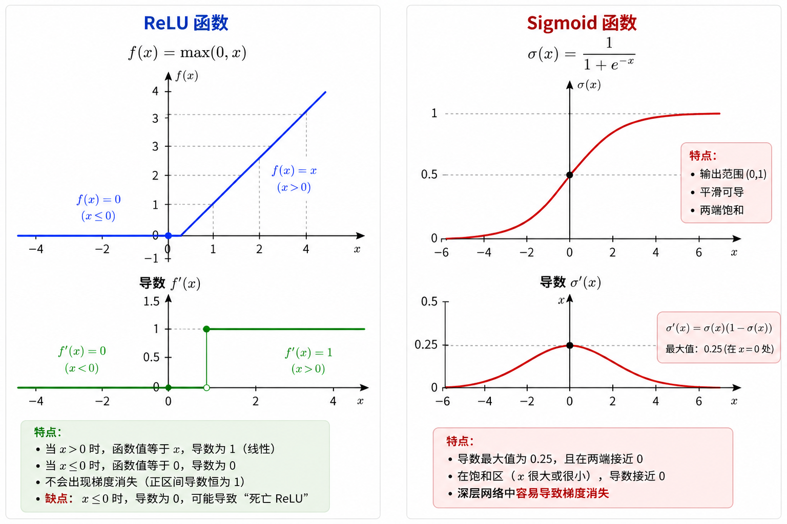

# AlexNet

AlexNet在2012年ImageNet挑战赛中取得了第一名的成绩. AlexNet以 Alex Krizhevsky的名字命名. AlexNet的网络结构如下图所示:

左边为 LetNet 网络结构, 右边为 AlexNet 网络结构. AlexNet 的网络结构比 LeNet 更深, 包含了更多的卷积层和全连接层. AlexNet 还引入了 ReLU 激活函数和 Dropout 技术来提高模型的性能和防止过拟合. AlexNet 的成功标志着深度学习在计算机视觉领域的突破, 并引发了后续更深更复杂的卷积神经网络的发展.

## 激活函数
AlexNet 使用了 ReLU (Rectified Linear Unit) 激活函数, 定义为
$$
\mathrm{ReLU}(x) = \max(0, x).
$$ 
ReLU 激活函数的优点是计算简单, 可以加速模型的训练过程, 并且在一定程度上缓解了梯度消失问题. ReLU 还具有稀疏激活的特性, 即在某些输入下会输出零, 这有助于提高模型的表达能力和泛化能力.

> **Q1: 为什么ReLU可以缓解梯度消失问题?**
> 
> *(Made by ChatGPT*)
> - 本质上一个 $L$ 层的神经网络可表示为 $y=f_L(f_{L-1}(\cdots f_1(x)))$, 由求导的链式法则可知
> $$
> \frac{\partial y}{\partial x} = f_L'(z_L)f'_{L-1}(z_{L-1})\cdots f'_1(z_1).
> $$
> 如果 $f_i$ 是 Sigmoid 或 Tanh 激活函数, 则 $f'_i(z_i)$ 的值在 $(0, 1)$ 之间, 当网络层数较多时, $\frac{\partial y}{\partial x}$ 的值会变得非常小, 导致梯度消失问题. 而 ReLU 激活函数的导数在 $x > 0$ 时为 1, 在 $x \leq 0$ 时为 0, 因此在正区间内不会导致梯度消失问题.

> **Q2: ReLU为什么具有稀疏激活的特性?**
> - ReLU 激活函数在输入小于或等于零时输出零,在输入大于零时输出输入值本身. 这意味着在某些输入下，ReLU 的输出会是零，这就形成了稀疏激活的特性. 稀疏激活有助于提高模型的表达能力和泛化能力, 因为它可以使模型更专注于重要的特征, 并且减少了不必要的计算和过拟合的风险.
> - 注意：不是越稀疏越好, ReLU 也有缺点.如果某些神经元长期输入都是负数，它们输出一直是 $0$, 梯度也可能一直是 $0$. 这就是所谓的死亡 ReLU：$x<0\Rightarrow f(x)=0,f'(x)=0$, 这个神经元可能再也学不动了. 所以后来有一些改进版本, 比如 Leaky ReLU：
> $$f(x)=\begin{cases}x,&x>0\\\\ \alpha x,&x\leq 0\end{cases}$$ 
> $\quad\quad~~$它在负半轴保留一个很小的斜率，避免神经元彻底死亡.

## Dropout
AlexNet 还引入了 Dropout 技术来防止过拟合. Dropout 的基本思想是在训练过程中随机丢弃一部分神经元的输出,以减少神经元之间的依赖关系. 在每次训练迭代中,Dropout 会以一定的概率 $p$ 将神经元的输出设置为零,从而使模型在训练过程中更具鲁棒性和泛化能力. 在测试阶段, Dropout 不会丢弃神经元的输出, 而是将神经元的输出乘以 $1-p$ 来保持输出的期望值不变. 

> **例**: 某个神经元输出为 $h$, 且在训练阶段使用了 Dropout, 以概率 $p$ 将该神经元的输出设置为零. 则它的平均输出为 $h(1-p) + 0 \cdot p = h(1-p)$. 在测试阶段, 为了保持输出的期望值不变, 需要将神经元的输出乘以 $1-p$, 即 $h(1-p)$.

Dropout 技术在 AlexNet 中被广泛应用于全连接层, 有效地减少了过拟合现象, 提高了模型的性能.

## AlexNet 各层的输出大小

- **输入层**: 输入图像大小为 $224 \times 224 \times 3$ (RGB 图像)
- **卷积层 1 (96)**: 参数为 $11 \times 11$ 的卷积核, 步长为 4
    $$
    \left\lfloor\frac{224 - 11}{4}\right\rfloor + 1 = 54
    $$
    输出大小为 $54 \times 54 \times 96$.
- **汇聚层 1**: 参数为 $3 \times 3$ 的汇聚核, 步长为 2
    $$
    \left\lfloor\frac{54 - 3}{2}\right\rfloor + 1 = 26
    $$
    输出大小为 $26 \times 26 \times 96$.
- **卷积层 2 (256)**: 参数为 $5 \times 5$ 的卷积核, 步长为 1, 填充为 2
    $$
    \left\lfloor\frac{26 +2\times2 - 5}{1}\right\rfloor + 1 = 26
    $$
    输出大小为 $26 \times 26 \times 256$.
- **汇聚层 2**: 参数为 $3 \times 3$ 的汇聚核, 步长为 2
    $$
    \left\lfloor\frac{26 - 3}{2}\right\rfloor + 1 = 12
    $$
    输出大小为 $12 \times 12 \times 256$.
- **卷积层 3 (384)**: 参数为 $3 \times 3$ 的卷积核, 步长为 1, 填充为 1
    $$
    \left\lfloor\frac{12 + 2\times1 - 3}{1}\right\rfloor + 1 = 12
    $$
    输出大小为 $12 \times 12 \times 384$.
- **卷积层 4 (384)**: 参数为 $3 \times 3$ 的卷积核, 步长为 1, 填充为 1
    $$
    \left\lfloor\frac{12 + 2\times1 - 3}{1}\right\rfloor + 1 = 12
    $$
    输出大小为 $12 \times 12 \times 384$.
- **卷积层 5 (256)**: 参数为 $3 \times 3$ 的卷积核, 步长为 1, 填充为 1
    $$
    \left\lfloor\frac{12 + 2\times1 - 3}{1}\right\rfloor + 1 = 12
    $$
    输出大小为 $12 \times 12 \times 256$.
- **汇聚层 3**: 参数为 $3 \times 3$ 的汇聚核, 步长为 2
    $$
    \left\lfloor\frac{12 - 3}{2}\right\rfloor + 1 = 5
    $$
    输出大小为 $5 \times 5 \times 256$.
- **全连接层 1 (4096)**: 输出大小为 $4096$.
- **全连接层 2 (4096)**: 输出大小为 $4096$.
- **全连接层 3 (1000)**: 输出大小为 $1000$.

> 参考: 
> - 机器学习方法, 李航
> - 动手学深度学习, 李沐等著