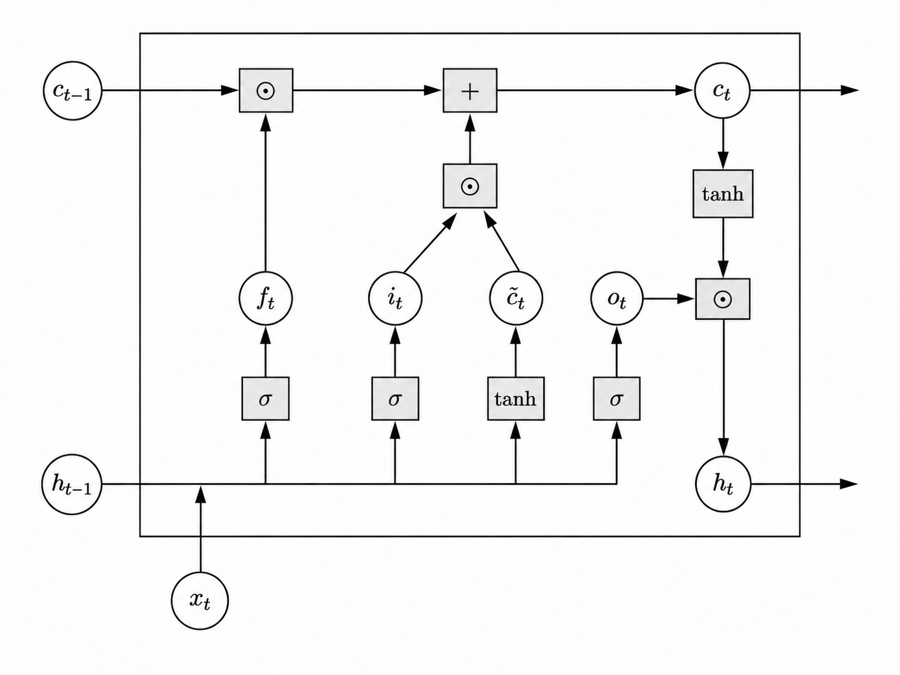

# LSTM

> S-RNN 对长距离依存关系处理能力有限, 问题主要有三点:
> - 梯度消失
> - 隐藏状态容量有限
>   
>   S-RNN 用一个固定长度的向量 $h_t$ 来表示历史信息. 随着序列变长, 早期信息容易被丢失.
> - 缺少显式的记忆控制机制

LSTM 由 Hochreiter 和 Schmidhuber 在 1997 年提出, 是一种改进的循环神经网络架构, 旨在解决 S-RNN 的上述问题.

LSTM 引入了两个机制: 记忆元 (memory cell) 和门控 (gated control). 其中门控包含遗忘门 (forget gate), 输入门 (input gate) 和输出门 (output gate). 这些机制使得 LSTM 能够更好地捕捉长距离依赖关系, 并且具有更强的记忆能力.

> **定义 (单元)** 在 RNN 的每一个位置上, 以当前位置的输入 $\boldsymbol x_t$ 和前一个位置的状态 $\boldsymbol h_{t-1}$ 作为输入, 输出当前状态 $\boldsymbol h_t$ 的函数称为单元 (unit).

## LSTM 的定义
设有一组序列数据 $\{\boldsymbol{x}_1, \boldsymbol{x}_2, \cdots, \boldsymbol{x}_T\}$, 其中 $\boldsymbol{x}_t$ 是在时间步 $t$ 的输入. 在 RNN 的每一个位置上都有状态和记忆元, 以及输入门、遗忘门和输出门, 构成一个单元.

第 $t$ 位置上的单元是以当前位置的输入 $\boldsymbol x_t$ 、之前位置的记忆元 $\boldsymbol c_{t-1}$ 和之前位置的状态 $\boldsymbol h_{t-1}$ 作为输入, 输出当前状态 $\boldsymbol h_t$ 和记忆元 $\boldsymbol c_t$的函数.

计算过程如下:
$$
\begin{aligned}
\boldsymbol{i}_t &= \sigma(\boldsymbol{U}_i \cdot \boldsymbol{h}_{t-1} + \boldsymbol{W}_i\boldsymbol{x}_t + \boldsymbol{b}_i) \\
\boldsymbol{f}_t &= \sigma(\boldsymbol{U}_f \cdot \boldsymbol{h}_{t-1} + \boldsymbol{W}_f\boldsymbol{x}_t + \boldsymbol{b}_f) \\
\boldsymbol{o}_t &= \sigma(\boldsymbol{U}_o \cdot \boldsymbol{h}_{t-1} + \boldsymbol{W}_o\boldsymbol{x}_t + \boldsymbol{b}_o) \\
\tilde{\boldsymbol{c}}_t &= \tanh(\boldsymbol{U}_c \cdot \boldsymbol{h}_{t-1} + \boldsymbol{W}_c\boldsymbol{x}_t + \boldsymbol{b}_c) \\
\boldsymbol{c}_t &= \boldsymbol{f}_t \odot \boldsymbol{c}_{t-1} + \boldsymbol{i}_t \odot \tilde{\boldsymbol{c}}_t \\
\boldsymbol{h}_t &= \boldsymbol{o}_t \odot \tanh(\boldsymbol{c}_t)
\end{aligned}
$$
其中, $i_t$ 是输入门, $f_t$ 是遗忘门, $o_t$ 是输出门, $\tilde{c}_t$ 是中间结果, $c_t$ 是当前记忆元, $h_t$ 是当前状态. $\sigma$ 是 sigmoid 函数, $\odot$ 表示Harmard积.

一般取 $\boldsymbol c_0=\boldsymbol 0, \boldsymbol h_0=\boldsymbol 0$.

> **推论:** 当前记忆元 $\boldsymbol c_t$ 是之前所有位置的中间结果 $\tilde{\boldsymbol c}_i$ 的线性组合.

*Proof* : 由 LSTM 的定义可知

$$
\begin{aligned}
\boldsymbol{c}_t&=\boldsymbol i_t\odot\tilde{\boldsymbol c}_t+\boldsymbol f_t\odot\boldsymbol c_{t-1}\\
&=\boldsymbol i_t\odot\tilde{\boldsymbol c}_t+\boldsymbol f_t\odot \left(\boldsymbol i_{t-1}\odot\tilde{\boldsymbol c}_{t-1}+\boldsymbol f_{t-1}\odot\boldsymbol c_{t-2}\right)\\
&=\boldsymbol i_t\odot\tilde{\boldsymbol c}_t+\left(\boldsymbol f_t\odot \boldsymbol i_{t-1}\right)\odot\tilde{\boldsymbol c}_{t-1}+\left(\boldsymbol f_t\odot\boldsymbol f_{t-1}\right)\odot\boldsymbol c_{t-2}\\
&=\cdots\\
&=\boldsymbol i_t\odot\tilde{\boldsymbol c}_t+\left(\boldsymbol f_t\odot \boldsymbol i_{t-1}\right)\odot\tilde{\boldsymbol c}_{t-1}+\left(\boldsymbol f_t\odot\boldsymbol f_{t-1}\odot \boldsymbol i_{t-2}\right)\odot\tilde{\boldsymbol c}_{t-2}+\cdots+\left(\boldsymbol f_t\odot\cdots\odot\boldsymbol f_3\odot\boldsymbol i_{2}\right)\odot\tilde{\boldsymbol c}_2+\left(\boldsymbol f_t\odot\cdots\odot\boldsymbol f_3\odot\boldsymbol f_{2}\right)\odot{\boldsymbol c}_1\\
\end{aligned}
$$
又 $\boldsymbol c_1=\boldsymbol i_1\odot\tilde{\boldsymbol c}_1$, 故
$$
\boldsymbol c_t=\boldsymbol i_t\odot\tilde{\boldsymbol c}_t+\sum_{i=1}^{t-1}\left(\prod_{j=i+1}^t\boldsymbol f_j\odot\boldsymbol i_i\right)\odot \tilde{\boldsymbol c}_i.
$$
记 $\boldsymbol w_t^{(t)}=\boldsymbol i_t,~\boldsymbol{w}_i^{(t)}=\prod_{j=i+1}^t\boldsymbol f_j\odot\boldsymbol i_i~(1\le i\le t-1)$, 则
$$
\boldsymbol c_t=\sum_{i=1}^{t}\boldsymbol w_i\odot \tilde{\boldsymbol c}_i.\tag*{$\square$}
$$

## LSTM 的优势

与 S-RNN 相比:

**(1) LSTM 缓解了梯度消失和梯度爆炸**
- 先看 S-RNN 

    S-RNN 可写成
    $$\boldsymbol h_t=\tanh\left(\boldsymbol r_t\right),\quad \boldsymbol{r}_t=\boldsymbol U\cdot\boldsymbol h_{t-1}+\boldsymbol W\cdot\boldsymbol x_t+\boldsymbol b$$
    于是,
    $$\frac{\partial\boldsymbol h_t}{\partial\boldsymbol h_{t-1}}=\text{diag}\left(\boldsymbol 1-\tanh^2\boldsymbol{r}_t\right)\boldsymbol U:=\boldsymbol{D}_t\boldsymbol U.$$
    因此,
    $$\frac{\partial L_T}{\partial \boldsymbol h_k}=\frac{\partial L_T}{\partial \boldsymbol h_T}\frac{\partial \boldsymbol{h}_T}{\partial \boldsymbol h_k}=\frac{\partial L_T}{\partial \boldsymbol h_T}\prod_{t=k+1}^T\frac{\partial \boldsymbol{h}_t}{\partial \boldsymbol h_{t-1}}=\frac{\partial L_T}{\partial \boldsymbol h_T}\prod_{t=k+1}^T\boldsymbol D_t\boldsymbol U.$$
    注意到
    $$\left\Vert\frac{\boldsymbol{h}_T}{\boldsymbol{h}_k}\right\Vert\le\prod_{t=k+1}^T\left\Vert\boldsymbol D_t\boldsymbol U\right\Vert\le\prod_{t=k+1}^T\left\Vert\boldsymbol D_t\right\Vert\left\Vert\boldsymbol U\right\Vert$$
    而 $\Vert\boldsymbol D_t\Vert\le 1$. 若长期来看 $\left\Vert\boldsymbol D_t\boldsymbol U\right\Vert<1$, 则指数衰减
    $$\left\Vert\frac{\partial L_T}{\partial \boldsymbol h_k}\right\Vert\to\boldsymbol{0}$$
    这就导致了梯度消失.

    若长期来看 $\left\Vert\boldsymbol D_t\boldsymbol U\right\Vert>1$, 则梯度可能指数增长, 这就导致了梯度爆炸.

- LSTM 的记忆元 $\boldsymbol{c}_t=\boldsymbol i_t\odot\tilde{\boldsymbol c}_t+\boldsymbol f_t\odot\boldsymbol c_{t-1}$, 于是
  $$\frac{\partial\boldsymbol c_t}{\partial\boldsymbol c_{t-1}}=\text{diag}(\boldsymbol f_t)$$
  而遗忘门 $\boldsymbol f_t=\sigma(\boldsymbol{U}_f \cdot \boldsymbol{h}_{t-1} + \boldsymbol{W})\in (\boldsymbol 0, \boldsymbol 1)$, 如果模型需要长期保留某些信息, 就可以学习到 $\boldsymbol f_t\approx \boldsymbol 1$, 于是 $\frac{\partial\boldsymbol c_t}{\partial\boldsymbol c_{t-1}}\approx\boldsymbol I$. 因此梯度沿记忆元 $\boldsymbol c_t$ 这条路径传播时, 不会被压缩, 从而缓解梯度消失.

  另一方面,
  $$\Vert\text{diag}(\boldsymbol{f}_t)\Vert_2=\max_j\vert f_t^{(j)}\vert<1$$
  因此沿着条路径的梯度不会被放大.

- LSTM 不能完全消除梯度消失和梯度爆炸问题, 它只是缓解这些现象.
  - 一方面, 遗忘门 $f_t^{(j)}$ 不一定总是接近 $1$, 如果某段时间内 $f_t^{(j)}=0.9$, 虽然接近 $1$, 但经过 $100$ 步以后, $0.9^{100}\approx2.66\times10^{-5}$, 梯度仍会明显衰减.
  - 另一方面, 完整的LSTM还有很多乘法路径, 如果其他路径的权重矩阵范数很大, 仍然会导致梯度爆炸.

**(2) LSTM 能选择性记忆和选择性遗忘**

## LSTM 的缺陷
**(1) 参数量大**

**(2) 计算复杂度高**

**(3) 难以并行计算**

# GRU

针对 LSTM 参数量大计算效率低的问题, 门控循环单元 GRU 对其进行了简化. GRU 只有两个门: 更新门 (update gate) 和重置门 (reset gate), 不使用记忆元.

## GRU的定义
GRU的单元由状态、重置门和更新门构成. 第 $t$ 个位置上的单元是以当前位置的输入 $\boldsymbol x_t$、之前位置的状态 $\boldsymbol h_{t-1}$为输入, 以当前位置的状态为输出的函数.

计算过程如下:
$$
\begin{align*}
    \boldsymbol{r}_t&=\sigma\left(\boldsymbol{U}_r\boldsymbol{h}_{t-1}+\boldsymbol{W}_r\boldsymbol{x}_t+\boldsymbol{b}_r\right)\\
    \boldsymbol{z}_t&=\sigma\left(\boldsymbol{U}_z\boldsymbol{h}_{t-1}+\boldsymbol{W}_z\boldsymbol{x}_t+\boldsymbol{b}_z\right)\\
    \tilde{\boldsymbol{h}}_t&=\tanh\left(\boldsymbol{U}_h\boldsymbol{r}_t\odot\boldsymbol{h}_{t-1}+\boldsymbol{W}_h\boldsymbol{x}_t+\boldsymbol{b}_h\right)\\
    \boldsymbol{h}_t&=(\boldsymbol{1}-\boldsymbol{z}_t)\odot\tilde{\boldsymbol{h}}_t+\boldsymbol{z}_t\odot\boldsymbol{h}_{t-1}
\end{align*}
$$
这里, $\boldsymbol r_t$ 是重置门, $\boldsymbol z_t$ 是更新门, $\tilde{\boldsymbol{h}}_t$ 是中间结果.

> 参考: 机器学习方法, 李航