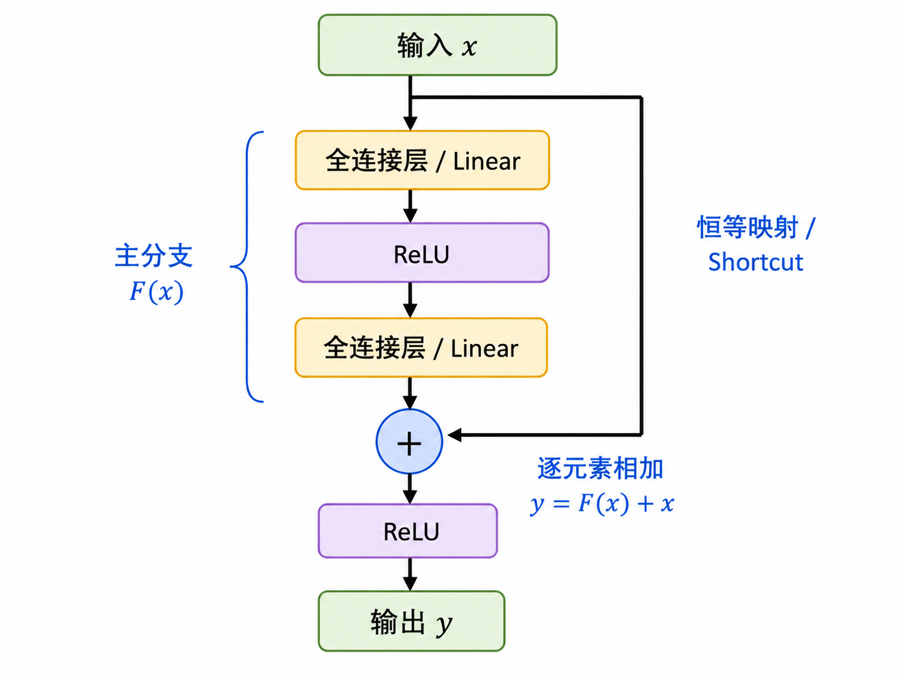
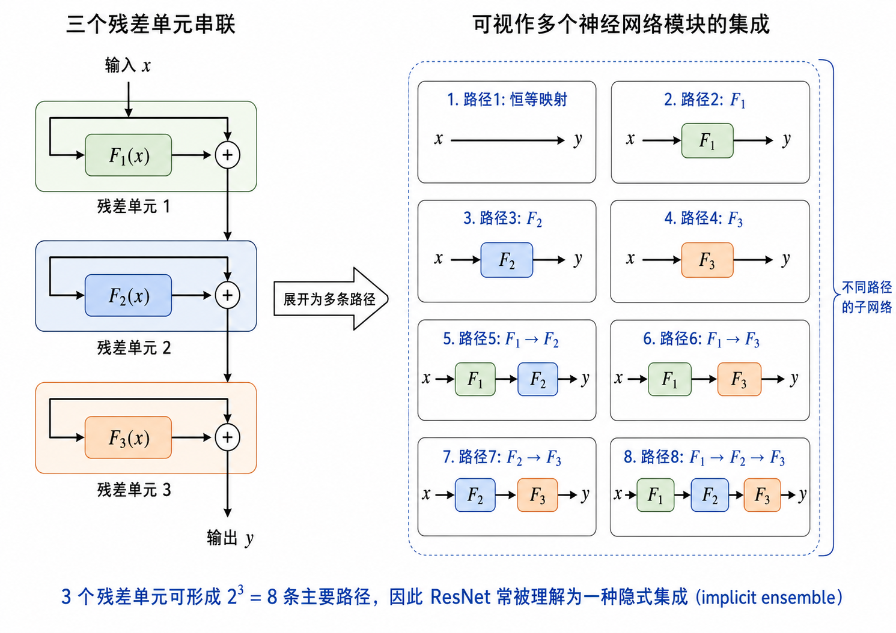
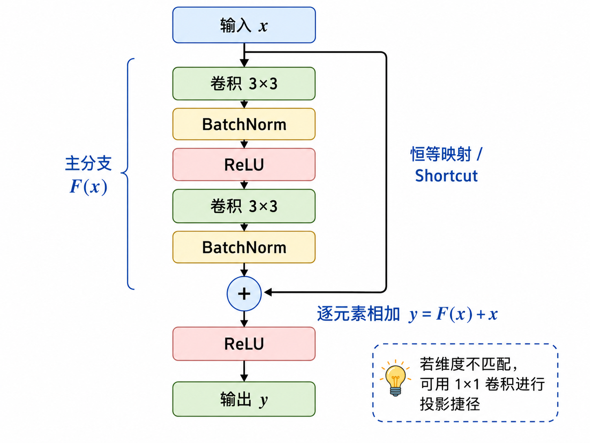
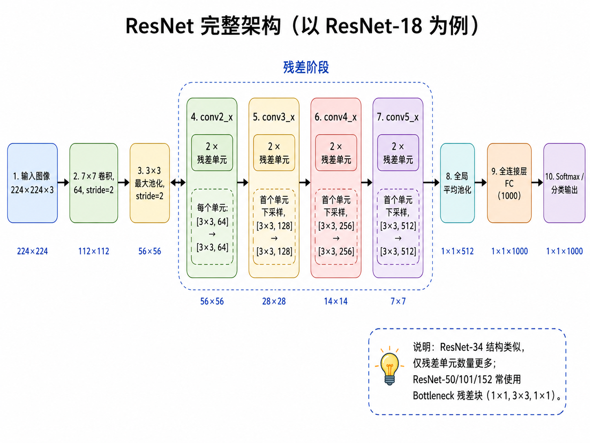

# ResNet
ResNet (Residual Network) 是一种深度卷积神经网络架构, 由 Kaiming He 等人在 2015 年提出, 它在2015年的 ImageNet 图片分类中取得了第一名. ResNet 的核心思想是引入残差连接 (residual connection), 通过跳过一些层来缓解深层网络中的梯度消失问题. 

假设要学习的真实模型为 $h(x)$, 深度学习通常是想要训练出一个神经网络 $f(x)$ 来近似 $h(x)$. 事实上, 真实模型也可写作

$$
h(x) = x + (h(x)-x).
$$

ResNet 的思想就是用一个神经网络 $f(x)$ 来近似残差 $h(x)-x$, 于是 $x+h(x)$ 就是 $h(x)$ 的近似.

ResNet 进行以下递归计算:

$$
\boldsymbol{x}_i = \boldsymbol{x}_{i-1} + f_i(\boldsymbol{x}_{i-1}),\quad i=1,2,\cdots,n,
$$

其中, $\boldsymbol x_i$ 是第 $i$ 层的输出, $f_i$ 称为第 $i$ 层的残差单元.

## 模型架构

### 基于前馈神经网络的残差网络

如图, 通过前馈神经网络可以实现残差单元函数

$$
F(x) = \boldsymbol{W_2}\text{relu}(\boldsymbol{W_1}x).
$$

于是输出为

$$
y = \text{relu}(x + F(x)) = \text{relu}(x + \boldsymbol{W_2}\text{relu}(\boldsymbol{W_1}x)).
$$


当输入 $x$ 与输出 $y$ 的维度不同时, 可以通过线性变换 $\boldsymbol{W_s}$ 来调整输入的维度, 使得输入和输出的维度一致. 于是输出为

$$
y = \text{relu}(\boldsymbol{W_s}x + F(x)) = \text{relu}(\boldsymbol{W_s}x + \boldsymbol{W_2}\text{relu}(\boldsymbol{W_1}x)).
$$


> **残差网络可以展开成多个神经网络的集成**
> 
>
> 假设有一个由 $3$ 个残差单元组成的残差神经网络, 输入是 $x_0$, 输出是 $x_3$. 则这个网络可以展开写作
> 

### 基于卷积神经网络的残差网络

做图像分类时, ResNet 使用卷积神经网络. 每个残差单元由 $2$ 个卷积层和残差连接组成.


$$
\boldsymbol{Y} = \text{relu}(\boldsymbol{X} + \boldsymbol{W}_2*(\text{relu}(\boldsymbol{W}_1*\boldsymbol{X}))).
$$


以 ResNet-18 为例, 它包含 $17$ 个卷积层, $2$ 个汇聚层. ResNet-18 的网络结构如下图所示:

