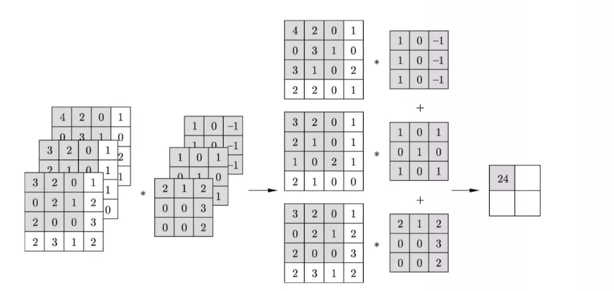
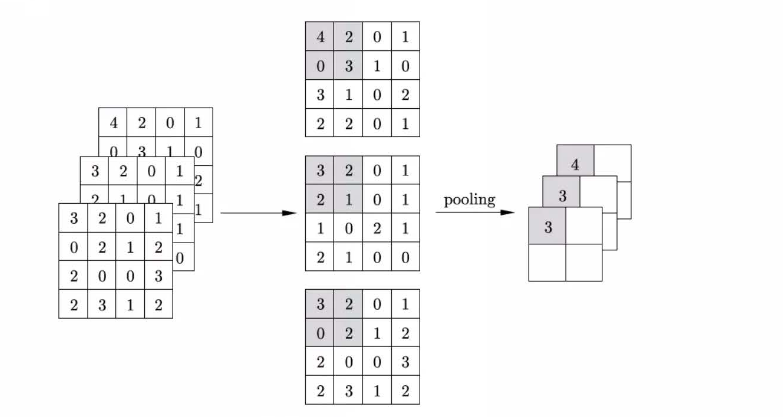
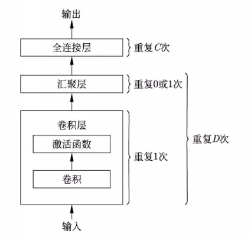

# 卷积神经网络 CNN

## 预备知识

### 卷积 (convolution)

**[定义 1 (二维卷积)]** 给定一个 $I\times J$ 输入矩阵 $\boldsymbol X=(x_{i,j})_{I\times J}$, 一个 $M\times N$ 核矩阵 $\boldsymbol W=(w_{m,n})_{M\times N}$, 满足 $M\ll I,~N\ll J$. 让核矩阵在输入矩阵从左到右再从上到下按顺序滑动, 在滑动的每一个位置, 核矩阵与输入矩阵的一个子矩阵重叠. 求核矩阵与每个子矩阵的 Frobenius 内积, 最终产生一个 $K\times l$ 输出矩阵 $\boldsymbol Y=(y_{k,l})_{K\times L}$, 称此运算为二维卷积. 写作
$$
\boldsymbol Y=\boldsymbol W*\boldsymbol X. \tag{1}
$$
且
$$
y_{kl}=\sum_{m=1}^M\sum_{n=1}^Nw_{m,n}x_{k+m-1,l+n-1},\tag{2}
$$
其中, $k=1,2,\cdots,K,\quad l=1,2,\cdots,L,\quad K=I-M+1,\quad L=J-N+1$.

为了使卷积更充分地作用于输入矩阵的边缘元素, 可以对卷积增加零填充 (zero padding) 或步幅 (stride) 操作:

- 零填充:
  $$
  \begin{pmatrix}
  3 & 2 & 0 & 1\\
  0 & 2 & 1 & 2\\
  2 & 0 & 0 & 3\\
  3 & 3 & 1 & 2
  \end{pmatrix}
  \overset{\text{zero padding}}{\longrightarrow}
  \begin{pmatrix}
  0 & 0 & 0 & 0 & 0 & 0\\
  0 & 3 & 2 & 0 & 1 & 0\\
  0 & 0 & 2 & 1 & 2 & 0\\
  0 & 2 & 0 & 0 & 3 & 0\\
  0 & 3 & 3 & 1 & 2 & 0\\
  0 & 0 & 0 & 0 & 0 & 0
  \end{pmatrix}
  $$

- 步幅: 设定卷积步幅 $step$, 则每次卷积计算会向右或向下移动 $step$ 列或 $step$ 行.

假设输入矩阵大小  $I\times J$, 卷积核 $M\times N$, 两个方向的填充大小为 $P$ 和 $Q$, 步幅大小为 $S$, 则输出矩阵的大小 $K\times L$ 满足
$$
K=\left\lfloor\frac{I+2P-M}{S}\right\rfloor+1,\quad L=\left\lfloor\frac{J+2Q-N}{S}\right\rfloor+1.
$$
当 $P=M-1,~Q=N-1$ 时, 称为全填充.

> 在图像处理中, 卷积实现的是特征检测. 以二维卷积为例, 卷积的输入矩阵表示灰度图像, 矩阵的一个元素对应图像的一个像素, 代表像素的灰度. 卷积的核矩阵表示特征, 比如物体的边缘, 矩阵的一个元素代表在一个像素点上的灰度 (权重), 一个卷积核表示一个特征. 卷积运算将卷积核在图像上进行滑动, 在图像的每一个位置对一个特定的特征进行检测, 输出一个检测值. 在卷积神经网络中卷积核的权重是通过学习得到的, 即学习得到的是特征检测的能力.

#### 三维卷积

三维卷积的输入和输出为张量表示的特征图 (矩阵表示的特征图可以看成一张特征图, 张量表示的特征图可以看成多张特征图, 后面统称特征图). 这样的特征图有高度、宽度、深度.

彩色图像数据可以看成一种特殊的特征图, 由红、绿、蓝三个通道的数据组成. 每个通道的数据由一个矩阵表示, 矩阵的每一个元素对应一个像素, 代表颜色的深度. 三个矩阵排列起来构成一个张量. 彩色图像三个通道的矩阵的行数和列数是特征图的高度和宽度, 通道数是特征图的深度. 用张量表示:
$$
\boldsymbol X=(\boldsymbol X_R,\boldsymbol X_G, \boldsymbol X_B),
$$
其中 $\boldsymbol X_R,\boldsymbol X_G, \boldsymbol X_B$ 是三个通道的数据, 各自用矩阵表示. 卷积核也用张量表示 $\boldsymbol W=(\boldsymbol W_R,\boldsymbol W_G, \boldsymbol W_B)$, 其中 $\boldsymbol W_R,\boldsymbol W_G, \boldsymbol W_B$ 是三个通道的 (二维) 卷积核, 也各自由矩阵表示. 则三维卷积可以由下式计算得到:
$$
\boldsymbol Y=\boldsymbol X*\boldsymbol W=\boldsymbol X_R*\boldsymbol W_R+\boldsymbol X_G*\boldsymbol W_G+\boldsymbol X_B*\boldsymbol W_B.
$$

### 汇聚 (pooling)

#### 二维汇聚

**[定义 2 (二维汇聚)]** 给定一个 $I\times J$ 输入矩阵 $\boldsymbol X=(x_{i,j})_{I\times J}$, 一个虚设的 $M\times N$ 核矩阵 $\boldsymbol W=(w_{m,n})_{M\times N}$, 满足 $M\ll I,~N\ll J$. 让核矩阵在输入矩阵从左到右再从上到下按顺序滑动, 将输入矩阵划分成若干个 $M\times N$ 的子矩阵, 这些子矩阵相互不重叠且完全覆盖整个输入矩阵. 对每一个子矩阵求最大值或平均值, 产生一个 $K\times l$ 输出矩阵 $\boldsymbol Y=(y_{k,l})_{K\times L}$, 称此运算为二维汇聚. 对子矩阵取最大值的汇聚称为最大汇聚 (max pooling), 取平均值的汇聚称为平均汇聚 (mean pooling). 即有
$$
y_{kl}=\max\limits_{\substack{m\in\{1,2,\cdots,M\}\\ n\in\{1,2,\cdots,N\}}}x_{k+m-1,l+n-1}
$$
或
$$
y_{kl}=\frac{1}{MN}\sum_{m=1}^M\sum_{n=1}^Nx_{k+m-1,l+n-1},
$$
其中, $k=1,2,\cdots,K,~ l=1,2,\cdots,L$, $K$ 和 $L$ 满足
$$
K=\frac IM,\quad L=\frac JN,
$$
这里假设 $M\vert I,~N\vert J$.

汇聚也可以进行零填充和增加步幅. 汇聚也称为下采样 (down sampling), 因为它使数据矩阵大小变小. 相反, 使数据矩阵大小变大的运算称为上采样 (upsampling).

> 在图像处理中, 汇聚实现的是特征选择. 对于二维汇聚, 输入矩阵是一个矩阵, 矩阵的一个元素表示一个特征, 代表特征的检测值. 汇聚运算实际是将汇聚核在输入矩阵上进行滑动, 从汇聚覆盖的特征检测值中选择一个最大值或平均值, 这样可以有效地进行特征抽取. 输出是一个缩小的矩阵, 也就是下采样.

#### 三维汇聚

三维汇聚的输入和输出都是张量表示的特征图. 对输入张量的各个矩阵进行汇聚, 再将结果按原顺序排列起来, 得到输出张量

## 模型定义

- 输入: 张量表示的数据
- 输出: 标量 (分类/回归的预测值)

### 卷积层

卷积层进行基于卷积函数的仿射变换和基于激活函数的非线性变换. 假设第 $l$ 层是卷积层, 则其计算如下:
$$
\boldsymbol Z^{(l)}=\boldsymbol W^{(l)}*\boldsymbol X^{(l-1)}+\boldsymbol b^{(l)},\tag{3}
$$

$$
\boldsymbol X^{(l)}=a(\boldsymbol Z^{(l)}).\tag{4}
$$

- $\boldsymbol X^{(l-1)}$ 为输入的 $I\times J\times K$ 张量
- $\boldsymbol X^{(l)}$ 为输出的 $I'\times J'\times K'$ 张量
- $\boldsymbol W^{(l)}$ 为卷积核的 $M\times N\times K\times K'$ 张量
  - $M\times N\times K$ 为单个卷积核的形状
  - $K'$ 为卷积核的数量
- $\boldsymbol b^{(l)}$ 为偏置 $I'\times J'\times K'$ 张量
- $\boldsymbol Z^{(l)}$ 为净输入的 $I'\times J'\times K'$ 张量
- $a(\cdot)$ 为激活函数

$(3)(4)$ 表示的变换可以看成第 $l$ 层的神经元

也可以将 $I\times J\times K$ 张量展开成 $K$ 个 $I\times J$ 矩阵, 将 $I'\times J'\times K'$ 张量展开成 $K'$ 个 $I'\times J'$ 矩阵, 于是卷积层计算可以写成
$$
\boldsymbol Z_{k'}^{(l)}=\sum_k\boldsymbol W_{k,k'}^{(l)}*\boldsymbol X_k^{(l-1)}+\boldsymbol b_{k'}^{(l)}
$$

$$
\boldsymbol X_{k'}^{(l)}=a\left(\boldsymbol Z_{k'}^{(l)}\right)
$$

- $\boldsymbol X_k^{(l-1)}$ 为输入的第 $k$ 个 $I\times J$ 矩阵

- $\boldsymbol X_{k'}^{(l)}$ 为输出的第 $k'$ 个 $I'\times J'$ 矩阵

- $\boldsymbol W_{K,K'}^{(l)}$ 为二维卷积核的第 $(k, k')$ 个 $M\times N$ 矩阵

  - $\boldsymbol W^{(l)}$ 可写成
    $$
    \boldsymbol W^{(l)}=
    \begin{pmatrix}
    \boldsymbol W_{1,1}^{(l)} & \boldsymbol W_{1,2}^{(l)} & \cdots & \boldsymbol W_{1,k'}^{(l)}\\
    \boldsymbol W_{2,1}^{(l)} & \boldsymbol W_{2,2}^{(l)} &\cdots & \boldsymbol W_{2,k'}^{(l)}\\
    \vdots&\vdots&&\vdots\\
    \boldsymbol W_{k,1}^{(l)} & \boldsymbol W_{k,2}^{(l)} &\cdots & \boldsymbol W_{k,k'}^{(l)}
    \end{pmatrix}
    $$

- $\boldsymbol b_{k'}^{(l)}$ 为偏置的第 $k'$ 个 $I'\times J'$ 矩阵

- $\boldsymbol Z_{k'}^{(l)}$ 为净输入的第 $k'$ 个  $I'\times J'$ 矩阵

### 汇聚层

假设第 $l$ 层是汇聚层, 则其计算如下:
$$
\boldsymbol X^{(l)}=\text{pooling}\left(\boldsymbol X^{(l-1)}\right)\tag{5}
$$

- $\boldsymbol X^{(l-1)}$ 为输入的 $I\times J\times K$ 张量
- $\boldsymbol X^{(l)}$ 为输出的 $I'\times J'\times K'$ 张量
- $\text{pooliong}(\cdot)$ 是汇聚运算

### 全连接层

全连接层的第 $l$ 层会进行仿射变换和非线性变换:
$$
\boldsymbol z^{(l)}=\boldsymbol W^{(l)}\boldsymbol x^{(l-1)}+\boldsymbol b^{(l)}\tag{6}
$$

$$
\boldsymbol x^{(l)}=a(\boldsymbol z^{(l)})\tag{7}
$$

- $\boldsymbol x^{(l-1)}$ 为张量展开得到 $N$ 维输入向量
- $\boldsymbol x^{(l)}$ 为 $M$ 维输出向量
- $\boldsymbol W^{(l)}$ 为 $M\times N$ 权重矩阵
- $\boldsymbol b^{(l)}$ 为 $M$ 维偏置向量
- $\boldsymbol z^{(l)}$ 为 $M$ 维净输入向量
- $a(\cdot)$ 为激活函数

全连接层的最后一层的输出是标量.

> **注:**
>
> - CNN 的所有参数都通过学习获得.
> - CNN 可以只有卷积层和全连接层 (步幅大于 $1$ 的卷积运算也可以起到下采样的作用, 以代替汇聚运算).
> - 为了达到更好地预测效果, 设计原则通常是使用更小的卷积核 ( 如 $3\times 3$ ) 和更深的结构, 前端使用少量的卷积核, 后端使用大量的卷积核.

## CNN 的学习算法

### 卷积导数

设函数 $f(\boldsymbol Z),~\boldsymbol Z=\boldsymbol W*\boldsymbol X$, 其中 $\boldsymbol X=(x_{ij})_{I\times J}$ 是输入矩阵, $\boldsymbol W=(w_{mn})_{M\times N}$ 是卷积核, $\boldsymbol Z=(z_{kl})_{K\times L}$ 是净输入矩阵, 则 $f(\boldsymbol Z)$ 对 $\boldsymbol W$ 的偏导数如下:
$$
\frac{\partial f(\boldsymbol Z)}{\partial w_{mn}}=\sum_{k=1}^K\sum_{l=1}^L\frac{\partial z_{kl}}{\partial w_{mn}}\frac{\partial f(\boldsymbol Z)}{z_{kl}}=\sum_{k=1}^K\sum_{l=1}^Lx_{k+m-1,l+n-1}\frac{\partial f(\boldsymbol Z)}{z_{kl}}.
$$
整体可写作
$$
\frac{f(\boldsymbol Z)}{\partial\boldsymbol W}=\frac{\partial f(\boldsymbol Z)}{\partial \boldsymbol Z}*\boldsymbol X.
$$
$f(\boldsymbol Z)$ 对 $\boldsymbol X$ 的偏导数如下:
$$
\frac{\partial f(\boldsymbol Z)}{\partial x_{ij}}=\sum_{k=1}^K\sum_{l=1}^L\frac{\partial z_{kl}}{\partial x_{ij}}\frac{\partial f(\boldsymbol Z)}{\partial z_{kl}}=\sum_{k=1}^K\sum_{l=1}^Lw_{i-k+1,j-l+1}\frac{\partial f(\boldsymbol Z)}{\partial z_{kl}}.
$$
整体可写作
$$
\frac{f(\boldsymbol X)}{\partial\boldsymbol W}=\text{rot}180\left(\frac{\partial f(\boldsymbol Z)}{\partial \boldsymbol Z}\right)*\boldsymbol W=\text{rot}180\left(\boldsymbol W\right)*\frac{\partial f(\boldsymbol Z)}{\partial \boldsymbol Z}.
$$
这里 $\text{rot}180()$ 表示矩阵 $180$ 度旋转.

### 反向传播算法

#### (1) 卷积层

设第 $l$ 层为卷积层, 则第 $l$ 层的第 $k'$ 个净输入矩阵 $\boldsymbol{Z}_{k'}^{(l)}$ 为
$$
\boldsymbol{Z}_{k'}^{(l)}=\sum_{k=1}^{K}\boldsymbol{W}_{k,k'}^{(l)}*\boldsymbol{X}_k^{(l-1)}+\boldsymbol{b}_{k'}^{(l)},
$$
其中,

- $\boldsymbol{X}_k^{(l-1)}$ 为第 $l$ 层的第 $k$ 个输入矩阵;
- $\boldsymbol{W}_{k,k'}^{(l)}$ 是第 $l$ 层的第 $k\times k'$ 个卷积核矩阵;
- $\boldsymbol{b}_{k'}^{(l)}$ 是第 $l$ 层的第 $k'$ 个偏置矩阵.

于是, 第 $k'$ 个输出矩阵 $\boldsymbol{X}_{k'}^{(l)}$ 为
$$
\boldsymbol{X}_{k'}^{(l)}=a\left(\boldsymbol{Z}_{k'}^{(l)}\right).
$$
由此可以进行从第 $l-1$ 层到第 $l$ 层的正向传播.

再考虑第 $l$ 层的梯度更新. 设第 $l$ 层的第 $k'$ 个误差矩阵 $\boldsymbol{\delta}_{k'}^{(l)}$ 为
$$
\boldsymbol{\delta}_{k'}^{(l)}=\frac{\partial L}{\partial \boldsymbol{Z}_{k'}^{(l)}}.
$$
它可以通过反向传播得到. 于是第 $l$ 层的第 $k\times k'$ 个卷积核矩阵 $\boldsymbol{W}_{k,k'}^{(l)}$ 和第 $k'$ 个偏置矩阵 $\boldsymbol{b}_{k'}^{(l)}$ 的梯度分别为 
$$
\begin{aligned}
\frac{\partial L}{\partial \boldsymbol{W}_{k,k'}^{(l)}}&=\frac{\partial L}{\partial \boldsymbol{Z}_{k'}^{(l)}}*\boldsymbol{X}_k^{(l-1)}=\boldsymbol{\delta}_{k'}^{(l)}*\boldsymbol{X}_k^{(l-1)},\\

\frac{\partial L}{\partial \boldsymbol{b}_{k'}^{(l)}}&=\boldsymbol{\delta}_{k'}^{(l)}.
\end{aligned}
$$
下面考虑第 $l$ 层到第 $l-1$ 层的反向传播. 设第 $l-1$ 层的第 $k$ 个误差矩阵 $\boldsymbol{\delta}_k^{(l-1)}$ 为
$$
\begin{aligned}
\boldsymbol{\delta}_k^{(l-1)}&=\frac{\partial L}{\partial \boldsymbol{Z}_k^{(l-1)}}\\
&=\frac{\partial L}{\partial\boldsymbol{X}_{k}^{(l-1)}}\frac{\partial\boldsymbol{X}_{k}^{(l-1)}}{\partial\boldsymbol{Z}_k^{(l-1)}}\\
&=\frac{\partial a}{\partial\boldsymbol Z_{k}^{(l-1)}}\circ\sum_{k'=1}^{K'}\text{rot}180\left(\boldsymbol{W}_{k,k'}^{(l)}\right)*\boldsymbol{\delta}_{k'}^{(l)}.
\end{aligned}
$$
其中 $\circ$ 表示 Hadamard 乘积 (element-wise product).

#### (2) 汇聚层

设第 $l$ 层为汇聚层, 则第 $l$ 层的第 $k$ 个输出矩阵 $\boldsymbol{X}_{k}^{(l)}$ 为
$$
\boldsymbol X_k^{(l)}=\boldsymbol Z_k^{(l)}=\text{pooling}\left(\boldsymbol{X}_k^{(l-1)}\right).
$$
由此可以进行从第 $l-1$ 层到第 $l$ 层的正向传播. 再考虑第 $l$ 层到第 $l-1$ 层的反向传播. 设第 $l$ 层的第 $k$ 个误差矩阵 
$$
\boldsymbol{\delta}_k^{(l)} = \frac{\partial L}{\partial \boldsymbol{Z}_k^{(l)}}.
$$
则第 $l-1$ 层的第 $k$ 个误差矩阵
$$
\begin{aligned}
\boldsymbol{\delta}_k^{(l-1)}&=\frac{\partial L}{\partial \boldsymbol{Z}_k^{(l-1)}}\\
&=\frac{\partial L}{\partial \boldsymbol{X}_k^{(l)}}\frac{\partial \boldsymbol{X}_k^{(l)}}{\partial \boldsymbol{Z}_k^{(l-1)}}\\
&=\frac{\partial a}{\partial\boldsymbol Z_k^{(l-1)}}\circ\text{up\_sample}\left(\boldsymbol{\delta}_k^{(l)}\right).
\end{aligned}
$$
其中 $\text{up\_sample}(\cdot)$ 是上采样函数, 是汇聚 (下采样) 的反向运算. 对于最大汇聚, 上采样函数会将误差矩阵中的每一个元素复制到对应的子矩阵中最大值的位置, 其他位置填充 $0$. 对于平均汇聚, 上采样函数会将误差矩阵中的每一个元素平均分配到对应的子矩阵中.

#### 算法

- 输入: 神经网络 $f(\boldsymbol X;\boldsymbol\theta)$, 一个样本 $(\boldsymbol X, \boldsymbol y)$
- 输出: 更新的参数 $\boldsymbol\theta$
- 参数: 学习率 $\alpha$

1. 正向传播: 计算各层输出 $\boldsymbol{X}^{(1)}, \boldsymbol{X}^{(2)}, ..., \boldsymbol{X}^{(s)}$
    
    $$\boldsymbol{X}^{(0)} = \boldsymbol{X}$$
    
    - for $t = 1, 2, ..., s$ do

        $$\boldsymbol{Z}^{(t)} = \boldsymbol{W}^{(t)} * \boldsymbol{X}^{(t-1)} + \boldsymbol{b}^{(t)},\quad \boldsymbol{X}^{(t)} = a(\boldsymbol{Z}^{(t)})$$
    - end for

2. 反向传播: 计算各层误差矩阵 $\boldsymbol{\delta}^{(1)}, \boldsymbol{\delta}^{(2)}, ..., \boldsymbol{\delta}^{(s)}$
    $$\boldsymbol{\delta}^{(s)} = \nabla_{\boldsymbol{X}^{(s)}} L(\boldsymbol{X}^{(s)},\boldsymbol{y})$$
    - for $t = s, s-1, ..., 1$ do
        $$\boldsymbol{\delta}^{(t)} = \frac{\partial a}{\partial \boldsymbol{Z}^{(t)}} \circ \boldsymbol{\delta}^{(t)}$$
        计算第 $t$ 层的参数梯度
        $$\nabla_{\boldsymbol{W}^{(t)}} L = \boldsymbol{\delta}^{(t)} * \boldsymbol{X}^{(t-1)},\quad \nabla_{\boldsymbol{b}^{(t)}} L = \boldsymbol{\delta}^{(t)}$$
        利用梯度下降法更新参数
        $$\boldsymbol{W}^{(t)} \leftarrow \boldsymbol{W}^{(t)} - \alpha \nabla_{\boldsymbol{W}^{(t)}} L,\quad \boldsymbol{b}^{(t)} \leftarrow \boldsymbol{b}^{(t)} - \alpha \nabla_{\boldsymbol{b}^{(t)}} L$$
      - if $t > 1$ then
        计算第 $t-1$ 层的误差矩阵 (误差传递)
        $$\boldsymbol{\delta}^{(t-1)} = \sum_{k'}\text{rot}180(\boldsymbol{W}_{k'}^{(t)})*\boldsymbol{\delta}^{(t)}$$
      - end if
    - end for
3. 返回更新的参数 $\boldsymbol\theta$

> 参考: 机器学习方法, 李航