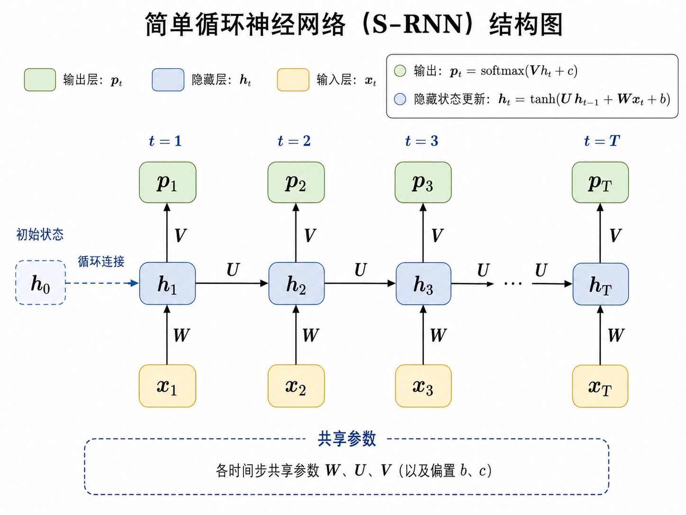
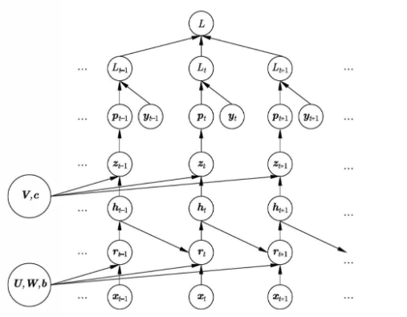

# 循环神经网络基本模型

## 简单循环神经网络 (S-RNN) 的定义

简单循环神经网络 (Simple Recurrent Neural Network, S-RNN) 是一种基本的循环神经网络架构, 由 Elman 在 1990 年提出. 

设有一组序列数据 $\{\boldsymbol{x}_1, \boldsymbol{x}_2, \cdots, \boldsymbol{x}_T\}$, 其中 $\boldsymbol{x}_t$ 是在时间步 $t$ 的输入. 每一个时间点上使用同一个神经网络结构. 

### 隐层
在 $t$ 时刻 ($t=1,2,\cdots,T$), 神经网络的隐层或中间层以 $\boldsymbol x_t$ 和 $\boldsymbol h_{t-1}$ 作为输入, 输出 $\boldsymbol h_t$:
$$
\boldsymbol{h}_t = \tanh(\boldsymbol{U}\cdot\boldsymbol{h}_{t-1} + \boldsymbol{W}\cdot\boldsymbol{x}_t + \boldsymbol{b}),
$$
其中, 
- $\boldsymbol x_t = (x_{t1}, x_{t2}, \cdots, x_{td})^T$ 是实向量; 
- $\boldsymbol h_{t-1} = (h_{t-1,1}, h_{t-1,2}, \cdots, h_{t-1,m})^T$ 表示第 $t-1$ 个位置的状态, 也是实向量, 通常假定 $\boldsymbol h_0 = \boldsymbol 0$; 
- $\boldsymbol U, \boldsymbol W$ 是权重矩阵, $\boldsymbol b$ 是偏置项.

### 输出层

神经网络的输出层以 $\boldsymbol h_t$ 作为输入, 输出 $\boldsymbol p_t$:
$$
\boldsymbol{p}_t = \text{softmax}(\boldsymbol{V}\cdot\boldsymbol{h}_t + \boldsymbol{c}),
$$
其中,
- $\boldsymbol p_t = (p_{t1}, p_{t2}, \cdots, p_{tk})^T$ 是一个概率向量, 表示在时间步 $t$ 的输出;
- $\boldsymbol V$ 是权重矩阵, $\boldsymbol c$ 是偏置项.

##  学习算法

先总结一下 S-RNN 的计算过程:
$$
\begin{aligned}
\boldsymbol{r}_t &= \boldsymbol{U}\cdot\boldsymbol{h}_{t-1} + \boldsymbol{W}\cdot\boldsymbol{x}_t + \boldsymbol{b},\\
\boldsymbol{h}_t &= \tanh(\boldsymbol{r}_t),\\
\boldsymbol{z}_t &= \boldsymbol{V}\cdot\boldsymbol{h}_t + \boldsymbol{c},\\
\boldsymbol{p}_t &= \text{softmax}(\boldsymbol{z}_t).
\end{aligned}
$$
其中, $\boldsymbol r_t$ 和 $\boldsymbol z_t$ 都是净输入向量.

分两个部分计算参数的梯度

### 先计算 $\frac{\partial L}{\partial \boldsymbol{z}_t}$ 和 $\frac{\partial L}{\partial \boldsymbol{r}_t}$

- $\frac{\partial L}{\partial \boldsymbol{z}_t}=\frac{\partial L}{\partial L_t}\frac{\partial L_t}{\partial \boldsymbol z_t}=\frac{\partial L_t}{\partial \boldsymbol z_t}$
  
  注意到 $L_t = -\sum_{j=1}^k y_{t,j}\log p_{t,j}$, 则
  $$
    \frac{\partial L_t}{\partial z_{t,j}} = \sum_{l=1}^k \frac{\partial L_t}{\partial p_{t,l}}\frac{\partial p_{t,l}}{\partial z_{t,j}} = \sum_{l=1}^k -\frac{y_{t,l}}{p_{t,l}}p_{t,l}(\delta_{lj}-p_{t,j}) = p_{t,j}-y_{t,j}.
  $$
  故
  $$
    \frac{\partial L}{\partial \boldsymbol{z}_t} = \boldsymbol{p}_t - \boldsymbol{y}_t.
  $$
- 再计算 $\frac{\partial L}{\partial \boldsymbol{r}_t}$
  - 当 $t=T$ 时,
    $$
    \begin{aligned}
     &\frac{\partial L}{\partial \boldsymbol{r}_{T,i}} = \sum_j\frac{\partial L}{\partial \boldsymbol{z}_{T,j}}\frac{\partial \boldsymbol{z}_{T,j}}{\partial \boldsymbol{r}_{T,i}} = \sum_j (p_{T,j} - y_{T,j}) \cdot v_{j,i}\cdot \frac{\partial z_{T,j}}{\partial r_{T,i}}\\
     \Rightarrow &\frac{\partial L}{\partial \boldsymbol{r}_T}= \text{diag}(1-\tanh^2(\boldsymbol{r}_T))\boldsymbol{V}^T(\boldsymbol{p}_T - \boldsymbol{y}_T).
    \end{aligned}
    $$
  - 当 $1\le t<T$ 时,
    $$
    \begin{aligned}
     \frac{\partial L}{\partial \boldsymbol{r}_{t}} &= \frac{\partial L}{\partial \boldsymbol{z}_{t}}\frac{\partial \boldsymbol z_{t}}{\partial \boldsymbol{r}_{t}} + \frac{\partial L}{\partial \boldsymbol{r}_{t+1}}\frac{\partial \boldsymbol{r}_{t+1}}{\partial \boldsymbol{r}_{t}}\\
        &= \text{diag}(1-\tanh^2(\boldsymbol{r}_t))\boldsymbol{V}^T(\boldsymbol{p}_t - \boldsymbol{y}_t) + \text{diag}(1-\tanh^2(\boldsymbol{r}_t))\boldsymbol{U}^T\frac{\partial L}{\partial \boldsymbol{r}_{t+1}}\\
    \end{aligned}
    $$ 
### 再计算 $\frac{\partial L}{\partial \boldsymbol{U}}$, $\frac{\partial L}{\partial \boldsymbol{W}}$, $\frac{\partial L}{\partial \boldsymbol{V}}$, $\frac{\partial L}{\partial \boldsymbol{b}}$, $\frac{\partial L}{\partial \boldsymbol{c}}$

$$
\begin{aligned}
\frac{\partial L}{\partial \boldsymbol{U}} &= \sum_{t=1}^T \frac{\partial L}{\partial \boldsymbol{r}_t}\frac{\partial \boldsymbol{r}_t}{\partial \boldsymbol{U}} = \sum_{t=1}^T \frac{\partial L}{\partial \boldsymbol{r}_t}\cdot \boldsymbol{h}_{t-1}^T,\\
\frac{\partial L}{\partial \boldsymbol{W}} &= \sum _{t=1}^T \frac{\partial L}{\partial \boldsymbol{r}_t}\frac{\partial \boldsymbol{r}_t}{\partial \boldsymbol{W}} = \sum_{t=1}^T \frac{\partial L}{\partial \boldsymbol{r}_t}\cdot \boldsymbol{x}_{t}^T,\\
\frac{\partial L}{\partial \boldsymbol{V}} &= \sum_{t=1}^T \frac{\partial L}{\partial \boldsymbol{z}_t}\frac{\partial \boldsymbol{z}_t}{\partial \boldsymbol{V}} = \sum_{t=1}^T \frac{\partial L}{\partial \boldsymbol{z}_t}\cdot \boldsymbol{h}_{t}^T,\\
\frac{\partial L}{\partial \boldsymbol{b}} &= \sum_{t=1}^T \frac{\partial L}{\partial \boldsymbol{r}_t}\frac{\partial \boldsymbol{r}_t}{\partial \boldsymbol{b}}    = \sum_{t=1}^T \frac{\partial L}{\partial \boldsymbol{r}_t},\\
\frac{\partial L}{\partial \boldsymbol{c}} &= \sum_{t=1}^T \frac{\partial L}{\partial \boldsymbol{z}_t}\frac{\partial \boldsymbol{z}_t}{\partial \boldsymbol{c}}    = \sum_{t=1}^T \frac{\partial L}{\partial \boldsymbol{z}_t}.
\end{aligned}
$$

## 反向传播算法的缺点
- 反向传播算法在训练循环神经网络时可能会遇到梯度消失或梯度爆炸的问题. 当网络层数较多时, 反向传播过程中计算的梯度可能会变得非常小 (梯度消失) 或非常大 (梯度爆炸), 导致模型难以收敛或训练不稳定.
- 反向传播算法需要存储每个时间步的中间计算结果, 当序列长度较长时, 可能会占用大量的内存资源.

> 参考: 机器学习方法, 李航.