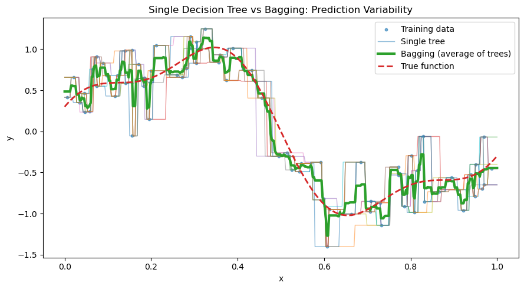
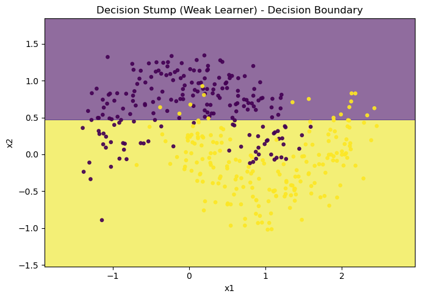
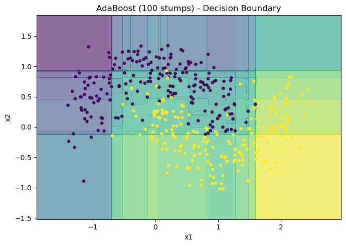
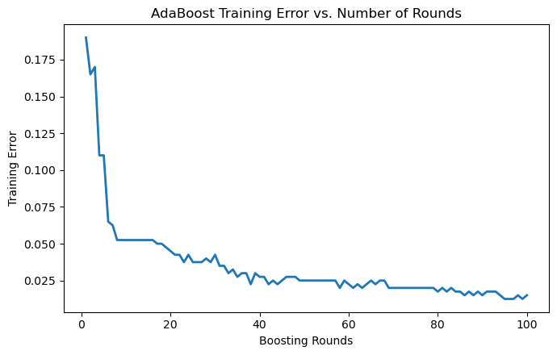
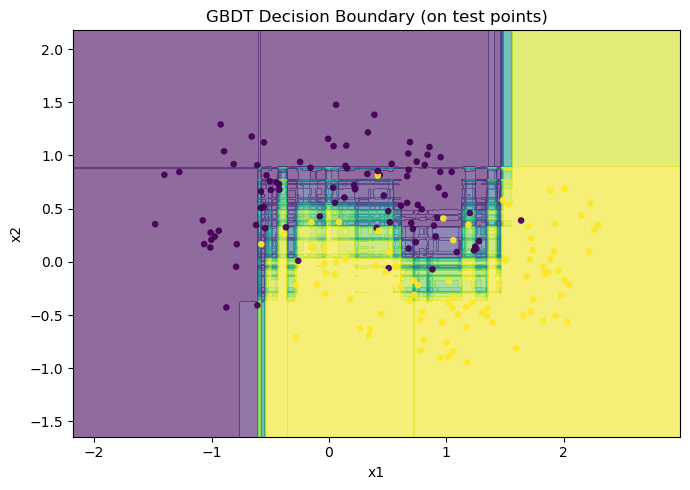
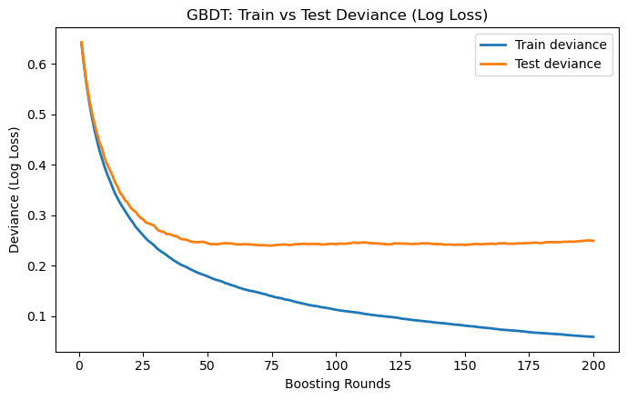
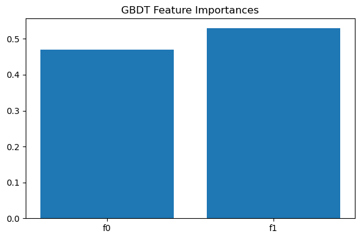

# 集成学习方法概述
集成学习的核心在于组合多个弱模型, 得到一个比单一模型更强的模型. 集成学习有三大类方法: Bagging (Bootstrap Aggregating), Boosting, Stacking.

## Baaging
对于数据集采用“有放回抽样”的方式得到多个子数据集, 训练多个分类器, 最终通过投票/平均来得到结果. 通过此方法可以降低模型预测误差的方差, 减小过拟合.

设每个基学习期预测误差 $\varepsilon_i$ 的方差为 $\sigma^2$, 且基学习器之间相互独立, 那么 Bagging 后的方差为:
$$
Var_{bagging}=\frac{\sigma^2}{k},
$$
其中 $k$ 为基学习器的个数. 不难看出, 随着 $k$ 的增加, 方差会显著降低. 即使基学习器之间有相关性, Bagging 仍能降低一部分方差, 只是效果会减弱.

代表方法: 随机森林 —— 集成多棵决策树.

### 实例
单个决策树 vs Bagging 后预测波动.
```python
import numpy as np
import matplotlib.pyplot as plt
from sklearn.tree import DecisionTreeRegressor
from sklearn.utils import resample

# 1) Generate synthetic data
rng = np.random.RandomState(42)
n_samples = 80
X = np.sort(rng.rand(n_samples))[:, None]  # shape (n, 1) in [0,1]
# True function
def f(x):
    return np.sin(2 * np.pi * x) + 0.3 * np.cos(5 * np.pi * x)

y = f(X.ravel()) + rng.normal(scale=0.25, size=n_samples)

# 2) Fit many single decision trees on bootstrap samples
n_estimators = 50
trees = []
for _ in range(n_estimators):
    X_b, y_b = resample(X, y, replace=True, random_state=rng.randint(0, 10_000))
    tree = DecisionTreeRegressor(random_state=rng.randint(0, 10_000))
    tree.fit(X_b, y_b)
    trees.append(tree)

# 3) Predictions on a dense grid
xx = np.linspace(0, 1, 400)[:, None]
preds = np.column_stack([t.predict(xx) for t in trees])  # shape (400, n_estimators)
bagging_mean = preds.mean(axis=1)

# 4) Plot: single-tree predictions vs bagging average
plt.figure(figsize=(9, 5))

# scatter training data (small markers)
plt.scatter(X.ravel(), y, s=10, alpha=0.6, label="Training data")

# plot several individual tree predictions (to avoid clutter, show first ~12)
for i in range(min(12, n_estimators)):
    plt.plot(xx.ravel(), preds[:, i], linewidth=1, alpha=0.5, label="Single tree" if i == 0 else None)

# plot bagging average (thicker)
plt.plot(xx.ravel(), bagging_mean, linewidth=3, label="Bagging (average of trees)")

# plot ground truth
plt.plot(xx.ravel(), f(xx.ravel()), linestyle="--", linewidth=2, label="True function")

plt.title("Single Decision Tree vs Bagging: Prediction Variability")
plt.xlabel("x")
plt.ylabel("y")
plt.legend(loc="best")
plt.tight_layout()
plt.show()
```


## Boosting
Boosting 算法的核心思想为
- 将多个弱学习器**串行训练**.
- 每个新模型都会关注并纠正前一轮模型预测错误的样本.
- 最终将所有弱学习期的结果加权组合, 得到一个强学习器.

### AdaBoost (Adaptive Boosting)
AdaBoost 训练时会提高前一轮弱学习器错误分类的的样本的权重, 而降低正确分类的样本的权重.

机制:
- 初始时, 所有样本权重相同.
- 训练弱分类器, 计算加权误差率.
- 错分样本权重增加, 使下一个分类器更关注这些样本.
- 个给每个弱分类器分配一个权重 (误差越小, 权重越大).
- 最终结果是弱分类器的加权投票/求和.

缺点: 对噪声和异常值敏感. 因为噪声点/异常点往往是不可预测/难以拟合的, AdaBoost 机制会把这些点看作"重要样本", 不断提升它们的权重, 后续的弱学习器被迫去"死磕"这些点, 从而导致过拟合噪声(模型复杂度上升, 决策边界扭曲), 泛化能力下降(测试集表现变差).

#### 实例
用决策树作为弱分类器训练 AdaBoost.
```python
# AdaBoost demo: Decision stump vs AdaBoost on a 2D toy dataset
# ------------------------------------------------------------
# 1) Decision boundary of a single decision stump (weak learner).
# 2) Decision boundary of an AdaBoost classifier (many stumps).
# 3) Training error vs. number of boosting rounds.

import numpy as np
import matplotlib.pyplot as plt
from sklearn.datasets import make_moons
from sklearn.tree import DecisionTreeClassifier
from sklearn.ensemble import AdaBoostClassifier
from sklearn.metrics import zero_one_loss

# 1) Create a toy 2D dataset
X, y = make_moons(n_samples=400, noise=0.25, random_state=42)

# 2) A single weak learner: decision stump (depth=1)
stump = DecisionTreeClassifier(max_depth=1, random_state=42)
stump.fit(X, y)

# 3) AdaBoost with decision stumps
n_estimators = 100
ada = AdaBoostClassifier(
    estimator=DecisionTreeClassifier(max_depth=1, random_state=42),
    n_estimators=n_estimators,
    learning_rate=0.8,
    algorithm="SAMME.R",
    random_state=42,
)
ada.fit(X, y)

# Helper to plot decision boundary
def plot_decision_boundary(model, X, y, title):
    # mesh
    x_min, x_max = X[:, 0].min() - 0.5, X[:, 0].max() + 0.5
    y_min, y_max = X[:, 1].min() - 0.5, X[:, 1].max() + 0.5
    xx, yy = np.meshgrid(np.linspace(x_min, x_max, 400),
                         np.linspace(y_min, y_max, 400))
    grid = np.c_[xx.ravel(), yy.ravel()]
    # predict proba if available, else predict
    if hasattr(model, "predict_proba"):
        Z = model.predict_proba(grid)[:, 1]
    else:
        Z = model.predict(grid)
    Z = Z.reshape(xx.shape)

    plt.figure(figsize=(7, 5))
    # contourf without explicit colors
    cs = plt.contourf(xx, yy, Z, alpha=0.6, levels=20)
    plt.scatter(X[:, 0], X[:, 1], c=y, s=14, alpha=0.9)  # default colormap
    plt.title(title)
    plt.xlabel("x1")
    plt.ylabel("x2")
    plt.tight_layout()
    plt.show()

# Chart 1: single stump boundary
plot_decision_boundary(stump, X, y, "Decision Stump (Weak Learner) - Decision Boundary")

# Chart 2: AdaBoost boundary
plot_decision_boundary(ada, X, y, "AdaBoost (100 stumps) - Decision Boundary")

# Chart 3: training error vs. boosting rounds
errors = []
for y_pred in ada.staged_predict(X):
    errors.append(zero_one_loss(y, y_pred))

plt.figure(figsize=(7, 4.5))
plt.plot(range(1, n_estimators + 1), errors, linewidth=2)
plt.title("AdaBoost Training Error vs. Number of Rounds")
plt.xlabel("Boosting Rounds")
plt.ylabel("Training Error")
plt.tight_layout()
plt.show()
```




### GBDT (Gradient Boosting Decision Tree)
GBDT 的基学习器通常是 CART 回归树. 它的核心思想是: 每一轮不是直接拟合标签, 而是拟合上一轮预测的残差, 即利用梯度下降思想逐步优化目标函数.

#### CART (Classification And Regression Tree)
CART 是一种二叉树模型, 可以用于分类也可以用于回归. 其构建过程如下:
- 划分节点
  - 给定一个特征和一个划分点, 把样本分成左右两部分.
  - 目标: 选择使得分裂后平方误差最小的划分点.
  $$
    \min\limits_{j,s}\left(\sum_{x_i\in R_1(j,s)}(y_i-c_1)^2+\sum_{x_i\in R_2(j,s)}(y_i-c_2)^2\right),
  $$
  其中, $j$ 为选择的特征, $s$ 为分裂阈值, $R_1,R_2$ 为划分后的区域, $c_1,c_2$ 为对应区域的均值.
- 确定叶节点的预测值
  - 在某个区域 $R_m$ 内, 预测值就是该区域样本点的平均值:
  $$ c_m=\frac{1}{|R_m|}\sum_{x_i\in R_m}y_i$$
- 递归构建
  - 对每个子节点继续分裂, 直至满足停止条件 (如节点样本数过小、误差减小不足).
- 剪枝
  - 为了避免过拟合, 需要对过深的树进行剪枝, 保留泛化性能更好的子树.

#### GBDT 算法流程
- 初始化模型
  - 用常数模型作为初始预测:
  $$F_0(x)=\arg\min\limits_{\gamma}\sum_{i}L(y_i,\gamma)$$
- 迭代训练 ($m=1,2,\cdots,M$)
  - 计算损失函数对当前预测的负梯度作为残差近似:
  $$r_{im}=-\left[\frac{\partial L(y_i,F(x_i))}{\partial F(x_i)}\right]_{F(x)=F_{m-1}(x)}$$
  - 训练一棵 CART 树 $h_m(x)$ 拟合残差 $r_{im}$.
  - 计算叶节点的最佳输出值 $\gamma_{jm}$.
  - 更新模型:
  $$F_m(x)=F_{m-1}(x)+\nu\cdot h_m(x)$$
  其中 $\nu$ 为学习率.
- 最终模型
$$F_M(x)=\sum_{m=1}^M\nu\cdot h_m(x).$$

GBDT 算法精度高、泛化能力好, 但是训练速度慢, 参数较多, 需要要调参, 对噪声敏感.

#### 实例
```python
# Re-running the full demo (state was reset)

import numpy as np
import matplotlib.pyplot as plt
from sklearn.datasets import make_moons
from sklearn.model_selection import train_test_split
from sklearn.ensemble import GradientBoostingClassifier
from sklearn.metrics import accuracy_score, classification_report, log_loss

# Data
X, y = make_moons(n_samples=600, noise=0.3, random_state=0)
X_train, X_test, y_train, y_test = train_test_split(X, y, test_size=0.3, random_state=42, stratify=y)

# Model
gbdt = GradientBoostingClassifier(
    n_estimators=200,
    learning_rate=0.08,
    max_depth=3,
    subsample=0.9,
    random_state=42
)
gbdt.fit(X_train, y_train)

# Decision boundary
def plot_decision_boundary(model, X, y, title):
    x_min, x_max = X[:, 0].min() - 0.7, X[:, 0].max() + 0.7
    y_min, y_max = X[:, 1].min() - 0.7, X[:, 1].max() + 0.7
    xx, yy = np.meshgrid(np.linspace(x_min, x_max, 400),
                         np.linspace(y_min, y_max, 400))
    grid = np.c_[xx.ravel(), yy.ravel()]
    Z = model.predict_proba(grid)[:, 1].reshape(xx.shape)

    plt.figure(figsize=(7, 5))
    plt.contourf(xx, yy, Z, levels=20, alpha=0.6)
    plt.scatter(X[:, 0], X[:, 1], c=y, s=14, alpha=0.9)
    plt.title(title)
    plt.xlabel("x1")
    plt.ylabel("x2")
    plt.tight_layout()
    plt.show()

plot_decision_boundary(gbdt, X_test, y_test, "GBDT Decision Boundary (on test points)")

# Train vs Test deviance
train_logloss = []
test_logloss = []
for proba in gbdt.staged_predict_proba(X_train):
    train_logloss.append(log_loss(y_train, proba))
for proba in gbdt.staged_predict_proba(X_test):
    test_logloss.append(log_loss(y_test, proba))

plt.figure(figsize=(7, 4.5))
plt.plot(range(1, len(train_logloss) + 1), train_logloss, linewidth=2, label="Train deviance")
plt.plot(range(1, len(test_logloss) + 1), test_logloss, linewidth=2, label="Test deviance")
plt.title("GBDT: Train vs Test Deviance (Log Loss)")
plt.xlabel("Boosting Rounds")
plt.ylabel("Deviance (Log Loss)")
plt.legend()
plt.tight_layout()
plt.show()

# Feature importances
importances = gbdt.feature_importances_
plt.figure(figsize=(6, 4))
plt.bar(range(len(importances)), importances)
plt.xticks(range(len(importances)), [f"f{i}" for i in range(X.shape[1])])
plt.title("GBDT Feature Importances")
plt.tight_layout()
plt.show()

# Metrics
y_pred = gbdt.predict(X_test)
acc = accuracy_score(y_test, y_pred)
from sklearn.metrics import confusion_matrix
cm = confusion_matrix(y_test, y_pred)

print("Test Accuracy:", round(acc, 4))
print("\nClassification Report:\n", classification_report(y_test, y_pred, digits=3))
print("\nConfusion Matrix:\n", cm)
```



```
Test Accuracy: 0.9

Classification Report:
               precision    recall  f1-score   support

           0      0.939     0.856     0.895        90
           1      0.867     0.944     0.904        90

    accuracy                          0.900       180
   macro avg      0.903     0.900     0.900       180
weighted avg      0.903     0.900     0.900       180


Confusion Matrix:
 [[77 13]
 [ 5 85]]
```

### XGBoost (Extreme Gradient Boosting)
本质上是对 GBDT 的基础上做一系列优化, 使得其更快、更准、更稳定.

#### 模型的基本形式
XGBoost 是一个加法模型:
$$
\hat y_i = \sum_{k=1}^Kf_k(x_i),\quad f_k\in\mathcal F
$$
其中 $\mathcal F$ 为回归树的集合 (CART 树), 每一轮往模型里加一棵树, 去拟合残差.

目标函数为:
$$
\mathcal L=\sum_i l(y_i,\hat y_i)+\sum_k\Omega(f_k),
$$
其中, $l$ 为训练误差 (如平方误差、Logistic loss).
$$
\Omega(f)=\gamma T+\frac12\lambda\Vert w\Vert^2.
$$
$T$ 为叶子节点数, $w$ 为叶子权重, $\gamma,\lambda$ 为正则化参数.

#### 二阶近似
传统的 GBDT 只用一阶梯度 (残差) 更新, XGBoost 使用二阶 Taylor 展开. 在 $t$ 棵树时, 目标函数近似为:
$$
\mathcal L^{(t)}\approx\sum_{i=1}^n\left[g_if_t(x_i)+\frac12h_if_t(x_i)^2\right]+\Omega(f_t),
$$
其中, 
$$
\begin{aligned}
g_i&=\partial_{\hat y^{(t-1)}}l(y_i,\hat y^{(t-1)}),\\\\
h_i&=\partial^2_{\hat y^{(t-1)}}l(y_i,\hat y^{(t-1)}).
\end{aligned}
$$

#### 树的生长 (分裂准则)
给定一个候选划分, 增益函数:
$$
Gain = \frac12\left[\frac{G_L^2}{H_L+\lambda}+\frac{G_R^2}{H_R+\lambda}-\frac{(G_L+G_R)^2}{H_L+H_R+\lambda}\right]-\gamma,
$$
其中, $G_L,H_L$ 为左子树的梯度和与二阶梯度和, $G_R,H_R$ 为右子树的梯度和与二阶梯度和, $\lambda,\gamma$ 为正则化参数. 分裂时选择增益最大的划分, 若增益 < 0, 就不分裂 (剪枝).

#### 实例
二分类问题 (Logistic loss)

假设有一个数据集:

| 样本 $x$ | 标签 $y$ |
| ------ | ------ |
| 1      | 0      |
| 2      | 0      |
| 3      | 1      |
| 4      | 1      |

损失函数:
$$
l(y,\hat y)=-\left[y\log p+(1-y)\log(1-p)\right],\quad p=\sigma(\hat y),
$$
其中 $\hat y$ 为模型输出 logit.

- 第 $0$ 轮 (初始化)
  - XGBoost 初始化预测值为常数, 例如取 $logit=0$ (即 $p=\sigma(logit)=0.5$)
  - 所有样本预测 $p=0.5$
- 第 $1$ 轮建树
  - 计算一阶、二阶梯度 (对 log loss):
    - 一阶梯度:
      $$g_i= \partial_{\hat y}l_i=-\left[y_i\frac{\partial_{\hat y} p_i}{p_i}-(1-y_i)\frac{\partial_{\hat y}p_i}{1-p_i}\right]=-\left[y_i(1-p_i)-(1-y_i)p_i\right]=p_i-y_i$$
    - 二阶梯度:
    $$h_i=p_i(1-p_i)$$
    代入样本:
    - 样本1 (y=0): $g_1=0.5,~h_1=0.25$
    - 样本2 (y=0): $g_2=0.5,~h_2=0.25$
    - 样本3 (y=1): $g_3=-0.5,~h_3=0.25$
    - 样本4 (y=1): $g_4=-0.5,~h_4=0.25$
  - 尝试划分特征阈值, 例如按照 $x=0.25$ 分左右
    - 左子集 $(x=1,2)$: $G_L=0.5+0.5=1,~H_L=0.25+0.25=0.5$
    - 右子集 $(x=3,4)$: $G_R=-0.5-0.5=-1,~H_R=0.25+0.25=0.5$
    
    计算增益 $\lambda=1,\gamma=0$:
    $$
    Gain=\frac{1}{2}\left(\frac{1^2}{0.5+1}+\frac{(-1)^2}{0.5+1}-\frac{(1-1)^2}{0.5+0.5+1}\right)\approx0.67.
    $$
    增益大于 $0$, 划分成立.
  - 确定叶子节点权重
    - 左叶:
    $$
    w_L^{\ast}=-\frac{G_L}{H_L+\lambda}=-\frac1{1.5}\approx-0.67. 
    $$
    - 右叶:
    $$
    w_R^{\ast}=-\frac{G_R}{H_R+\lambda}-\frac{-1}{1.5}\approx0.67. 
  - 更新预测值 (学习率 $\eta=0.5$)
    - 左叶 ($x=1,2$): $\hat y_{new}=0+0.5\times(-0.67)=-0.335$. 
    - 右叶 ($x=3,4$): $\hat y_{new}=0+0.5\times0.67=0.335$. 
  - 更新后预测
    - 样本 $1,2$ (属于左叶): 预测 $logit=-0.335\to p\approx0.42$. 
    - 样本 $3,4$ (属于右叶): 预测 $logit=+0.335\to p\approx0.58$. 
  - 后续轮次
    - 第 $2$ 棵继续基于残差 (梯度 $g,h$ ) 建树. 
    - 不断迭代, 每棵树都在纠正上一轮的不足. 
    - 多轮之后, 左边样本概率接近 $0$, 右边样本概率接近 $1$. 

### LightGBM
#### 原理
LightGBM (Light Gradient Boosting Machine) 是微软 DMTK 团队在 2017 年开源的一个梯度提升树 (GBDT). 

其核心思想为 Boosting+决策树, 迭代训练多棵树, 每一棵树去拟合前一棵树的残差. 决策树所选择的基学习器为 CART.


#### 实践