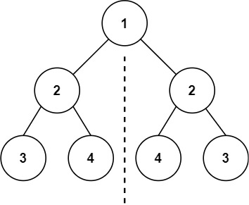
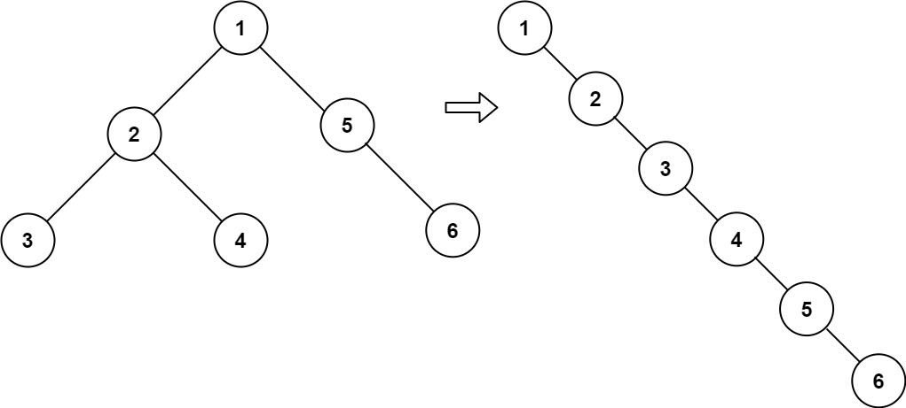
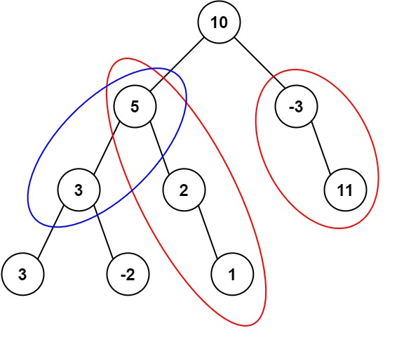

## 94. 二叉树的中序遍历

给定一个二叉树的根节点 `root`, 返回它的中序遍历.

```
示例 1：

输入：root = [1,null,2,3]
输出：[1,3,2]
```

> 思路: 递归, 先遍历左子树, 再记录当前节点, 最后遍历右子树

```python
# Definition for a binary tree node.
# class TreeNode:
#     def __init__(self, val=0, left=None, right=None):
#         self.val = val
#         self.left = left
#         self.right = right
class Solution:
    def inorderTraversal(self, root: Optional[TreeNode]) -> List[int]:
        res = []
        def order(root):
            if not root:
                return None
            order(root.left)
            res.append(root.val)
            order(root.right)
        order(root)
        return res
```

## 104. 二叉树的深度

给定一个二叉树 `root`, 返回其最大深度.

二叉树的最大深度是指从根节点到最远叶子节点的最长路径上的节点数.
 
```
示例 1：

输入：root = [3,9,20,null,null,15,7]
输出：3
```

> 思路: 递归，深度优先搜索BFS

```python
# Definition for a binary tree node.
# class TreeNode:
#     def __init__(self, val=0, left=None, right=None):
#         self.val = val
#         self.left = left
#         self.right = right
class Solution:
    def maxDepth(self, root: Optional[TreeNode]) -> int:
        if not root:
            return 0
        return max(self.maxDepth(root.left), self.maxDepth(root.right)) + 1
```

## 226. 翻转二叉树

给你一棵二叉树的根节点 `root`, 翻转这棵二叉树, 并返回其根节点.


```
示例 1：

输入：root = [4,2,7,1,3,6,9]
输出：[4,7,2,9,6,3,1]
```

> 思路: 递归.

```python
# Definition for a binary tree node.
# class TreeNode:
#     def __init__(self, val=0, left=None, right=None):
#         self.val = val
#         self.left = left
#         self.right = right
class Solution:
    def invertTree(self, root: Optional[TreeNode]) -> Optional[TreeNode]:
        if not root:
            return
        
        root.left, root.right = root.right, root.left

        self.invertTree(root.left)
        self.invertTree(root.right)

        return root
```


## 101. $\star$ 对称二叉树
给你一个二叉树的根节点 `root`, 检查它是否轴对称.


```
示例 1：

输入：root = [1,2,2,3,4,4,3]
输出：true
```

> 思路: DFS递归

```python
# Definition for a binary tree node.
# class TreeNode:
#     def __init__(self, val=0, left=None, right=None):
#         self.val = val
#         self.left = left
#         self.right = right
class Solution:
    def isSymmetric(self, root: Optional[TreeNode]) -> bool:
        if not root:
            return
        
        def dfs(left, right):
            if not(left or right):
                return True
            if not(left and right):
                return False
            if left.val != right.val:
                return False
            return dfs(left.left, right.right) and dfs(left.right, right.left)
        
        return dfs(root.left, root.right)
```

## $\star$ 543. 二叉树的直径

给你一棵二叉树的根节点, 返回该树的直径.

二叉树的直径是指树中任意两个节点之间最长路径的长度. 这条路径可能经过也可能不经过根节点 `root`.

两节点之间路径的长度由它们之间边数表示.

```
示例 1：

输入：root = [1,2,3,4,5]
输出：3
解释：3 ，取路径 [4,2,1,3] 或 [5,2,1,3] 的长度。
```

> 思路: DFS递归

```python
# Definition for a binary tree node.
# class TreeNode:
#     def __init__(self, val=0, left=None, right=None):
#         self.val = val
#         self.left = left
#         self.right = right
class Solution:
    def diameterOfBinaryTree(self, root: Optional[TreeNode]) -> int:
        res = 0
        def dfs(t):
            if not t:
                return -1
            leftlen = dfs(t.left)+1 # 到 t.left 的最大链长+1
            rightlen = dfs(t.right)+1
            nonlocal res # 可以修改外层函数变量，注意与全局变量 global 的区别
            res = max(res, leftlen+rightlen)
            return max(leftlen, rightlen) # 返回到当前节点的最大链长

        dfs(root)
        
        return res
```

## $\star$ 102. 二叉树的层序遍历
给你二叉树的根节点 `root`, 返回其节点值的层序遍历. (即逐层地, 从左到右访问所有节点).


```
示例 1：

输入：root = [3,9,20,null,null,15,7]
输出：[[3],[9,20],[15,7]]
```

> 思路1: 递归, 构造函数 `dfs(depth, root)`, `depth` 为当前所在深度, `root` 为当前层的根节点.
> - 初始化一个空列表 `levelOrderList = []`, 用来存层序遍历的结果.
> - 如果 `len(levelOrderList) < depth`, 说明 `levelOrderList` 中还没有存当前深度的节点, 因此需要构造空列表 `levelOrderList.append([])`
> - 将当前的根节点存到 `levelOrderList[depth-1]` 中
> - 递归遍历左子树和右子树
> 
> 思路2: 利用一个队列存前一层的所有节点, 然后遍历这个队列, 得到下一层的节点.


```python
'''
思路1: 深度优先搜索DFS
'''
# Definition for a binary tree node.
# class TreeNode:
#     def __init__(self, val=0, left=None, right=None):
#         self.val = val
#         self.left = left
#         self.right = right
class Solution:
    def levelOrder(self, root: Optional[TreeNode]) -> List[List[int]]:
        if not root:
            return []

        res = []

        def dfs(length, r):
            if len(res) < length:
                res.append([])
            res[length-1].append(r.val)
            if r.left:
                dfs(length+1, r.left)
            if r.right:
                dfs(length+1, r.right)
        
        dfs(1, root)
        return res
```

```python
'''
思路1: 深度优先搜索DFS
'''
# Definition for a binary tree node.
# class TreeNode:
#     def __init__(self, val=0, left=None, right=None):
#         self.val = val
#         self.left = left
#         self.right = right
class Solution:
    def levelOrder(self, root: Optional[TreeNode]) -> List[List[int]]:
        if not root:
            return []
        
        res = []
        queue = deque([root])

        while queue:
            level_size = len(queue)
            currentList = []
            for _ in range(level_size):
                node = queue.popleft()
                currentList.append(node.val)
                if node.left:
                    queue.append(node.left)
                if node.right:
                    queue.append(node.right)
            res.append(currentList)

        return res
```

## $\star$ 108. 有序数组转为平衡二叉树
给你一个整数数组 `nums`, 其中元素已经按升序排列, 请你将其转换为一棵平衡二叉搜索树.


```
示例 1：

输入：nums = [-10,-3,0,5,9]
输出：[0,-3,9,-10,null,5]
解释：[0,-10,5,null,-3,null,9] 也将被视为正确答案：
```

> 思路: 二分区间，每次以 `(left+right)//2` 为根节点

```python
# Definition for a binary tree node.
# class TreeNode:
#     def __init__(self, val=0, left=None, right=None):
#         self.val = val
#         self.left = left
#         self.right = right
class Solution:
    def sortedArrayToBST(self, nums: List[int]) -> Optional[TreeNode]:
        def helper(left, right):
            mid = (left+right)//2
            root = TreeNode(nums[mid])

            if mid-1 >= left:
               root.left = helper(left, mid-1)
            if mid+1 <= right:
                root.right = helper(mid+1, right)
            
            return root
        
        return helper(0, len(nums)-1)
```

## $\star$ 98. 验证二叉搜索树

给你一个二叉树的根节点 `root`, 判断其是否是一个有效的二叉搜索树.

有效二叉搜索树定义如下:
- 节点的左子树只包含严格小于当前节点的数.
- 节点的右子树只包含严格大于当前节点的数.
- 所有左子树和右子树自身必须也是二叉搜索树.

```
示例 1：

输入：root = [2,1,3]
输出：true
```

> 思路: 定义函数 `helper(node, left, right)`, 判断 `node.val` 是否在 `(left,right)` 区间中.

```python
# Definition for a binary tree node.
# class TreeNode:
#     def __init__(self, val=0, left=None, right=None):
#         self.val = val
#         self.left = left
#         self.right = right
class Solution:
    def isValidBST(self, root: Optional[TreeNode]) -> bool:
        def helper(root, left = float('-inf'), right = float('inf')):
            if not root:
                return True
            
            if root.val <= left or root.val >= right:
                return False

            return helper(root.left, left, root.val) and helper(root.right, root.val, right)
        
        return helper(root)
```

## $\star$ 230. 二叉搜索树中第 `k` 小的元素
给定一个二叉搜索树的根节点 `root`, 和一个整数 `k`, 请你设计一个算法查找其中第 `k` 小的元素 (`k` 从 `1` 开始计数). 


```
示例 1：

输入：root = [3,1,4,null,2], k = 1
输出：1
```

> 思路: 采取中序遍历 (先左节点, 最后右节点)

```python
# Definition for a binary tree node.
# class TreeNode:
#     def __init__(self, val=0, left=None, right=None):
#         self.val = val
#         self.left = left
#         self.right = right
class Solution:
    def kthSmallest(self, root: Optional[TreeNode], k: int) -> int:
        stack = [] # stack 的最后一个元素一定是当前最小的
        while root or stack:
            while root:
                stack.append(root)
                root = root.left
            
            root = stack.pop()
            k -= 1
            if k == 0:
                return root.val
            
            root = root.right
```

## $\star$ 199. 二叉树的右视图

给定一个二叉树的根节点 `root`, 想象自己站在它的右侧, 按照从顶部到底部的顺序, 返回从右侧所能看到的节点值.


```
示例 1：

输入：root = [1,2,3,null,5,null,4]

输出：[1,3,4]
```

> 思路: 深度优先，先递归右子树，再递归左子树

```python
# Definition for a binary tree node.
# class TreeNode:
#     def __init__(self, val=0, left=None, right=None):
#         self.val = val
#         self.left = left
#         self.right = right
class Solution:
    def rightSideView(self, root: Optional[TreeNode]) -> List[int]:
        res = [] # len(res) 表示二叉树已经遍历的深度
        def dfs(node, depth):
            if not node:
                return
            if depth == len(res): # 此时二叉树到达的深度为 len(res)+1
                res.append(node.val)
            dfs(node.right, depth+1)
            dfs(node.left, depth+1)
        dfs(root, 0)
        return res
```

层序遍历
```python
# Definition for a binary tree node.
# class TreeNode:
#     def __init__(self, val=0, left=None, right=None):
#         self.val = val
#         self.left = left
#         self.right = right
class Solution:
    def rightSideView(self, root: Optional[TreeNode]) -> List[int]:
        if not root:
            return []
        
        res = []
        cur = [root] # 当前深度的节点
        while cur:
            res.append(cur[-1].val)
            tmp = []
            for t in cur:
                if t.left:
                    tmp.append(t.left) 
                if t.right:
                    tmp.append(t.right) 
            cur = tmp
        return res
```

## $\star$ 114. 二叉树展开为链表
给你二叉树的根结点 `root`, 请你将它展开为一个单链表:
- 展开后的单链表应该同样使用 `TreeNode`, 其中 `right` 子指针指向链表中下一个结点, 而左子指针始终为 `null`.
- 展开后的单链表应该与二叉树先序遍历顺序相同.


```
示例 1：

输入：root = [1,2,5,3,4,null,6]
输出：[1,null,2,null,3,null,4,null,5,null,6]
```

> 思路
> ```
>     1
>    / \
>   2   5
>  / \   \
> 3   4   6
> 
> //将 1 的左子树插入到右子树的地方
>     1
>      \
>       2         5
>      / \         \
>     3   4         6        
> //将原来的右子树接到左子树的最右边节点
>     1
>      \
>       2          
>      / \          
>     3   4  
>          \
>           5
>            \
>             6
>             
>  //将 2 的左子树插入到右子树的地方
>     1
>      \
>       2          
>        \          
>         3       4  
>                  \
>                   5
>                    \
>                     6   
>         
>  //将原来的右子树接到左子树的最右边节点
>     1
>      \
>       2          
>        \          
>         3      
>          \
>           4  
>            \
>             5
>              \
>               6         
>   
>   ......
> 作者：windliang
> 来源：力扣（LeetCode）
> ```

```python
# Definition for a binary tree node.
# class TreeNode:
#     def __init__(self, val=0, left=None, right=None):
#         self.val = val
#         self.left = left
#         self.right = right
class Solution:
    def flatten(self, root: Optional[TreeNode]) -> None:
        """
        Do not return anything, modify root in-place instead.
        """
        while root:
            if root.left:
                tmp = root.right
                root.right = root.left
                root.left = None
                
                p = root.right
                while p.right:
                    p = p.right
                p.right = tmp

            root = root.right
```

## 105. 从先序和中序遍历序列中构造二叉树
给定两个整数数组 `preorder` 和 `inorder`, 其中 `preorder` 是二叉树的先序遍历, `inorder` 是同一棵树的中序遍历, 请构造二叉树并返回其根节点.


```
示例 1:

输入: preorder = [3,9,20,15,7], inorder = [9,3,15,20,7]
输出: [3,9,20,null,null,15,7]
```
> 思路: 用一个哈希表存储中序遍历的 `element` 和 `index`. 先序遍历序列能很快定位根节点, 于是通过哈希表可以很快定位根节点在中序序列中的 `index`, 于是中序序列可以迅速定位左子树和右子树部分, 从而可以通过递归的方式构造左右子树.
> ```
> preorder = [根节点, [左子树], [右子树]]
> inorder = [[左子树], 根节点, [右子树]]
> ```

```python
# Definition for a binary tree node.
# class TreeNode:
#     def __init__(self, val=0, left=None, right=None):
#         self.val = val
#         self.left = left
#         self.right = right
class Solution:
    def buildTree(self, preorder: List[int], inorder: List[int]) -> Optional[TreeNode]:
        def helper(preHead, preTail, inHead, inTail):
            if preHead > preTail or inHead > inTail:
                return 
            
            root_pre_index = preHead
            root_in_index = hashtable[preorder[preHead]]

            left_length = root_in_index - inHead

            root = TreeNode(preorder[preHead])

            root.left = helper(
                root_pre_index+1,
                root_pre_index+left_length,
                inHead,
                inHead+left_length-1
            )

            root.right = helper(
                root_pre_index+left_length+1,
                preTail,
                root_in_index+1,
                inTail
            )

            return root

        hashtable = {num: i for i, num in enumerate(inorder)}

        return helper(0, len(preorder)-1, 0, len(inorder)-1)

```

## $\star$ 437. 路径总和 III
向下搜索, 寻找总和为 `targetSum` 的路径条数.

给定一个二叉树的根节点 `root`, 和一个整数 `targetSum`, 求该二叉树里节点值之和等于 `targetSum` 的路径的数目.

路径不需要从根节点开始, 也不需要在叶子节点结束, 但是路径方向必须是向下的(只能从父节点到子节点).


```
示例 1：

输入：root = [10,5,-3,3,2,null,11,3,-2,null,1], targetSum = 8
输出：3
解释：和等于 8 的路径有 3 条，如图所示。
```

> 思路: 寻找以 `root` 为根节点的路径条数, 再以递归的形式寻找 `root.left` `root.right` 为根节点的路径的条数. 
> 
> 寻找以 `root` 为根节点的路径条数的时候, 以递归的形式向下搜素, 计算元素总和.

```python
# Definition for a binary tree node.
# class TreeNode:
#     def __init__(self, val=0, left=None, right=None):
#         self.val = val
#         self.left = left
#         self.right = right
class Solution:
    def pathSum(self, root: Optional[TreeNode], targetSum: int) -> int:
        def dfs(root, currentSum):
            if not root:
                return 0
            
            currentSum += root.val

            count = hashtable.get(currentSum-targetSum, 0)
            hashtable[currentSum] = hashtable.get(currentSum, 0) + 1

            count += dfs(root.left, currentSum)
            count += dfs(root.right, currentSum)

            hashtable[currentSum] -= 1 # 回溯

            return count

        hashtable = {0: 1}
        
        return dfs(root, 0)
            

```

## 236. 二叉树的最近公共祖先


[百度百科](https://baike.baidu.com/item/%E6%9C%80%E8%BF%91%E5%85%AC%E5%85%B1%E7%A5%96%E5%85%88/8918834?fr=aladdin)中最近公共祖先的定义为：“对于有根树 T 的两个节点 p、q，最近公共祖先表示为一个节点 x，满足 x 是 p、q 的祖先且 x 的深度尽可能大（**一个节点也可以是它自己的祖先**）。”

**示例 1：**


```
输入：root = [3,5,1,6,2,0,8,null,null,7,4], p = 5, q = 1
输出：3
解释：节点 5 和节点 1 的最近公共祖先是节点 3 。
```

> 思路
> - 如果根节点 `root` 是 `None` 或 `p` 或 `q`, 则返回根节点 `root`;
> - 如果根节点的左半支和右半支都没有 `p` `q`, 则返回 `None`;
> - 如果根节点的左半支含有 `p` 或 `q`, 但右半支不含有 `p` 和 `q`, 则返回左半支的的节点;
> - 如果根节点的右半支含有 `p` 或 `q`, 但左半支不含有 `p` 和 `q`, 则返回右半支的的节点;
> - 如果根节点的左半支含有 `p` (或 `q`), 且右半支含有 `q` (或 `p`), 则返回这个根节点

```python
# Definition for a binary tree node.
# class TreeNode:
#     def __init__(self, x):
#         self.val = x
#         self.left = None
#         self.right = None

class Solution:
    def lowestCommonAncestor(self, root: 'TreeNode', p: 'TreeNode', q: 'TreeNode') -> 'TreeNode':
        if not root or p == root or q == root:
            return root
        left = self.lowestCommonAncestor(root.left, p, q)
        right = self.lowestCommonAncestor(root.right, p, q)
        if not left and not right:
            return None
        if not left:
            return right
        if not right:
            return left
        return root
```

## $\star$ 124. 二叉树中的最大路径和
二叉树中的 路径 被定义为一条节点序列，序列中每对相邻节点之间都存在一条边。同一个节点在一条路径序列中 至多出现一次 。该路径 至少包含一个 节点，且不一定经过根节点。

路径和 是路径中各节点值的总和。

给你一个二叉树的根节点 root ，返回其 最大路径和 。


```
示例 1：

输入：root = [1,2,3]
输出：6
解释：最优路径是 2 -> 1 -> 3 ，路径和为 2 + 1 + 3 = 6
```
> 思路: 用 `left_sum` 表示左半支的到根节点的非负最大路径长度, 同理定义 `right_sum`, 于是到根节点的最大路径长度为 `root.val+max(left_sum, right_sum)`.
>
> 每次搜索一棵子树时, 我们都更新最大路径 `res=max(res, root.val+left_sum+right_sum)`.

```python
# Definition for a binary tree node.
# class TreeNode:
#     def __init__(self, val=0, left=None, right=None):
#         self.val = val
#         self.left = left
#         self.right = right
class Solution:
    def maxPathSum(self, root: Optional[TreeNode]) -> int:
        res = float('-inf')
        def dfs(root):
            if not root:
                return 0
            
            leftPathSum = max(dfs(root.left), 0)
            rightPathSum = max(dfs(root.right), 0)

            nonlocal res
            res = max(res, root.val+leftPathSum+rightPathSum)

            return root.val+max(leftPathSum, rightPathSum)
        
        dfs(root)

        return res
```
