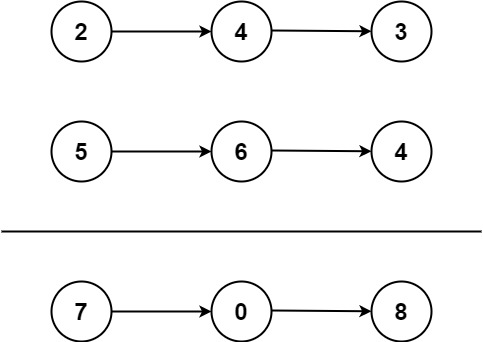

# LeetCode Hot100 —— 链表

## 160. 相交链表
给你两个单链表的头节点 `headA` 和 `headB`, 请你找出并返回两个单链表相交的起始节点. 如果两个链表不存在相交节点, 返回 `None`.

图示两个链表在节点 `c1` 开始相交:


> 假设有两个链表 `A` 和链表 `B`, 在某节点处相交, 之后部分重合. 我们用两个指针, 一个从 `A` 头节点开始遍历, 另一个从 `B` 头节点开始遍历, 并且指针遍历完一个链表后会移动到另一个链表的头节点. 则最后两个指针一定会相遇. 不妨设 `A` 和 `B` 重合部分长度为 `l`, `A` 的不重合部分为 `a`, `B` 的不重合部分为 `b`, 注意到 `a+l+b=b+l+a`, 即两指针在走这么多步后一定相遇, 且相遇在交点.

```python
# Definition for singly-linked list.
# class ListNode:
#     def __init__(self, x):
#         self.val = x
#         self.next = None
class Solution:
    def getIntersectionNode(self, headA: ListNode, headB: ListNode) -> Optional[ListNode]:
        A = headA; B = headB
        while A != B:
            A = A.next if A else headB
            B = B.next if B else headA
        return A
```

## 206. 反转链表
给你单链表的头节点 `head`, 请你反转链表, 并返回反转后的链表.


```
示例 1：

输入：head = [1,2,3,4,5]
输出：[5,4,3,2,1]
```

> 头插法: 构造两个节点, 一个是未反转链表的头节点, 一个是这个头节点应该指向的节点.

```python
# Definition for singly-linked list.
# class ListNode:
#     def __init__(self, val=0, next=None):
#         self.val = val
#         self.next = next
class Solution:
    def reverseList(self, head: Optional[ListNode]) -> Optional[ListNode]:
        prenode = None
        while head:
            node_next = head.next
            head.next = prenode
            prenode = head
            head = node_next
        return prenode
```
## 234. 回文链表
给你一个单链表的头节点 `head`, 请你判断该链表是否为回文链表. 如果是, 返回 `true`; 否则，返回 `false`.


```
示例 1：

输入：head = [1,2,2,1]
输出：true
```

> 用快慢指针找到链表的中间位置, 然后反转右边的链表, 再检验左右两边的链表是否一样

```python
# Definition for singly-linked list.
# class ListNode:
#     def __init__(self, val=0, next=None):
#         self.val = val
#         self.next = next
class Solution:
    def isPalindrome(self, head: Optional[ListNode]) -> bool:
        # 用快慢指针找到中间位置
        slow, fast = head, head
        while fast and fast.next:
            slow = slow.next
            fast = fast.next.next
        # 反转右边链表
        prenode = None
        while slow:
            node_next = slow.next
            slow.next = prenode
            prenode = slow
            slow = node_next
        # 判断两个链表是否相等
        while prenode:
            if prenode.val != head.val:
                return False
            prenode = prenode.next
            head = head.next
        return True
```

## 141. 环形链表
给你一个链表的头节点 `head`, 判断链表中是否有环.

如果链表中有某个节点, 可以通过连续跟踪 `next` 指针再次到达, 则链表中存在环. 为了表示给定链表中的环, 评测系统内部使用整数 `pos` 来表示链表尾连接到链表中的位置 (索引从 `0` 开始). 注意: `pos` 不作为参数进行传递. 仅仅是为了标识链表的实际情况.

如果链表中存在环, 则返回 `true`. 否则, 返回 `false`.


```
示例 1：

输入：head = [3,2,0,-4], pos = 1
输出：true
解释：链表中有一个环，其尾部连接到第二个节点。
```

> 用快慢指针, 如果两个指针会相遇则存在环

```python
# Definition for singly-linked list.
# class ListNode:
#     def __init__(self, x):
#         self.val = x
#         self.next = None

class Solution:
    def hasCycle(self, head: Optional[ListNode]) -> bool:
        slow, fast = head, head
        while fast and fast.next:
            slow, fast = slow.next, fast.next.next
            if slow == fast:
                return True
        return False
```

## 142. 环形链表II

给定一个链表的头节点 `head`, 返回链表开始入环的第一个节点. 如果链表无环, 则返回 `null`.

如果链表中有某个节点, 可以通过连续跟踪 `next` 指针再次到达, 则链表中存在环. 为了表示给定链表中的环, 评测系统内部使用整数 `pos` 来表示链表尾连接到链表中的位置 (索引从 `0` 开始). 如果 `pos` 是 `-1`, 则在该链表中没有环. 注意: `pos` 不作为参数进行传递, 仅仅是为了标识链表的实际情况.

不允许修改链表.


```
示例 1：

输入：head = [3,2,0,-4], pos = 1
输出：返回索引为 1 的链表节点
解释：链表中有一个环，其尾部连接到第二个节点。
```
> 设从头节点到环形链表的第一个节点要走 $x$ 步, 走一圈环需要 $y$ 步, 设慢指针和快指针相遇时分别走了 $d_1=x+k_1y+z$ 步和 $d_2=x+k_2y+z$ 步, 其中 $z_1,z_2$ 表示慢指针和快指针最后一次在环中走的步数 (因为它们相遇了, 所以最后一圈在环内一定走了相同步, 不妨都设为 $z$ 步). 
> 
> 注意到快指针走的步数为慢指针的两倍, 因此 
> 
> $$x+k_2y+z=2(x+k_1y+z)\Rightarrow x+z=(k_2-2k_1)y\Rightarrow x=(k_2-2k_1)y-z.$$ 
> 
> 于是, 从头节点出发走 $(k_2-2k_1)y-z$ 步到达环的第一个节点.
> 
> 注意到: 从相遇的节点出发走 $y-z+ky=(1+k)y-z$ 步也可到达环的第一个节点(只需取 $k=k_2-2k_1-1$).
>
> 因此当快慢指针相遇时, 我们让任意一个指针从头节点出发, 另一个节点从相遇点出发, 让它们每次都只走一步, 则它们最终一定在环的第一个节点相遇!

```python
# Definition for singly-linked list.
# class ListNode:
#     def __init__(self, x):
#         self.val = x
#         self.next = None

class Solution:
    def detectCycle(self, head: Optional[ListNode]) -> Optional[ListNode]:
        slow, fast = head, head
        while fast and fast.next:
            slow, fast = slow.next, fast.next.next
            if slow == fast:
                break
        else:
            return
        
        slow = head
        while slow != fast:
            slow, fast = slow.next, fast.next

        return slow
```

## 21. 合并两个有序链表

将两个升序链表合并为一个新的升序链表并返回. 新链表是通过拼接给定的两个链表的所有节点组成的. 


```
示例 1：

输入：l1 = [1,2,4], l2 = [1,3,4]
输出：[1,1,2,3,4,4]
```

> 采用递归的方式实现, 构造一个 `merge(node1, node2)`
> - 如果 `l1` 为空, 则返回 `l2`
> - 如果 `l2` 为空, 则返回 `l1`
> - 如果 `l1.val < l2.val`, 则更新 `l1.next <- merge(l1.next, l2)`, 返回 `l1`
> - 反之, 则更新 `l2.next <- merge(l2.next, l1)`, 返回 `l2`

```python
# Definition for singly-linked list.
# class ListNode:
#     def __init__(self, val=0, next=None):
#         self.val = val
#         self.next = next
class Solution:
    def mergeTwoLists(self, list1: Optional[ListNode], list2: Optional[ListNode]) -> Optional[ListNode]:
        if not list1:
            return list2
        if not list2:
            return list1
        if list1.val < list2.val:
            list1.next = self.mergeTwoLists(list1.next, list2)
            return list1
        else:
            list2.next = self.mergeTwoLists(list2.next, list1)
            return list2
```

## 2. 两数相加
给你两个非空的链表, 表示两个非负的整数. 它们每位数字都是按照逆序的方式存储的, 并且每个节点只能存储一位数字.

请你将两个数相加, 并以相同形式返回一个表示和的链表.

你可以假设除了数字 `0` 之外，这两个数都不会以 `0` 开头.


```
示例 1：

输入：l1 = [2,4,3], l2 = [5,6,4]
输出：[7,0,8]
解释：342 + 465 = 807.
```

> 主要处理进位问题

```python
# Definition for singly-linked list.
# class ListNode:
#     def __init__(self, val=0, next=None):
#         self.val = val
#         self.next = next
class Solution:
    def addTwoNumbers(self, l1: Optional[ListNode], l2: Optional[ListNode]) -> Optional[ListNode]:
        prenode = ListNode()
        p = prenode
        add = 0
        while l1 or l2:
            if l1:
                add += l1.val
                l1 = l1.next
            if l2:
                add += l2.val
                l2 = l2.next
            p.next = ListNode(add%10)
            p = p.next
            add = add//10
        if add > 0:
            p.next = ListNode(add)
        return prenode.next

```

## 19. 删除链表倒数第 $N$ 个节点
给你一个链表，删除链表的倒数第 `n` 个结点, 并且返回链表的头结点.


```
示例 1：

输入：head = [1,2,3,4,5], n = 2
输出：[1,2,3,5]
```

> 用两个指针, 先让其中一个指针先走 $n$ 步, 再让两个指针同步走, 则当先走的指针到链表末尾时, 后走的指针恰好可以走到倒数第 $n$ 个节点的前一个节点位置.

```python
class Solution:
    def removeNthFromEnd(self, head: Optional[ListNode], n: int) -> Optional[ListNode]:
        prenode = ListNode(0)
        prenode.next = head
        slow, fast = prenode, prenode
        for i in range(n):
            fast = fast.next
        while fast.next:
            slow, fast = slow.next, fast.next
        slow.next = slow.next.next
        return prenode.next
```

## 24. 两两交换链表节点
给你一个链表, 两两交换其中相邻的节点, 并返回交换后链表的头节点. 你必须在不修改节点内部的值的情况下完成本题 (即, 只能进行节点交换).


```
示例 1:

输入：head = [1,2,3,4]
输出：[2,1,4,3]
```

> 头插法

```python
# Definition for singly-linked list.
# class ListNode:
#     def __init__(self, val=0, next=None):
#         self.val = val
#         self.next = next
class Solution:
    def swapPairs(self, head: Optional[ListNode]) -> Optional[ListNode]:
        if not head or not head.next:
            return head
        prenode = ListNode(0)
        prenode.next = head
        node1 = head
        p = prenode
        while node1 and node1.next:
            node2 = node1.next
            p.next = node2
            tmp = node2.next
            node2.next = node1
            node1.next = tmp
            p = node1
            node1 = tmp
        return prenode.next

```


## $\star$ 25. $k$ 个一组翻转链表

给你链表的头节点 `head`, 每 `k` 个节点一组进行翻转, 请你返回修改后的链表.
- `k` 是一个正整数,它的值小于或等于链表的长度.
- 如果节点总数不是 `k` 的整数倍,那么请将最后剩余的节点保持原有顺序.


```
输入：head = [1,2,3,4,5], k = 2
输出：[2,1,4,3,5]
```

> 思路——利用栈. 依次将`k`个节点放入栈中, 然后再一个个`pop`出来, 这样就实现了反转.

```python
# Definition for singly-linked list.
# class ListNode:
#     def __init__(self, val=0, next=None):
#         self.val = val
#         self.next = next
class Solution:
    def reverseKGroup(self, head: Optional[ListNode], k: int) -> Optional[ListNode]:
        new_list = ListNode(0)
        p = new_list
        while True:
            count = k
            stack = []
            tmp = head
            # 只要 count>0 且 tmp 不是 None, 就把结点放到栈里
            while count and tmp:
                stack.append(tmp)
                tmp = tmp.next
                count -= 1
            # 注意：如果count=0, 那么此时 tmp 对应 k 个结点之后的结点

            # 如果剩余链表的长度不足 k, 拿着剩下的链表不用再反转了，直接接上就行, 然后退出整个循环
            if count:
                p.next = head
                break
            # 利用栈的 `pop` 实现反转
            while stack:
                p.next = stack.pop()
                p = p.next
            
            # 更新 head
            head = tmp
            
        return new_list.next
```

## 138. 随机链表的复制
给你一个长度为 `n` 的链表，每个节点包含一个额外增加的随机指针 `random` ，该指针可以指向链表中的任何节点或空节点。构造这个链表的 **深拷贝**。 深拷贝应该正好由 `n` 个**全新**节点组成，其中每个新节点的值都设为其对应的原节点的值。新节点的 `next` 指针和 `random` 指针也都应指向复制链表中的新节点，并使原链表和复制链表中的这些指针能够表示相同的链表状态。复制链表中的指针都不应指向原链表中的节点。

> 思路：哈希表
> - 先遍历链表所有节点，复制节点，构造 `{节点: 复制节点}` 的键值对；
> - 再遍历链表所有节点，复制节点的 `next` 和 `random`.

```python
"""
# Definition for a Node.
class Node:
    def __init__(self, x: int, next: 'Node' = None, random: 'Node' = None):
        self.val = int(x)
        self.next = next
        self.random = random
"""

class Solution:
    def copyRandomList(self, head: 'Optional[Node]') -> 'Optional[Node]':
        # 如果 head 是空链表，则返回 None
        if not head:
            return None
        
        # 创建一个空的哈希表 dic
        dic = {}
        # 复制所有节点，构造键值对
        cur = head
        while cur:
            dic[cur] = Node(cur.val)
            cur = cur.next
        
        # 复制节点的next和random
        cur = head
        while cur:
            dic[cur].next = dic.get(cur.next)
            dic[cur].random = dic.get(cur.random)
            cur = cur.next
        
        return dic[head]

```

## 148. 链表排序
给你链表的头结点 `head`，请将其按**升序**排列并返回排序后的链表。

> 思路: 利用归并排序

```python
# Definition for singly-linked list.
# class ListNode:
#     def __init__(self, val=0, next=None):
#         self.val = val
#         self.next = next
class Solution:
    def sortList(self, head: Optional[ListNode]) -> Optional[ListNode]:
        # 如果链表是空的或者只有一个元素，则直接返回链表本身
        if not head or not head.next:
            return head
        
        # 定义快慢指针，目的是将链表拆分成两两一半
        slow, fast = head, head
        while fast.next and fast.next.next:
            slow = slow.next
            fast = fast.next.next
        curLeft = head # 链表左半部分
        curRight = slow.next # 链表右半部分
        slow.next = None # 将链表断开
        
        # 递归
        left = self.sortList(curLeft)
        right = self.sortList(curRight)

        # 合并
        res = ListNode(0)
        p = res
        while left and right:
            if left.val < right.val:
                p.next = left
                left = left.next
            else:
                p.next = right
                right = right.next
            p = p.next
        if left:
            p.next = left
        else:
            p.next = right

        return res.next
```

## 23. 合并 K 个升序链表

> 思路: 顺序两两合并

```python
# Definition for singly-linked list.
# class ListNode:
#     def __init__(self, val=0, next=None):
#         self.val = val
#         self.next = next
class Solution:
    def mergeKLists(self, lists: List[Optional[ListNode]]) -> Optional[ListNode]:
        # 如果是空列表，就返回空链表
        n = len(lists)
        if n == 0:
            return None

        L0 = lists[0]
        for i in range(1, n):
            tmp = ListNode(0)
            p = tmp
            while L0 and lists[i]:
                if L0.val < lists[i].val:
                    p.next = L0
                    L0 = L0.next
                else:
                    p.next = lists[i]
                    lists[i] = lists[i].next
                p = p.next
            p.next = L0 if L0 else lists[i]
            L0 = tmp.next
        return L0
```


##  $\star$ 146. LRU 缓存

```
示例:

输入
["LRUCache", "put", "put", "get", "put", "get", "put", "get", "get", "get"]
[[2], [1, 1], [2, 2], [1], [3, 3], [2], [4, 4], [1], [3], [4]]
输出
[null, null, null, 1, null, -1, null, -1, 3, 4]

解释
LRUCache lRUCache = new LRUCache(2);
lRUCache.put(1, 1); // 缓存是 {1=1}
lRUCache.put(2, 2); // 缓存是 {1=1, 2=2}
lRUCache.get(1);    // 返回 1
lRUCache.put(3, 3); // 该操作会使得关键字 2 作废，缓存是 {1=1, 3=3}
lRUCache.get(2);    // 返回 -1 (未找到)
lRUCache.put(4, 4); // 该操作会使得关键字 1 作废，缓存是 {4=4, 3=3}
lRUCache.get(1);    // 返回 -1 (未找到)
lRUCache.get(3);    // 返回 3
lRUCache.get(4);    // 返回 4
```

### 思路

利用 `OrderDict`

```python
from collections import OrderedDict
class LRUCache:

    def __init__(self, capacity: int):
        self.length = capacity
        self.dic = OrderedDict()

    def get(self, key: int) -> int:
        if key in self.dic:
            self.dic.move_to_end(key) # 将此 key 移至最后，表示这是最新的更新
            return self.dic[key]
        return -1

    def put(self, key: int, value: int) -> None:
        if key in self.dic:
            self.dic.move_to_end(key) # 将此 key 移至最后，表示这是最新的更新

        self.dic[key] = value
        if len(self.dic) > self.length:
            self.dic.popitem(last=False)


# Your LRUCache object will be instantiated and called as such:
# obj = LRUCache(capacity)
# param_1 = obj.get(key)
# obj.put(key,value)
```
